```{r}
#| include: false
library(hrbrthemes)

library(sva)
library(vegan)
library(fgsea)
library(DESeq2)
library(limma)
library(BioNERO)
library(permutes)
library(tidyverse)
library(factoextra)
library(clusterProfiler)
library(metafor)

library(ggpubr)
library(ggplot2)
library(pheatmap)
library(multcomp)
library(RColorBrewer)
library(ComplexHeatmap)
library(EnhancedVolcano)

library(DOSE)
library(msigdbr)
library(biomaRt)
library(ReactomePA)
library(org.Hs.eg.db)
library(AnnotationDbi)
library(AnnotationHub)
library(STRINGdb)
library(GSVA)
library(ggfortify)
library(GseaVis)
library(rcartocolor)
library(UpSetR)

library(DT)
library(downloadthis)

mypal <- brewer.pal(8, "Set1")

set.seed(666)
```

```{r}
#| include: false
ensbl2geneid <- read.csv("data/ensbl2geneid.tsv", sep = "\t", header = T)

cell_marker_data <- read.csv("data/cell_marker_human.csv", sep = "\t")
cell_names <- unique(cell_marker_data$cell_name)

meta_data <- read.csv("data/metadata.tsv", sep = "\t")
meta_data <- meta_data[meta_data$Ergicity == "DA",]
colnames(meta_data)[1] <- "sampleid"

meta_data$replicate <- factor(meta_data$Tech.rep)
meta_data$place <- factor(meta_data$Cells.Msc.SPb)

meta_data$pict.name <- sub("_1|_2|_3", "", meta_data$pict.name)

meta_data$mutation <- factor(meta_data$pict.name)
meta_data$condition <- factor(meta_data$Health.PD)

meta_data$File <- meta_data$sampleid
meta_data$File <- paste0(meta_data$File, ".counts")

meta_data <- meta_data %>% relocate(File, .after = sampleid)
meta_data <- meta_data[c(1,2,11:14)]

reads.counts <- read.csv("data/counts.tsv", sep = "\t")
reads.counts$sampleid <- sub(".txt", "", reads.counts$sampleid)
reads.counts$sampleid <- sub("_1A", "-1A", reads.counts$sampleid)
colnames(reads.counts)[4] <- "%_filt"
reads.counts <- merge(meta_data, reads.counts, by = 1)[-c(2,4)]

ddsHTSeq <- DESeqDataSetFromHTSeqCount(sampleTable = meta_data,
                                       directory = "data/htseq/",
                                       design = ~ place + replicate + condition)

rownames(ddsHTSeq) <- sapply(str_split(rownames(ddsHTSeq), "\\."), function(x) x[1])
```

# Materials and methods
<p style="text-align: justify;">
Raw transcriptomic data underwent quality control using FastQC v0.12.1 [<https://github.com/s-andrews/FastQC>] and aggregated reports were generated with MultiQC v1.27.1 [Ewels et al., 2016]. Low-quality reads were filtered using Fastp v0.23.4 [Chen et al., 2018]. Reads were aligned to the human reference genome GRCh38.p14 [GENCODE: <https://www.gencodegenes.org>] using STAR v2.7.11 [Dobin et al., 2013] with the gencode.v47.chr_patch_hapl_scaff.annotation.gtf file. Gene expression profiles were quantified using HTSeq-count v2.0.5 [Anders et al., 2015]. Differential expression analysis between experimental groups was performed using DESeq2 v1.44.0 [Love et al., 2014] incorporating the design formula ~ place (Spb or Msc) + experimental replicate + experimental group to account for technical variability. Initial assessment of data dispersion and its relationship with variables was carried out using principal component analysis (PCA) and permutation multivariate analysis of variance (PERMANOVA). Enrichment analysis was performed using both fgsea v1.31.6 [Korotkevich et al., 2016] and clusterProfiler v4.12.6 [Wu et al., 2021] with the following databases: MSigDB [Castanza et al., 2023], Reactome V93 [Milacic et al., 2024], Gene Ontology [Gene Ontology consortium, 2021], and Cell Marker 2.0 for cell type structure analysis [Hu et al., 2023]. Gene identifiers were mapped between different coding systems using the biomaRt package [Durinck et al., 2009]. Co-expression analysis was performed using BioNERO v1.12.0 [Almeida-Silva et al., 2022], with a signed hybrid network type and Pearson and Spearman correlation coefficients. Expression data were corrected for batch effects using the removeBatchEffect function from the limma package [Ritchie et al., 2015] before the analysis. Protein-protein interaction networks for differentially expressed genes and co-expressed modules were generated using the STRING database v12.0 [Szklarczyk et al., 2023]. Over-representation analysis for functional analysis of co-expressed gene modules linked to experimental groups was performed using the clusterProfiler package. Results were visualized using pheatmap v1.0.12 [<https://github.com/raivokolde/pheatmap>], ggplot2 v3.5.1 [<https://ggplot2.tidyverse.org>], EnhancedVolcano [<https://github.com/kevinblighe/EnhancedVolcano>], and GseaVis [<https://github.com/junjunlab/GseaVis>]. All data analysis was implemented in R (v4.4.2).
</p>

### References:
1. Ewels, Philip, et al. "MultiQC: summarize analysis results for multiple tools and samples in a single report." Bioinformatics 32.19 (2016): 3047-3048. DOI: 10.1093/bioinformatics/btw354
2. Chen, Shifu, et al. "fastp: an ultra-fast all-in-one FASTQ preprocessor." Bioinformatics 34.17 (2018): i884-i890. DOI: 10.1093/bioinformatics/bty560
3. Dobin, Alexander, et al. "STAR: ultrafast universal RNA-seq aligner." Bioinformatics 29.1 (2013): 15-21. DOI: 10.1093/bioinformatics/bts635
4. Anders, Simon, Paul Theodor Pyl, and Wolfgang Huber. "HTSeq—a Python framework to work with high-throughput sequencing data." Bioinformatics 31.2 (2015): 166-169. DOI: 10.1093/bioinformatics/btu638
5. Love, Michael I., Wolfgang Huber, and Simon Anders. "Moderated estimation of fold change and dispersion for RNA-seq data with DESeq2." Genome biology 15 (2014): 1-21. DOI: 10.1186/s13059-014-0550-8
6. Korotkevich, Gennady, et al. "Fast gene set enrichment analysis." bioRxiv (2016): 060012. DOI: 10.1101/060012
7. Wu, Tianzhi, et al. "clusterProfiler 4.0: A universal enrichment tool for interpreting omics data." The innovation 2.3 (2021). DOI: 10.1101/060012
8. Castanza, Anthony S., et al. "Extending support for mouse data in the Molecular Signatures Database (MSigDB)." Nature methods 20.11 (2023): 1619-1620. DOI: 10.1038/s41592-023-02014-7
9. Milacic, Marija, et al. "The reactome pathway knowledgebase 2024." Nucleic acids research 52.D1 (2024): D672-D678. DOI: 10.1093/nar/gkad1025
10. The Gene Ontology resource: enriching a GOld mine //Nucleic acids research. – 2021. – Т. 49. – №. D1. – С. D325-D334. DOI: 10.1093/nar/gkaa1113
11. Hu, Congxue, et al. "CellMarker 2.0: an updated database of manually curated cell markers in human/mouse and web tools based on scRNA-seq data." Nucleic acids research 51.D1 (2023): D870-D876. DOI: 10.1093/nar/gkac947
12. Durinck S, Spellman P, Birney E, Huber W (2009). "Mapping identifiers for the integration of genomic datasets with the R/Bioconductor package biomaRt." Nature Protocols, 4, 1184–1191. DOI: 10.1038/nprot.2009.97
13. Almeida-Silva, Fabricio, and Thiago M. Venancio. "BioNERO: an all-in-one R/Bioconductor package for comprehensive and easy biological network reconstruction." Functional & Integrative Genomics 22.1 (2022): 131-136. DOI: 10.1007/s10142-021-00821-9
14. Ritchie, Matthew E., et al. "limma powers differential expression analyses for RNA-sequencing and microarray studies." Nucleic acids research 43.7 (2015): e47-e47. DOI: 10.1093/nar/gkv007
15. Szklarczyk, Damian, et al. "The STRING database in 2023: protein–protein association networks and functional enrichment analyses for any sequenced genome of interest." Nucleic acids research 51.D1 (2023): D638-D646. DOI: 10.1093/nar/gkac1000

### Experimental DATA
1. Reads and mapping results (Lopukhin FRCC PCM disk space): `/data18/bio/DATA/PARK_RNASeq_2023`
2. STAR index with GTF file (Lopukhin FRCC PCM disk space): `/ssd/databases/STAR/GRCh38`
3. Data analysis: <https://github.com/cbio-lab/PARK_RNASeq_2023>

### Database links
1. GENCODE: <https://www.gencodegenes.org/human/>
2. MSigDB: <https://www.gsea-msigdb.org/gsea/msigdb>
3. Gene Ontology: <https://geneontology.org/>
4. Reactome: <https://reactome.org/>
5. Cell Marker 2.0 <http://www.bio-bigdata.center/>
5. STRING: <https://string-db.org/>

### Tool links
1. FastQC: <https://github.com/s-andrews/FastQC>
2. MultiQC: <https://github.com/MultiQC/MultiQC>
3. fastp: <https://github.com/OpenGene/fastp>
4. STAR: <https://github.com/alexdobin/STAR>
5. HTSeq: <https://github.com/simon-anders/htseq>
6. DESeq2: <https://github.com/thelovelab/DESeq2>
7. fgsea: <https://github.com/alserglab/fgsea>
8. clusterProfiler: <https://guangchuangyu.github.io/software/clusterProfiler/>
9. biomaRt: <https://github.com/grimbough/biomaRt>
10. BioNERO: <https://github.com/almeidasilvaf/BioNERO>
11. pheatmap: <https://github.com/raivokolde/pheatmap>
12. ggplot2: <https://github.com/tidyverse/ggplot2>
13. EnhancedVolcano: <https://github.com/kevinblighe/EnhancedVolcano>
14. GseaVis: <https://github.com/junjunlab/GseaVis>
15. limma: <https://bioconductor.org/packages/release/bioc/html/limma.html>
16. STRINGdb: <https://www.bioconductor.org/packages/release/bioc/html/STRINGdb.html>
17. R: <https://www.r-project.org/>
18. Quarto: <https://quarto.org/>

```{mermaid}
flowchart LR
    A[("Raw reads")] --> B{"fastp"}
    B --> C{"FastQC"} & E{"STAR"}
    C --> D{"MultiQC"}
    E --> F{"HTSeq"}
    F --> G[("Count table")]
    G --> I{"DESeq2"} & Z{"limma"} & W{"PCA"}
    I --> O{"WebGestalt"}
    Z --> H{"PCA"} & J{"BioNERO"}
    I --> K{"GSEA"} & M{"STRING"}
    J --> L{"WebGestalt"} & N{"STRING"}
```

# Samples and experimental groups
<p style="text-align: justify;">
A total of 34 transcriptomic samples were analyzed, sourced from two laboratories: 10 from Moscow and 24 from Saint Petersburg. The cohort consisted of 22 patients with Parkinson's disease and 12 healthy donors (Table 1). To mitigate potential confounding effects from technical replicates and laboratory of origin, we implemented the following coding scheme:

Moscow --> Msc

Saint Petersburg --> Spb

Techical replicate 1 --> 1

Techical replicate 2 --> 2
<p>

```{r}
#| echo: false
rownames(meta_data) <- 1:nrow(meta_data)

datatable(meta_data[-2], 
          caption = "Table 1. Samples metadata.",
          style = "bootstrap5", 
          extensions = 'Buttons', 
          options = list(dom = 'lBfrtip',
                         buttons = c('csv', 'excel')))
```

# Quality control
<p style="text-align: justify;">
Following quality control with Fastp, the tool MultiQC was used to aggregate the reports from FastQC. The resulting summary confirmed high-quality sequencing data, with approximately 811 million reads retained for downstream analysis (mean ± SD: 25 ± 12 million per sample). On average, Fastp filtered out 12% ± 4% of the reads per sample (see Table 2 for detailed metrics). Gene expression was quantified with HTSeq-count, and the distribution of raw counts across samples is depicted in Figure 1. A two-way ANOVA revealed that read counts were significantly dependent on both differentiation time and experimental group. Finally, the raw gene expression counts were normalized using the median of ratios method and are presented in Table 3.
<p>

[MultiQC full report](figures/multiqc_report.html)

```{r}
#| echo: false
datatable(reads.counts, 
          caption = "Table 2. Reads filtering statistic.",
          style = "bootstrap5", 
          extensions = 'Buttons', 
          options = list(dom = 'lBfrtip',
                         buttons = c('csv', 'excel')))
```

## Mapped reads counts
```{r}
#| echo: false
counts.df <- as.data.frame(round(colSums(counts(ddsHTSeq))/1000000, 2))
counts.df <- cbind(sampleid = rownames(counts.df), counts.df)
colnames(counts.df)[2] <- "counts"

counts.df <- merge(meta_data[-2], counts.df, by = 1)

counts_plot <- ggplot(counts.df, aes(counts, reorder(sampleid, counts), fill = condition))+
      geom_bar(stat = "identity")+
      theme_bw()+
      scale_fill_brewer(palette = "Set1")+
      xlab("Reads counts, mln")+
      ylab("Sample ID")+
      theme(legend.position = "bottom")
```

```{r fig.width=8, fig.height=8}
#| echo: false
download_this(
  counts_plot,
  output_name = "counts_plot",
  output_extension = ".pdf",
  button_label = "PDF",
  button_type = "primary"
)
```

```{r fig.width=8, fig.height=8}
#| echo: false
#| fig-cap: "Figure 1. Barplot denoted HTSeq counts per experimantal sample."
counts_plot
```

#### Shapiro-Wilk test
```{r}
#| echo: false
shapiro.test(log(counts.df$counts))
```

#### ANOVA
```{r}
#| echo: false
counts.anova <- aov(log(counts) ~ place + replicate + condition, counts.df)
summary(counts.anova)
```

```{r}
#| echo: false
summary(glht(counts.anova, linfct = mcp(place = "Tukey")), test = adjusted("bonferroni"))
```

## Expression counts
```{r}
#| echo: false
#| message: false
#| warning: false
keep <- rowSums(counts(ddsHTSeq) >= 10) > ncol(ddsHTSeq)*0.3
ddsHTSeq <- ddsHTSeq[keep,]

ddsHTSeq <- DESeq(ddsHTSeq)

COU <- counts(ddsHTSeq, normalized = T)
COU.add <- merge(ensbl2geneid, cbind(rownames(COU), COU), by = 1)

datatable(COU.add, 
          caption = "Table 3. Normalized counts table.",
          style = "bootstrap5", 
          extensions = 'Buttons', 
          options = list(dom = 'lBfrtip',
                         buttons = c('csv', 'excel')))
```

# Principal component analysis
<p style="text-align: justify;">
Principal component analysis (PCA) was performed for exploratory data analysis and visualization. To address heteroscedasticity, the gene expression data were first subjected to a variance-stabilizing transformation (VST). This method uses the fitted dispersion-mean relationship to normalize count data (accounting for library size) and produces values that are approximately homoscedastic. The transformed data are visualized in two dimensions using the first two principal components (Figures 2-4), with the proportion of variance explained by each component shown in Figure 5. Permutational multivariate analysis of variance (PERMANOVA) revealed significant associations between the global expression profiles and both the sampling location (R² = 0.23, p < 0.0001) and the experimental condition/mutation status (R² = 0.12, p < 0.0001). In contrast, no significant association was found with the technical replicate variable.
<p>

```{r}
#| echo: false
vsd <- as.data.frame(assay(vst(ddsHTSeq)))

PCA <- prcomp(t(vsd))
PCA.points <- as.data.frame(PCA$x)
PCA.points <- merge(meta_data, cbind(rownames(PCA.points), PCA.points), by = 1)[-2]

PCA_plot_1 <- ggplot(PCA.points, aes(PC1, PC2, col = place, shape = replicate))+
    geom_point(size = 2.75)+
    theme_bw()+
    theme(legend.position = "right")+
    scale_color_brewer(palette = "Set1")+
    xlab("PC1")+
    ylab("PC2")

PCA_plot_2 <- ggplot(PCA.points, aes(PC1, PC2, col = condition, shape = replicate))+
    geom_point(size = 2.75)+
    theme_bw()+
    theme(legend.position = "right")+
    scale_color_manual(values = brewer.pal(n = 4, name = "Set1")[c(3,4)])+
    xlab("PC1")+
    ylab("PC2")

PCA_plot_3 <- ggplot(PCA.points, aes(PC1, PC2, col = place, shape = mutation))+
    geom_point(size = 2.75)+
    theme_bw()+
    theme(legend.position = "right")+
    scale_color_manual(values = brewer.pal(n = 4, name = "Set1")[c(3,4)])+
    xlab("PC1")+
    ylab("PC2")
```

```{r fig.width=5, fig.height=4}
#| echo: false
download_this(
  PCA_plot_1,
  output_name = "PCA_plot_1",
  output_extension = ".pdf",
  button_label = "PDF",
  button_type = "primary"
)
```

```{r fig.width=5, fig.height=4}
#| echo: false
#| fig-cap: "Figure 2. PCA visualization using regularized log transformation counts (place + replicate)."
PCA_plot_1
```

```{r fig.width=5, fig.height=4}
#| echo: false
download_this(
  PCA_plot_2,
  output_name = "PCA_plot_2",
  output_extension = ".pdf",
  button_label = "PDF",
  button_type = "primary"
)
```

```{r fig.width=5, fig.height=4}
#| echo: false
#| fig-cap: "Figure 3. PCA visualization using regularized log transformation counts (condition + replicate)."
PCA_plot_2
```

```{r fig.width=5, fig.height=4}
#| echo: false
download_this(
  PCA_plot_3,
  output_name = "PCA_plot_3",
  output_extension = ".pdf",
  button_label = "PDF",
  button_type = "primary"
)
```

```{r fig.width=5, fig.height=4}
#| echo: false
#| fig-cap: "Figure 4. PCA visualization using regularized log transformation counts (place + mutation)."
PCA_plot_3
```

```{r}
#| echo: false
prop_plot <- fviz_eig(PCA, col.var="blue") + ggtitle("Proportion of explained variance")
```

```{r fig.width=5, fig.height=4}
#| echo: false
download_this(
  prop_plot,
  output_name = "prop_plot",
  output_extension = ".pdf",
  button_label = "PDF",
  button_type = "primary"
)
```

```{r fig.width=5, fig.height=4}
#| echo: false
#| fig-cap: "Figure 5. The proportion of explained variance of each component."
prop_plot
```

### PERMANOVA
```{r}
#| echo: false
#| message: true
#| warning: false
PERMANOVA <- adonis2(t(vsd) ~  place + replicate + condition/mutation, data = meta_data, permutations = 9999, by = "margin", method = "euclidean")
PERMANOVA
```

# Differential expression analysis
<p style="text-align: justify;">
Differential gene expression analysis was performed to compare the Parkinson's disease (PD) group against healthy controls, as well as in pairwise comparisons between specific mutation groups. The analysis adjusted for potential batch effects from technical replicates and sampling location. Using the DESeq2 package, we implemented a generalized linear model based on the negative binomial distribution. The design formula ~ place + replicate + condition (or mutation) was used to account for technical variability. Linear contrasts were then tested to identify significant differences between groups. For a given contrast, a positive log2 fold change (LFC) indicated higher expression in the first named group (e.g., PD, LRRK2, or Parkin), while a negative value indicated higher expression in the second group (e.g., Healthy controls). We conducted four pairwise comparisons: PD vs. Healthy, LRRK2 vs. Healthy, Parkin vs. Healthy, and LRRK2 vs. Parkin. Genes with an adjusted p-value < 0.05 and an absolute LFC > 1 were considered significantly differentially expressed. The resulting sets of genes were largely consistent within comparisons but were mutually exclusive across them. The global expression profile for each contrast is visualized in a volcano plot (Figures 6-9), which contrasts statistical significance (–log10(adjusted p-value)) against effect size (log2 fold change), underscoring the robustness of the observed differences. The lists of differentially expressed genes for each comparison are provided in Tables 4-11, and the results of a gene intersection analysis are visualized in Figures 10-11. As a result of this analysis, we identified distinct gene signatures for each group. In the PD versus healthy comparison, 144 genes were significantly associated with the PD group and 270 with the healthy control group. For the mutation-specific comparisons, 503 genes were upregulated and 1,141 were downregulated in the LRRK2 group .relative to the healthy control group (the baseline for these comparisons). Similarly, 124 genes were upregulated and 96 were downregulated in the Parkin group. We performed an over-representation analysis (ORA) on the gene signatures from each experimental group using WebGestalt. The detailed results are presented in Tables 13, 21, 32, 36, 45, 51.
<p>

<p style="text-align: justify;">
To elucidate the functional relationships among differentially expressed genes (DEGs), we performed a stepwise protein-protein interaction (PPI) network analysis. The workflow began by constructing a core PPI network using only DEG identifiers (Figures 12, 20, 31, 35, 46, 51) sourced from the STRING database with a high-confidence interaction score threshold of 0.4 to 0.7. To uncover latent connectivity and module diversity, this core network was systematically expanded by incorporating first-order and second-order interactors (Figures 13, 21, 32, 36, 47, 52). The resulting expanded network was then partitioned into biologically coherent modules using the MCL clustering algorithm (Figures 14, 22, 33, 37, 48, 53). In a subsequent refinement step, these modules were further elaborated by adding module-specific first- and second-order interactors (Figures 15, 17, 19, 23, 25, 34, 38, 40, 49, 54). Finally, we performed a comprehensive functional pathway enrichment analysis on the refined modules using both the STRING database and WebGestalt (Figures 16, 18, 24, 26, 39, 41, 50, 55; Tables 14, 16, 19, 22, 24, 26, 34, 37, 39, 46, 50). The complete gene lists for each identified STRING cluster are provided in Tables 15, 17, 18, 23, 25, 33, 38, 40, 47, 51, and the intersections between the original DEG lists and the final network modules are visualized in Figures 27, 42, 56.
<p>

<p style="text-align: justify;">
To validate the biological relevance of the expanded PPI clusters, which included non-DEG interactors, we employed Gene Set Enrichment Analysis (GSEA). The identified clusters were used as custom gene sets and tested against a pre-ranked list of all genes based on the magnitude of their expression changes. The GSEA results demonstrated a statistically significant association between these network-derived gene sets and the experimental groups, confirming the functional coherence of the expanded clusters and pointing to a state of systematic dysregulation within the iPSC-derived neuronal models. The detailed GSEA results are presented in Tables 27-30, 41-43, 52, 53 and visualized in Figures 28-30, 43-45, 57. Our analysis identified common dysregulated PPI gene clusters associated with an upregulation of potassium signaling and a downregulation of chromatin and WNT pathways. Furthermore, in the LRRK2 group, we found PPI clusters linked to the upregulation of glutamatergic synapse genes, alongside a downregulation of extracellular matrix and interferon signaling. Moreover, PPI clusters linked to the Parkin group were associated with a specific downregulation of G-protein-coupled receptors (GPCRs). A comprehensive summary of all these changes is provided in Table 54.
<p>

### LRRK2 and Parkin
```{r}
#| echo: false
#| message: false
#| warning: false

res <- results(ddsHTSeq, contrast = c("condition", "PD", "H"))

# Make DEG tables
get_DEG <- function(res){
    # DEG <- cbind(as.data.frame(res), COU)
    DEG <- as.data.frame(res)
    DEG <- DEG[!is.na(DEG$padj),]
    # DEG <- DEG[order(DEG$log2FoldChange, decreasing = T),]
    return(DEG)
}

deg <- get_DEG(res)

deg.add <- merge(ensbl2geneid, cbind(rownames(deg), deg), by = 1)
deg.add <- deg.add[order(deg.add$log2FoldChange, decreasing = T),]
rownames(deg.add) <- 1:nrow(deg.add)

PD <- deg.add[deg.add$log2FoldChange > 1 & deg.add$padj < 0.05,]
Healthy <- deg.add[deg.add$log2FoldChange < -1 & deg.add$padj < 0.05,]
```

#### PD linked genes
```{r}
#| echo: false
rownames(PD) <- 1:nrow(PD)
datatable(PD, 
          caption = "Table 4. PD group linked genes list.",
          style = "bootstrap5", 
          extensions = 'Buttons', 
          options = list(dom = 'lBfrtip', 
              buttons = c('csv', 'excel')))
```

#### Healthy linked genes
```{r}
#| echo: false
rownames(Healthy) <- 1:nrow(Healthy)
datatable(Healthy, 
          caption = "Table 5. Healthy group linked genes list.",
          style = "bootstrap5", 
          extensions = 'Buttons', 
          options = list(dom = 'lBfrtip', 
              buttons = c('csv', 'excel')))
```

#### Volcano plot
```{r}
#| message: false
#| warning: false
#| include: false
VolcanoPlot <- EnhancedVolcano(deg.add,
                lab = deg.add$gene_name,
                x = 'log2FoldChange',
                y = 'padj', pCutoff = 0.05, 
                subtitle = "", 
                title = "PD vs Healthy", 
                ###########################
                labSize = 0,
                drawConnectors = FALSE, 
                # widthConnectors = 0.75, 
                gridlines.major = FALSE, 
                gridlines.minor = FALSE)
```

```{r fig.width=7, fig.height=8}
#| echo: false
#| message: false
#| warning: false
download_this(
  VolcanoPlot,
  output_name = "VolcanoPlot",
  output_extension = ".pdf",
  button_label = "PDF",
  button_type = "primary"
)
```

```{r fig.width=7, fig.height=8}
#| echo: false
#| message: false
#| warning: false
#| fig-cap: "Figure 6. Volcano plot denoted differential expressed genes between experimental groups."
VolcanoPlot
```

### LRKK2
```{r}
#| include: false
meta_data_LRKK2 <- meta_data[meta_data$mutation != "Parkin",]

ddsLRKK2 <- DESeqDataSetFromHTSeqCount(sampleTable = meta_data_LRKK2,
                                       directory = "data/htseq/",
                                       design= ~ place + replicate + condition)
rownames(ddsLRKK2) <- sapply(str_split(rownames(ddsLRKK2), "\\."), function(x) x[1])

keepLRKK2 <- rowSums(counts(ddsLRKK2)>= 10) > ncol(ddsLRKK2)*0.3
ddsLRKK2 <- ddsLRKK2[keepLRKK2,]

ddsLRKK2 <- DESeq(ddsLRKK2)
resLRKK2 <- results(ddsLRKK2, contrast = c("condition", "PD", "H"))

degLRKK2 <- get_DEG(resLRKK2)

degLRKK2.add <- merge(ensbl2geneid, cbind(rownames(degLRKK2), degLRKK2), by = 1)
degLRKK2.add <- degLRKK2.add[order(degLRKK2.add$log2FoldChange, decreasing = T),]
rownames(degLRKK2.add) <- 1:nrow(degLRKK2.add)

PD_LRKK2 <- degLRKK2.add[degLRKK2.add$log2FoldChange > 1 & degLRKK2.add$padj < 0.05,]
Healthy_LRKK2 <- degLRKK2.add[degLRKK2.add$log2FoldChange < -1 & degLRKK2.add$padj < 0.05,]
```

#### LRRK2 linked genes
```{r}
#| echo: false
rownames(PD_LRKK2) <- 1:nrow(PD_LRKK2)
datatable(PD_LRKK2, 
          caption = "Table 6. LRRK2 group linked genes list.",
          style = "bootstrap5", 
          extensions = 'Buttons', 
          options = list(dom = 'lBfrtip', 
              buttons = c('csv', 'excel')))
```

#### Healthy linked genes (LRRK2)
```{r}
#| echo: false
rownames(Healthy_LRKK2) <- 1:nrow(Healthy_LRKK2)
datatable(Healthy_LRKK2, 
          caption = "Table 7. Healthy group linked genes list (LRRK2).",
          style = "bootstrap5", 
          extensions = 'Buttons', 
          options = list(dom = 'lBfrtip', 
              buttons = c('csv', 'excel')))
```

#### Volcano plot
```{r}
#| message: false
#| warning: false
#| include: false
VolcanoPlotLRRK2 <- EnhancedVolcano(degLRKK2.add,
                lab = degLRKK2.add$gene_name,
                x = 'log2FoldChange',
                y = 'padj', pCutoff = 0.05, 
                subtitle = "", 
                title = "LRRK2 vs Healthy", 
                ###########################
                labSize = 0,
                drawConnectors = FALSE, 
                # widthConnectors = 0.75, 
                gridlines.major = FALSE, 
                gridlines.minor = FALSE)
```

```{r fig.width=7, fig.height=8}
#| echo: false
#| message: false
#| warning: false
download_this(
  VolcanoPlotLRRK2,
  output_name = "VolcanoPlotLRRK2",
  output_extension = ".pdf",
  button_label = "PDF",
  button_type = "primary"
)
```

```{r fig.width=7, fig.height=8}
#| echo: false
#| message: false
#| warning: false
#| fig-cap: "Figure 7. Volcano plot denoted differential expressed genes between experimental groups (LRRK2)."
VolcanoPlotLRRK2
```

### Parkin
```{r}
#| include: false
meta_data_Parkin <- meta_data[meta_data$mutation != "LRRK2",]

ddsParkin <- DESeqDataSetFromHTSeqCount(sampleTable = meta_data_Parkin,
                                       directory = "data/htseq/",
                                       design= ~ place + replicate + condition)
rownames(ddsParkin) <- sapply(str_split(rownames(ddsParkin), "\\."), function(x) x[1])

keepParkin <- rowSums(counts(ddsParkin)>= 10) > ncol(ddsParkin)*0.3
ddsParkin <- ddsParkin[keepParkin,]

ddsParkin <- DESeq(ddsParkin)
resParkin <- results(ddsParkin, contrast = c("condition", "PD", "H"))

degParkin <- get_DEG(resParkin)

degParkin.add <- merge(ensbl2geneid, cbind(rownames(degParkin), degParkin), by = 1)
degParkin.add <- degParkin.add[order(degParkin.add$log2FoldChange, decreasing = T),]
rownames(degParkin.add) <- 1:nrow(degParkin.add)

PD_Parkin <- degParkin.add[degParkin.add$log2FoldChange > 1 & degParkin.add$padj < 0.05,]
Healthy_Parkin <- degParkin.add[degParkin.add$log2FoldChange < -1 & degParkin.add$padj < 0.05,]
```

#### Parkin linked genes
```{r}
#| echo: false
rownames(PD_Parkin) <- 1:nrow(PD_Parkin)
datatable(PD_Parkin, 
          caption = "Table 8. Parkin group linked genes list.",
          style = "bootstrap5", 
          extensions = 'Buttons', 
          options = list(dom = 'lBfrtip', 
              buttons = c('csv', 'excel')))
```

#### Healthy linked genes (Parkin)
```{r}
#| echo: false
rownames(Healthy_Parkin) <- 1:nrow(Healthy_Parkin)
datatable(Healthy_Parkin, 
          caption = "Table 9. Healthy group linked genes list (Parkin).",
          style = "bootstrap5", 
          extensions = 'Buttons', 
          options = list(dom = 'lBfrtip', 
              buttons = c('csv', 'excel')))
```

#### Volcano plot
```{r}
#| message: false
#| warning: false
#| include: false
VolcanoPlotParkin <- EnhancedVolcano(degParkin.add,
                lab = degParkin.add$gene_name,
                x = 'log2FoldChange',
                y = 'padj', pCutoff = 0.05, 
                subtitle = "", 
                title = "Parkin vs Healthy", 
                ###########################
                labSize = 0,
                drawConnectors = FALSE, 
                # widthConnectors = 0.75, 
                gridlines.major = FALSE, 
                gridlines.minor = FALSE)
```

```{r fig.width=7, fig.height=8}
#| echo: false
#| message: false
#| warning: false
download_this(
  VolcanoPlotParkin,
  output_name = "VolcanoPlotParkin",
  output_extension = ".pdf",
  button_label = "PDF",
  button_type = "primary"
)
```

```{r fig.width=7, fig.height=8}
#| echo: false
#| message: false
#| warning: false
#| fig-cap: "Figure 8. Volcano plot denoted differential expressed genes between experimental groups (Parkin)."
VolcanoPlotParkin
```

### Differences between LRRK2 and Parkin
```{r}
#| include: false
meta_data_B <- meta_data[meta_data$mutation != "Healthy",]

ddsB <- DESeqDataSetFromHTSeqCount(sampleTable = meta_data_B,
                                       directory = "data/htseq/",
                                       design= ~ place + replicate + mutation)
rownames(ddsB) <- sapply(str_split(rownames(ddsB), "\\."), function(x) x[1])

keepB <- rowSums(counts(ddsB)>= 10) > ncol(ddsB)*0.3
ddsB <- ddsB[keepB,]

ddsB <- DESeq(ddsB)
resB <- results(ddsB, contrast = c("mutation", "LRRK2", "Parkin"))

degB <- get_DEG(resB)

degB.add <- merge(ensbl2geneid, cbind(rownames(degB), degB), by = 1)
degB.add <- degB.add[order(degB.add$log2FoldChange, decreasing = T),]
rownames(degB.add) <- 1:nrow(degB.add)

LRRK2 <- degB.add[degB.add$log2FoldChange > 1 & degB.add$padj < 0.05,]
Parkin <- degB.add[degB.add$log2FoldChange < -1 & degB.add$padj < 0.05,]
```

#### LRRK2 linked genes
```{r}
#| echo: false
rownames(LRRK2) <- 1:nrow(LRRK2)
datatable(LRRK2, 
          caption = "Table 10. LRRK2 group linked genes list.",
          style = "bootstrap5", 
          extensions = 'Buttons', 
          options = list(dom = 'lBfrtip', 
              buttons = c('csv', 'excel')))
```

#### Parkin linked genes
```{r}
#| echo: false
rownames(Parkin) <- 1:nrow(Parkin)
datatable(Parkin, 
          caption = "Table 11. Parkin group linked genes list.",
          style = "bootstrap5", 
          extensions = 'Buttons', 
          options = list(dom = 'lBfrtip', 
              buttons = c('csv', 'excel')))
```

#### Volcano plot
```{r}
#| message: false
#| warning: false
#| include: false
VolcanoPlotB <- EnhancedVolcano(degB.add,
                lab = degB.add$gene_name,
                x = 'log2FoldChange',
                y = 'padj', pCutoff = 0.05, 
                subtitle = "", 
                title = "LRRK2 vs Parkin", 
                ###########################
                labSize = 0,
                drawConnectors = FALSE, 
                # widthConnectors = 0.75, 
                gridlines.major = FALSE, 
                gridlines.minor = FALSE)
```

```{r fig.width=7, fig.height=8}
#| echo: false
#| message: false
#| warning: false
download_this(
  VolcanoPlotB,
  output_name = "VolcanoPlotB",
  output_extension = ".pdf",
  button_label = "PDF",
  button_type = "primary"
)
```

```{r fig.width=7, fig.height=8}
#| echo: false
#| message: false
#| warning: false
#| fig-cap: "Figure 9. Volcano plot denoted differential expressed genes between LRRK2 and Parkin groups."
VolcanoPlotB
```

## Intersections between DEGs
```{r}
#| include: false
DEG_list <- list(PD_ALL = PD$gene_id, 
                   Healthy_ALL = Healthy$gene_id,
                   PD_LRKK2 = PD_LRKK2$gene_id, 
                   Healthy_LRKK2 = Healthy_LRKK2$gene_id,
                   PD_Parkin = PD_Parkin$gene_id,
                   Healthy_Parkin = Healthy_Parkin$gene_id, 
                   LRRK2 = LRRK2$gene_id,
                   Parkin = Parkin$gene_id
)

DEG_upset <- upset(fromList(DEG_list), 
      nintersects = 40, 
      nsets = 8, 
      order.by = "freq", 
      decreasing = T, 
      mb.ratio = c(0.6, 0.4),
      number.angles = 0, 
      text.scale = 1.1, 
      point.size = 2.8, 
      line.size = 1
)

# pdf("figures/DEG_upset.pdf", width = 9, height = 7)
# DEG_upset
# dev.off()
```

[Figure 10](figures/DEG_upset.pdf)

```{r fig.width=9, fig.height=7}
#| echo: false
#| message: false
#| warning: false
#| fig-cap: "Figure 10. Intersections between DEGs."
DEG_upset
```

```{r}
#| include: false
all_genes <- unique(unlist(DEG_list))

indicator_matrix <- sapply(DEG_list, function(x) as.integer(all_genes %in% x))
rownames(indicator_matrix) <- all_genes

combinations <- apply(indicator_matrix, 1, paste, collapse = "")
intersection_genes <- split(all_genes, combinations)
unique_intersections <- intersection_genes[sapply(intersection_genes, function(x) length(x) > 0)]

get_set_names <- function(binary_str, set_names) {
  indices <- which(strsplit(binary_str, "")[[1]] == "1")
  paste(set_names[indices], collapse = " & ")
}

set_names <- names(DEG_list)
names(unique_intersections) <- sapply(names(unique_intersections), get_set_names, set_names)
```

## Consistent gene sets for each experimental group
```{r}
#| include: false
consistent_DEG <- list(PD = c(unique_intersections$`PD_ALL & PD_LRKK2 & PD_Parkin`, unique_intersections$`PD_LRKK2 & PD_Parkin`), 
     Healthy = c(unique_intersections$`Healthy_ALL & Healthy_LRKK2 & Healthy_Parkin`, unique_intersections$`Healthy_LRKK2 & Healthy_Parkin`), 
     LRRK2_up = unique_intersections$`PD_LRKK2 & LRRK2`,
     LRRK2_down = unique_intersections$`Healthy_LRKK2 & Parkin`,
     Parkin_up = unique_intersections$`PD_Parkin & Parkin`,
     Parkin_down = unique_intersections$`Healthy_Parkin & LRRK2`)

DEG_consistent_upset <- upset(fromList(consistent_DEG), 
      nintersects = 40, 
      nsets = 6, 
      order.by = "freq", 
      decreasing = T, 
      mb.ratio = c(0.6, 0.4),
      number.angles = 0, 
      text.scale = 1.1, 
      point.size = 2.8, 
      line.size = 1
)

# pdf("figures/DEG_consistent_upset.pdf", width = 5, height = 5)
# DEG_consistent_upset
# dev.off()
```

[Figure 11](figures/DEG_consistent_upset.pdf)

```{r fig.width=5, fig.height=5}
#| echo: false
#| message: false
#| warning: false
#| fig-cap: "Figure 11. Consistent intersections between DEGs."
DEG_consistent_upset
```

## PD
```{r}
#| include: false
consistent_PD <-  c(unique_intersections$`PD_ALL & PD_LRKK2 & PD_Parkin`, unique_intersections$`PD_LRKK2 & PD_Parkin`)

consistent_PD.df <- ensbl2geneid[ensbl2geneid$gene_id %in% consistent_PD,]
rownames(consistent_PD.df) <- NULL
```

```{r}
#| echo: false
datatable(consistent_PD.df, 
          caption = "Table 12. Consistent PD linked gene list (n = 144).",
          style = "bootstrap5", 
          extensions = 'Buttons', 
          options = list(dom = 'lBfrtip', 
              buttons = c('csv', 'excel')))
```

#### WebGestalt ORA
[Table 13 - WebGestalt results](figures/STRING/PD/PD_enrichment_results_wg.html)

```{r}
#| echo: false
PD_enrichment_results_wg <- read.csv("figures/STRING/PD/PD_enrichment_results_wg.txt", sep = "\t")

datatable(PD_enrichment_results_wg, 
          caption = "Table 13. WebGestalt ORA results for PD linked genes.",
          style = "bootstrap5", 
          extensions = 'Buttons', 
          options = list(dom = 'lBfrtip', 
              buttons = c('csv', 'excel')))
```

#### STRING analysis
##### Raw network
[Figure 12](figures/STRING/PD/string_raw.png)

[Figure 12 - STRING website](https://version-12-0.string-db.org/cgi/network?networkId=bVNJwwZSDCQa)


##### Clusterization
[Figure 13](figures/STRING/PD/string_clusterisation.png)

[Figure 13 - STRING website](https://version-12-0.string-db.org/cgi/network?networkId=b7FXBYqhMkk7)


[Figure 14](figures/STRING/PD/clusterisation.png)


##### Olfactory cluster
[Figure 15](figures/STRING/PD/string_olfactory.png)

[Figure 15 - STRING website](https://version-12-0.string-db.org/cgi/network?networkId=bafQ1oqZUpwM)

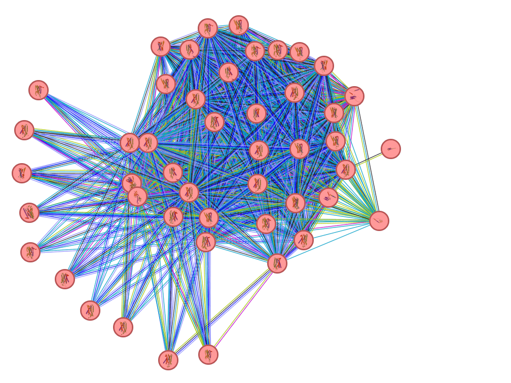

[Figure 16](figures/STRING/PD/string_olfactory_enrichment_Function.svg)

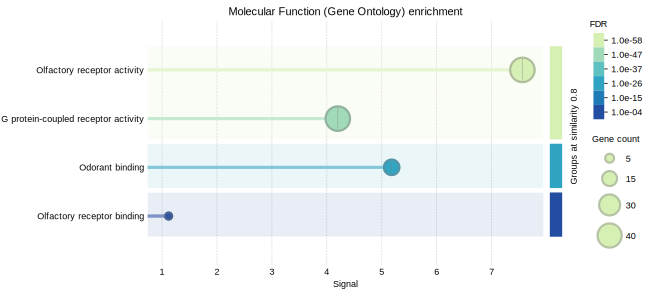

```{r}
#| echo: false
olfactory_enrichment_Function <- read.csv("figures/STRING/PD/string_olfactory_enrichment_Function.tsv", sep = "\t")
colnames(olfactory_enrichment_Function) <- c("ID", "description", "observed.gene.count", "background.gene.count", "strength", "signal", "false.discovery.rate", "matching.proteins.IDs", "matching.proteins.labels")

datatable(olfactory_enrichment_Function, 
          caption = "Table 14. Enriched Gene Ontology Molecular functions pathways for Olfactory cluster.",
          style = "bootstrap5", 
          extensions = 'Buttons', 
          options = list(dom = 'lBfrtip', 
              buttons = c('csv', 'excel')))
```

```{r}
#| echo: false
olfactory_gene_list <- read.csv("figures/STRING/PD/string_olfactory_gene_list.tsv", sep = "\t")
olfactory_gene_list <- unique(c(olfactory_gene_list$X.node1, olfactory_gene_list$node2))
olfactory_gene_list <- ensbl2geneid[ensbl2geneid$gene_name %in% olfactory_gene_list,]
olfactory_gene_list <- olfactory_gene_list[order(olfactory_gene_list$gene_name),]
rownames(olfactory_gene_list) <- NULL

datatable(olfactory_gene_list, 
          caption = "Table 15. Genes included to Olfactory cluster.",
          style = "bootstrap5", 
          extensions = 'Buttons', 
          options = list(dom = 'lBfrtip', 
              buttons = c('csv', 'excel')))
```

##### VGPC cluster 1
[Figure 17](figures/STRING/PD/string_VGPC.png)

[Figure 17 - STRING website](https://version-12-0.string-db.org/cgi/network?networkId=bTNsDUkqkUeN)


[Figure 18](figures/STRING/PD/string_VGPC_enrichment_RCTM.svg)

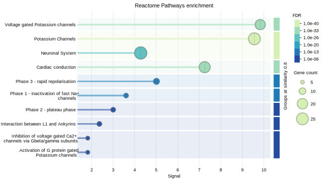

```{r}
#| echo: false
VGPC_enrichment_RCTM <- read.csv("figures/STRING/PD/string_VGPC_enrichment_RCTM.tsv", sep = "\t")
colnames(VGPC_enrichment_RCTM) <- c("ID", "description", "observed.gene.count", "background.gene.count", "strength", "signal", "false.discovery.rate", "matching.proteins.IDs", "matching.proteins.labels")

datatable(VGPC_enrichment_RCTM, 
          caption = "Table 16. Enriched Reactome pathways for VGPC cluster.",
          style = "bootstrap5", 
          extensions = 'Buttons', 
          options = list(dom = 'lBfrtip', 
              buttons = c('csv', 'excel')))
```

```{r}
#| echo: false
VGPC_gene_list <- read.csv("figures/STRING/PD/string_VGPC_gene_list.tsv", sep = "\t")
VGPC_gene_list <- unique(c(VGPC_gene_list$X.node1, VGPC_gene_list$node2))
VGPC_gene_list <- ensbl2geneid[ensbl2geneid$gene_name %in% VGPC_gene_list,]
VGPC_gene_list <- VGPC_gene_list[order(VGPC_gene_list$gene_name),]
rownames(VGPC_gene_list) <- NULL

datatable(VGPC_gene_list, 
          caption = "Table 17. Genes included to VGPC cluster.",
          style = "bootstrap5", 
          extensions = 'Buttons', 
          options = list(dom = 'lBfrtip', 
              buttons = c('csv', 'excel')))
```

##### Potassium ion transport 
[Figure 19](figures/STRING/PD/string_cluster_3.png)

[Figure 19 - STRING website](https://version-12-0.string-db.org/cgi/network?networkId=bU76dbSYrbzZ)


```{r}
#| echo: false
cluster_3_gene_list <- read.csv("figures/STRING/PD/string_cluster_3_gene_list.tsv", sep = "\t")
cluster_3_gene_list <- unique(c(cluster_3_gene_list$X.node1, cluster_3_gene_list$node2))
cluster_3_gene_list <- ensbl2geneid[ensbl2geneid$gene_name %in% cluster_3_gene_list,]
cluster_3_gene_list <- VGPC_gene_list[order(cluster_3_gene_list$gene_name),]
rownames(cluster_3_gene_list) <- NULL

datatable(cluster_3_gene_list, 
          caption = "Table 18. Genes included to Potassium ion transport.",
          style = "bootstrap5", 
          extensions = 'Buttons', 
          options = list(dom = 'lBfrtip', 
              buttons = c('csv', 'excel')))
```

[Table 19 - WebGestalt results](figures/STRING/PD/cluster_3_enrichment_results_wg.html)
```{r}
#| echo: false
cluster_3_enrichment_results_wg <- read.csv("figures/STRING/PD/cluster_3_enrichment_results_wg.txt", sep = "\t")

datatable(cluster_3_enrichment_results_wg, 
          caption = "Table 19. WebGestalt ORA results for Potassium ion transport.",
          style = "bootstrap5", 
          extensions = 'Buttons', 
          options = list(dom = 'lBfrtip', 
              buttons = c('csv', 'excel')))
```

## Healthy
```{r}
#| include: false
consistent_Healthy <- c(unique_intersections$`Healthy_ALL & Healthy_LRKK2 & Healthy_Parkin`, unique_intersections$`Healthy_LRKK2 & Healthy_Parkin`)

consistent_Healthy.df <- ensbl2geneid[ensbl2geneid$gene_id %in% consistent_Healthy,]
rownames(consistent_Healthy.df) <- NULL
```

```{r}
#| echo: false
datatable(consistent_Healthy.df, 
          caption = "Table 20. Consistent Healthy linked gene list (n = 270).",
          style = "bootstrap5", 
          extensions = 'Buttons', 
          options = list(dom = 'lBfrtip', 
              buttons = c('csv', 'excel')))
```

#### WebGestalt ORA
[Table 21 - WebGestalt results](figures/STRING/Healthy/healthy_enrichment_results_wg.html)

```{r}
#| echo: false
healthy_enrichment_results_wg <- read.csv("figures/STRING/Healthy/healthy_enrichment_results_wg.txt", sep = "\t")

datatable(healthy_enrichment_results_wg, 
          caption = "Table 21. WebGestalt ORA results for Healthy linked genes.",
          style = "bootstrap5", 
          extensions = 'Buttons', 
          options = list(dom = 'lBfrtip', 
              buttons = c('csv', 'excel')))
```

#### STRING analysis
##### Raw network
[Figure 20](figures/STRING/Healthy/string_raw.png)

[Figure 20 - STRING website](https://version-12-0.string-db.org/cgi/network?networkId=bBi5bHf3h9kn)

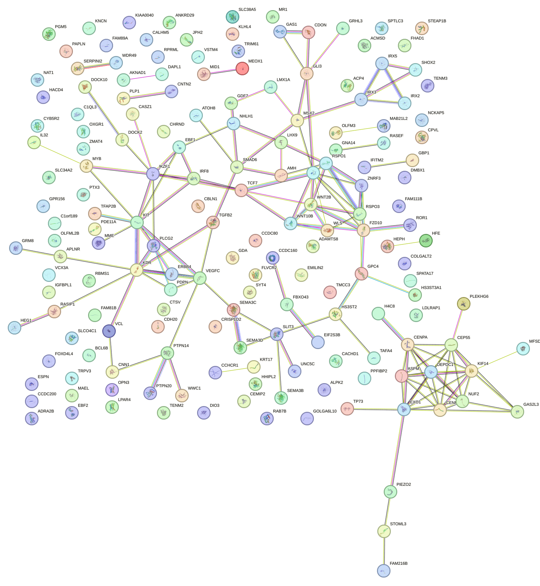

##### Clusterization
[Figure 21](figures/STRING/Healthy/string_clustering.png)

[Figure 21 - STRING website](https://version-12-0.string-db.org/cgi/network?networkId=brN1OwlSrVBp)

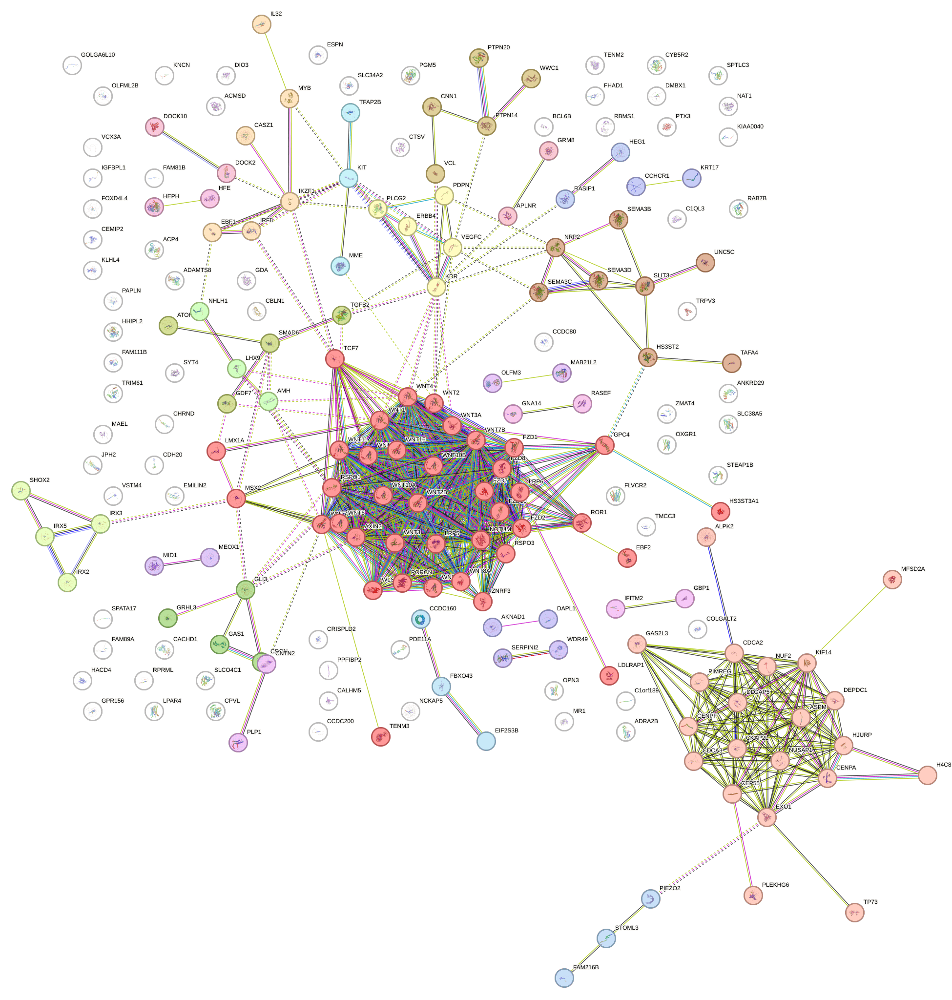

[Figure 22](figures/STRING/Healthy/clustering.png)


##### WNT cluster
[Figure 23](figures/STRING/Healthy/string_WNT.png)

[Figure 23 - STRING website](https://version-12-0.string-db.org/cgi/network?networkId=bGncWxCjBW27)


[Figure 24](figures/STRING/Healthy/string_WNT_enrichment_KEGG.svg)


```{r}
#| echo: false
string_WNT_enrichment_KEGG <- read.csv("figures/STRING/Healthy/string_WNT_enrichment_KEGG.tsv", sep = "\t")
colnames(string_WNT_enrichment_KEGG) <- c("ID", "description", "observed.gene.count", "background.gene.count", "strength", "signal", "false.discovery.rate", "matching.proteins.IDs", "matching.proteins.labels")

datatable(string_WNT_enrichment_KEGG, 
          caption = "Table 22. Enriched KEGG pathways for WNT cluster.",
          style = "bootstrap5", 
          extensions = 'Buttons', 
          options = list(dom = 'lBfrtip', 
              buttons = c('csv', 'excel')))
```

```{r}
#| echo: false
string_WNT_gene_list <- read.csv("figures/STRING/Healthy/string_WNT_gene_list.tsv", sep = "\t")
string_WNT_gene_list <- unique(c(string_WNT_gene_list$X.node1, string_WNT_gene_list$node2))
string_WNT_gene_list <- ensbl2geneid[ensbl2geneid$gene_name %in% string_WNT_gene_list,]
string_WNT_gene_list <- string_WNT_gene_list[order(string_WNT_gene_list$gene_name),]
rownames(string_WNT_gene_list) <- NULL

datatable(string_WNT_gene_list, 
          caption = "Table 23. Genes included to WNT cluster.",
          style = "bootstrap5", 
          extensions = 'Buttons', 
          options = list(dom = 'lBfrtip', 
              buttons = c('csv', 'excel')))
```

##### Chromatin cluster
[Figure 25](figures/STRING/Healthy/string_chromatin.png)

[Figure 25 - STRING website](https://version-12-0.string-db.org/cgi/network?networkId=bYuhll6L6QbO)

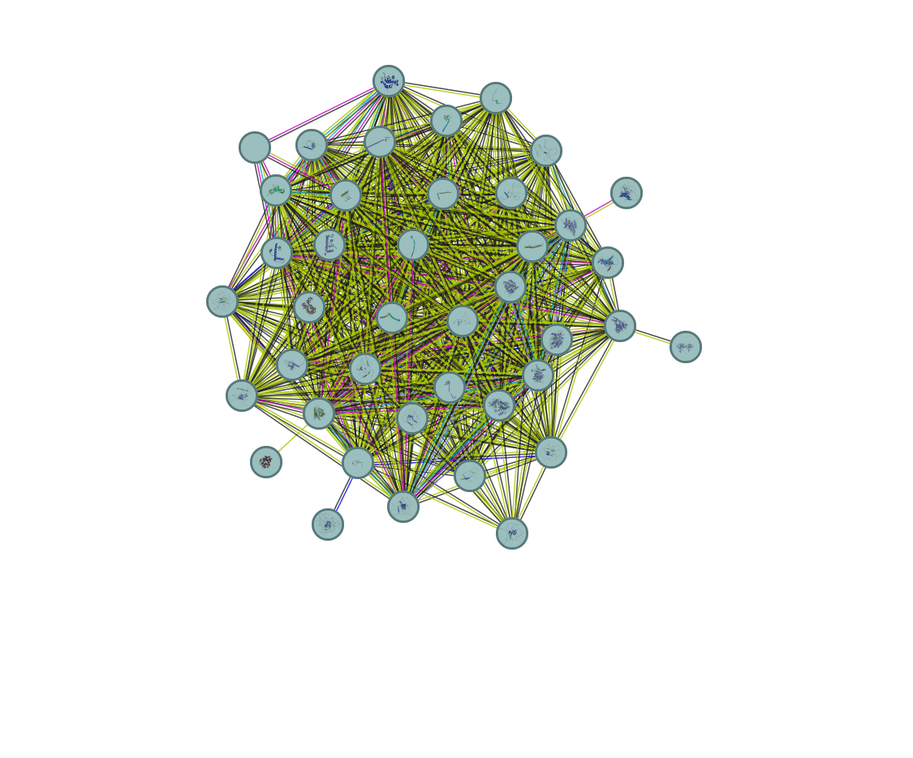

[Figure 26](figures/STRING/Healthy/string_chromatin_enrichment_Process.svg)

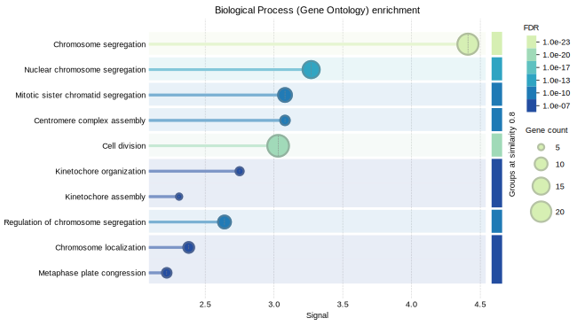

```{r}
#| echo: false
string_chromatin_enrichment_Process <- read.csv("figures/STRING/Healthy/string_chromatin_enrichment_Process.tsv", sep = "\t")
colnames(string_chromatin_enrichment_Process) <- c("ID", "description", "observed.gene.count", "background.gene.count", "strength", "signal", "false.discovery.rate", "matching.proteins.IDs", "matching.proteins.labels")

datatable(string_chromatin_enrichment_Process, 
          caption = "Table 24. Enriched GO Biological Process pathways for Chromatin cluster.",
          style = "bootstrap5", 
          extensions = 'Buttons', 
          options = list(dom = 'lBfrtip', 
              buttons = c('csv', 'excel')))
```

```{r}
#| echo: false
string_chromatin_gene_list <- read.csv("figures/STRING/Healthy/string_chromatin_gene_list.tsv", sep = "\t")
string_chromatin_gene_list <- unique(c(string_chromatin_gene_list$X.node1, string_chromatin_gene_list$node2))
string_chromatin_gene_list <- ensbl2geneid[ensbl2geneid$gene_name %in% string_chromatin_gene_list,]
string_chromatin_gene_list <- string_chromatin_gene_list[order(string_chromatin_gene_list$gene_name),]
rownames(string_chromatin_gene_list) <- NULL

datatable(string_chromatin_gene_list, 
          caption = "Table 25. Genes included to Chromatin cluster.",
          style = "bootstrap5", 
          extensions = 'Buttons', 
          options = list(dom = 'lBfrtip', 
              buttons = c('csv', 'excel')))
```

[Table 26 - WebGestalt results](figures/STRING/Healthy/string_chromatin_enrichment_results_wg.html)

```{r}
#| echo: false
string_chromatin_enrichment_results_wg <- read.csv("figures/STRING/Healthy/string_chromatin_enrichment_results_wg.txt", sep = "\t")

datatable(string_chromatin_enrichment_results_wg, 
          caption = "Table 26. WebGestalt ORA results for Chromatin cluster.",
          style = "bootstrap5", 
          extensions = 'Buttons', 
          options = list(dom = 'lBfrtip', 
              buttons = c('csv', 'excel')))
```

### Insertions between PD and Healthy linked DEG and STRING clusters
```{r}
#| include: false
DEG_STRING_1 <- list(PD = consistent_PD, 
                 Healthy = consistent_Healthy,
                 Olfactory = olfactory_gene_list$gene_id,
                 VGPC = VGPC_gene_list$gene_id,
                 Potassium_ion_transport = cluster_3_gene_list$gene_id,
                 WNT = string_WNT_gene_list$gene_id,
                 Chromatin = string_chromatin_gene_list$gene_id
)

DEG_STRING_upset_1 <- upset(fromList(DEG_STRING_1), 
      nintersects = 40, 
      nsets = 8, 
      order.by = "freq", 
      decreasing = T, 
      mb.ratio = c(0.6, 0.4),
      number.angles = 0, 
      text.scale = 1.1, 
      point.size = 2.8, 
      line.size = 1
)

# pdf("figures/DEG_STRING_upset_1.pdf", width = 8, height = 5)
# DEG_STRING_upset_1
# dev.off()
```

[Figure 27](figures/DEG_STRING_upset_1.pdf)

```{r fig.width=8, fig.height=5}
#| echo: false
#| message: false
#| warning: false
#| fig-cap: "Figure 27.  Intersections between PD and Healthy DEG and STRING clusters."
DEG_STRING_upset_1
```

### STRING clusters validation using GSEA
```{r}
#| include: false
get_ranks <- function(DEG){
      ranks.df <- -log10(DEG$pvalue)*sign(DEG$log2FoldChange)
      names(ranks.df) <- rownames(DEG)
      names(ranks.df) <- sapply(str_split(names(ranks.df), "\\."), function(x) x[1])    
      ranks.df <- sort(ranks.df, decreasing = T)
      return(ranks.df)
}

ranks <- get_ranks(deg)
ranks.lrrk2 <- get_ranks(degLRKK2)
ranks.Parkin <- get_ranks(degParkin)
ranks.B <- get_ranks(degB)
```

```{r}
#| include: false
ranks.df <- merge(ensbl2geneid, cbind(names(ranks), ranks), by = 1)
ranks.df <- ranks.df[order(ranks.df$ranks, decreasing = T),]

Olfactory <- unique(olfactory_gene_list$gene_id)
Potassium <- c(unique(cluster_3_gene_list$gene_id), unique(VGPC_gene_list$gene_id))
WNT <- unique(string_WNT_gene_list$gene_id)
Chromatin <- unique(string_chromatin_gene_list$gene_id)

df.Olfactory <- data.frame(gene_name = Olfactory, group = "Olfactory")
df.Potassium <- data.frame(gene_name = Potassium, group = "Potassium")
df.WNT <- data.frame(gene_name = WNT, group = "WNT")
df.Chromatin <- data.frame(gene_name = Chromatin, group = "Chromatin")

custom_genesets <- rbind(df.Olfactory, df.Potassium, df.WNT, df.Chromatin)

ranks.2 <- as.numeric(ranks.df$ranks)
names(ranks.2) <- ranks.df$gene_name
ranks.2 <- ranks.2[!duplicated(names(ranks.2))]
ranks.2 <- sort(ranks.2, decreasing = T)

gseaDEG_1 <- GSEA(geneList = ranks, TERM2GENE = custom_genesets[c(2,1)], eps = 0, pAdjustMethod = "fdr", 
                pvalueCutoff = 0.05, seed = 13)
gseaDEG_2 <- GSEA(geneList = ranks.lrrk2, TERM2GENE = custom_genesets[c(2,1)], eps = 0, pAdjustMethod = "fdr", 
                pvalueCutoff = 0.05, seed = 13)
gseaDEG_3 <- GSEA(geneList = ranks.Parkin, TERM2GENE = custom_genesets[c(2,1)], eps = 0, pAdjustMethod = "fdr", 
                pvalueCutoff = 0.05, seed = 13)
gseaDEG_4 <- GSEA(geneList = ranks.B, TERM2GENE = custom_genesets[c(2,1)], eps = 0, pAdjustMethod = "fdr", 
                pvalueCutoff = 0.05, seed = 13)

gseaDEG.df_1 <- as.data.frame(gseaDEG_1)
rownames(gseaDEG.df_1) <- NULL

gseaDEG.df_2 <- as.data.frame(gseaDEG_2)
rownames(gseaDEG.df_2) <- NULL

gseaDEG.df_3 <- as.data.frame(gseaDEG_3)
rownames(gseaDEG.df_3) <- NULL

gseaDEG.df_4 <- as.data.frame(gseaDEG_4)
rownames(gseaDEG.df_4) <- NULL

common_gsea_list <- c(gseaDEG_1, gseaDEG_2, gseaDEG_3)

common_gsea_1 <- GSEAmultiGP(gsea_list = common_gsea_list,
            geneSetID = "Potassium",
            exp_name = c("PD vs Healthy", "LRRK2 vs Healthy", "Parkin vs Healthy"), 
            legend.position = "right", 
            curve.col = brewer.pal(n = 4, name = "Set1"))

common_gsea_2 <- GSEAmultiGP(gsea_list = common_gsea_list,
            geneSetID = "Chromatin",
            exp_name = c("PD vs Healthy", "LRRK2 vs Healthy", "Parkin vs Healthy"), 
            legend.position = "right", 
            curve.col = brewer.pal(n = 4, name = "Set1"))

common_gsea_3 <- GSEAmultiGP(gsea_list = common_gsea_list,
            geneSetID = "WNT",
            exp_name = c("PD vs Healthy", "LRRK2 vs Healthy", "Parkin vs Healthy"), 
            legend.position = "right", 
            curve.col = brewer.pal(n = 4, name = "Set1"))
```

```{r}
#| echo: false
#| message: false
#| warning: false
datatable(gseaDEG.df_1[c(2:9)], 
          caption = "Table 27. Functional coherence of STRING/MCL clusters validated through Gene Set Enrichment Analysis (GSEA), demonstrating concordant enrichment of cluster-specific pathways in phenotype-ranked expression data (PD vs Healthy).",
          style = "bootstrap5", 
          extensions = 'Buttons', 
          options = list(dom = 'lBfrtip', 
              buttons = c('csv', 'excel')))
```

```{r}
#| echo: false
#| message: false
#| warning: false
datatable(gseaDEG.df_2[c(2:9)], 
          caption = "Table 28. Functional coherence of STRING/MCL clusters validated through Gene Set Enrichment Analysis (GSEA), demonstrating concordant enrichment of cluster-specific pathways in phenotype-ranked expression data (LRRK2 vs Healthy).",
          style = "bootstrap5", 
          extensions = 'Buttons', 
          options = list(dom = 'lBfrtip', 
              buttons = c('csv', 'excel')))
```

```{r}
#| echo: false
#| message: false
#| warning: false
datatable(gseaDEG.df_3[c(2:9)], 
          caption = "Table 29. Functional coherence of STRING/MCL clusters validated through Gene Set Enrichment Analysis (GSEA), demonstrating concordant enrichment of cluster-specific pathways in phenotype-ranked expression data (Parkin vs Healthy).",
          style = "bootstrap5", 
          extensions = 'Buttons', 
          options = list(dom = 'lBfrtip', 
              buttons = c('csv', 'excel')))
```

```{r}
#| echo: false
#| message: false
#| warning: false
datatable(gseaDEG.df_4[c(2:9)], 
          caption = "Table 30. Functional coherence of STRING/MCL clusters validated through Gene Set Enrichment Analysis (GSEA), demonstrating concordant enrichment of cluster-specific pathways in phenotype-ranked expression data (LRRK2 vs Parkin).",
          style = "bootstrap5", 
          extensions = 'Buttons', 
          options = list(dom = 'lBfrtip', 
              buttons = c('csv', 'excel')))
```

```{r fig.width=6, fig.height=6}
#| echo: false
#| message: false
#| warning: false
download_this(
  common_gsea_1,
  output_name = "common_gsea_1",
  output_extension = ".pdf",
  button_label = "PDF",
  button_type = "primary"
)
```

```{r fig.width=6.5, fig.height=4.5}
#| echo: false
#| message: false
#| warning: false
#| fig-cap: "Figure 28. Functional coherence of STRING/MCL clusters validated through Gene Set Enrichment Analysis (GSEA), demonstrating concordant enrichment of cluster-specific pathways in phenotype-ranked expression data (Potassium signaling)."
common_gsea_1
```

```{r fig.width=6, fig.height=6}
#| echo: false
#| message: false
#| warning: false
download_this(
  common_gsea_2,
  output_name = "common_gsea_2",
  output_extension = ".pdf",
  button_label = "PDF",
  button_type = "primary"
)
```

```{r fig.width=6.5, fig.height=4.5}
#| echo: false
#| message: false
#| warning: false
#| fig-cap: "Figure 29. Functional coherence of STRING/MCL clusters validated through Gene Set Enrichment Analysis (GSEA), demonstrating concordant enrichment of cluster-specific pathways in phenotype-ranked expression data (Chromatin)."
common_gsea_2
```

```{r fig.width=6, fig.height=6}
#| echo: false
#| message: false
#| warning: false
download_this(
  common_gsea_3,
  output_name = "common_gsea_3",
  output_extension = ".pdf",
  button_label = "PDF",
  button_type = "primary"
)
```

```{r fig.width=6.5, fig.height=4.5}
#| echo: false
#| message: false
#| warning: false
#| fig-cap: "Figure 30. Functional coherence of STRING/MCL clusters validated through Gene Set Enrichment Analysis (GSEA), demonstrating concordant enrichment of cluster-specific pathways in phenotype-ranked expression data (WNT)."
common_gsea_3
```

## LRRK2
### Upregulation
```{r}
#| include: false
LRRK2_up = unique_intersections$`PD_LRKK2 & LRRK2`
LRRK2_up.df <- ensbl2geneid[ensbl2geneid$gene_id %in% LRRK2_up,]
rownames(LRRK2_up.df) <- NULL
```

```{r}
#| echo: false
datatable(LRRK2_up.df, 
          caption = "Table 31. Consistent LRRK2 upregulated gene list (n = 503).",
          style = "bootstrap5", 
          extensions = 'Buttons', 
          options = list(dom = 'lBfrtip', 
              buttons = c('csv', 'excel')))
```

#### WebGestalt ORA
[Table 32 - WebGestalt results](figures/STRING/LRRK2_up/LRRK2_up_enrichment_results_wg.html)

```{r}
#| echo: false
LRRK2_up_enrichment_results_wg <- read.csv("figures/STRING/LRRK2_up/LRRK2_up_enrichment_results_wg.txt", sep = "\t")

datatable(LRRK2_up_enrichment_results_wg, 
          caption = "Table 32. WebGestalt ORA results for LRRK2 upregulation linked genes.",
          style = "bootstrap5", 
          extensions = 'Buttons', 
          options = list(dom = 'lBfrtip', 
              buttons = c('csv', 'excel')))
```

#### STRING analysis
##### Raw network
[Figure 31](figures/STRING/LRRK2_up/string_raw.png)

[Figure 31 - STRING website](https://version-12-0.string-db.org/cgi/network?networkId=bDypb2taIwBM)

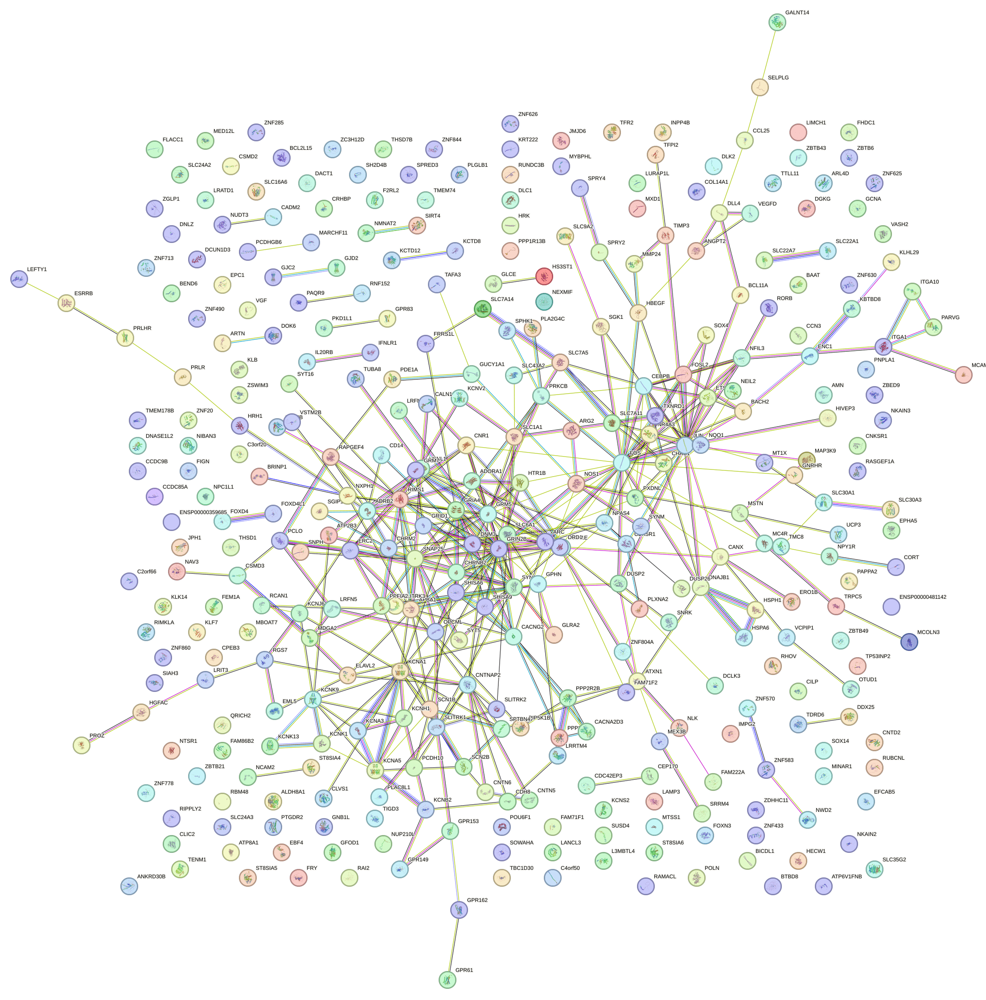

##### Clusterization
[Figure 32](figures/STRING/LRRK2_up/string_clusterisation.png)

[Figure 32 - STRING website](https://version-12-0.string-db.org/cgi/network?networkId=bk9OiBJJknj8)


[Figure 33](figures/STRING/LRRK2_up/clusterisation.png)


##### Synapse cluster
[Figure 34](figures/STRING/LRRK2_up/string_synapse.png)

[Figure 34 - STRING website](https://version-12-0.string-db.org/cgi/network?networkId=b24LWMywmW9R)


```{r}
#| echo: false
synapse_gene_list <- read.csv("figures/STRING/LRRK2_up/string_synapse_gene_list.tsv", sep = "\t")
synapse_gene_list <- unique(c(synapse_gene_list$X.node1, synapse_gene_list$node2))
synapse_gene_list <- ensbl2geneid[ensbl2geneid$gene_name %in% synapse_gene_list,]
synapse_gene_list <- synapse_gene_list[order(synapse_gene_list$gene_name),]
rownames(synapse_gene_list) <- NULL

datatable(synapse_gene_list, 
          caption = "Table 33. Genes included to Synapse cluster.",
          style = "bootstrap5", 
          extensions = 'Buttons', 
          options = list(dom = 'lBfrtip', 
              buttons = c('csv', 'excel')))
```

[Table 34 - WebGestalt results](figures/STRING/LRRK2_up/string_synapse_enrichment_results_wg.html)

```{r}
#| echo: false
synapse_enrichment_results_wg <- read.csv("figures/STRING/LRRK2_up/string_synapse_enrichment_results_wg.txt", sep = "\t")

datatable(synapse_enrichment_results_wg, 
          caption = "Table 34. WebGestalt ORA results for Synapse cluster.",
          style = "bootstrap5", 
          extensions = 'Buttons', 
          options = list(dom = 'lBfrtip', 
              buttons = c('csv', 'excel')))
```

### Downregulation
```{r}
#| include: false
LRRK2_down = unique_intersections$`Healthy_LRKK2 & Parkin`
LRRK2_down.df <- ensbl2geneid[ensbl2geneid$gene_id %in% LRRK2_down,]
rownames(LRRK2_down.df) <- NULL
```

```{r}
#| echo: false
datatable(LRRK2_down.df, 
          caption = "Table 35. Consistent LRRK2 downregulated gene list (n = 1141).",
          style = "bootstrap5", 
          extensions = 'Buttons', 
          options = list(dom = 'lBfrtip', 
              buttons = c('csv', 'excel')))
```

#### WebGestalt ORA
[Table 36 - WebGestalt results](figures/STRING/LRRK2_down/LRRK2_down_enrichment_results_wg.html)

```{r}
#| echo: false
LRRK2_down_enrichment_results_wg <- read.csv("figures/STRING/LRRK2_down/LRRK2_down_enrichment_results_wg.txt", sep = "\t")

datatable(LRRK2_down_enrichment_results_wg, 
          caption = "Table 36. WebGestalt ORA results for LRRK2 downregulation genes.",
          style = "bootstrap5", 
          extensions = 'Buttons', 
          options = list(dom = 'lBfrtip', 
              buttons = c('csv', 'excel')))
```

#### STRING analysis
##### Raw network
[Figure 35](figures/STRING/LRRK2_down/string_raw.svg)

[Figure 35 - STRING website](https://version-12-0.string-db.org/cgi/network?networkId=bc2iui0fiKvS)

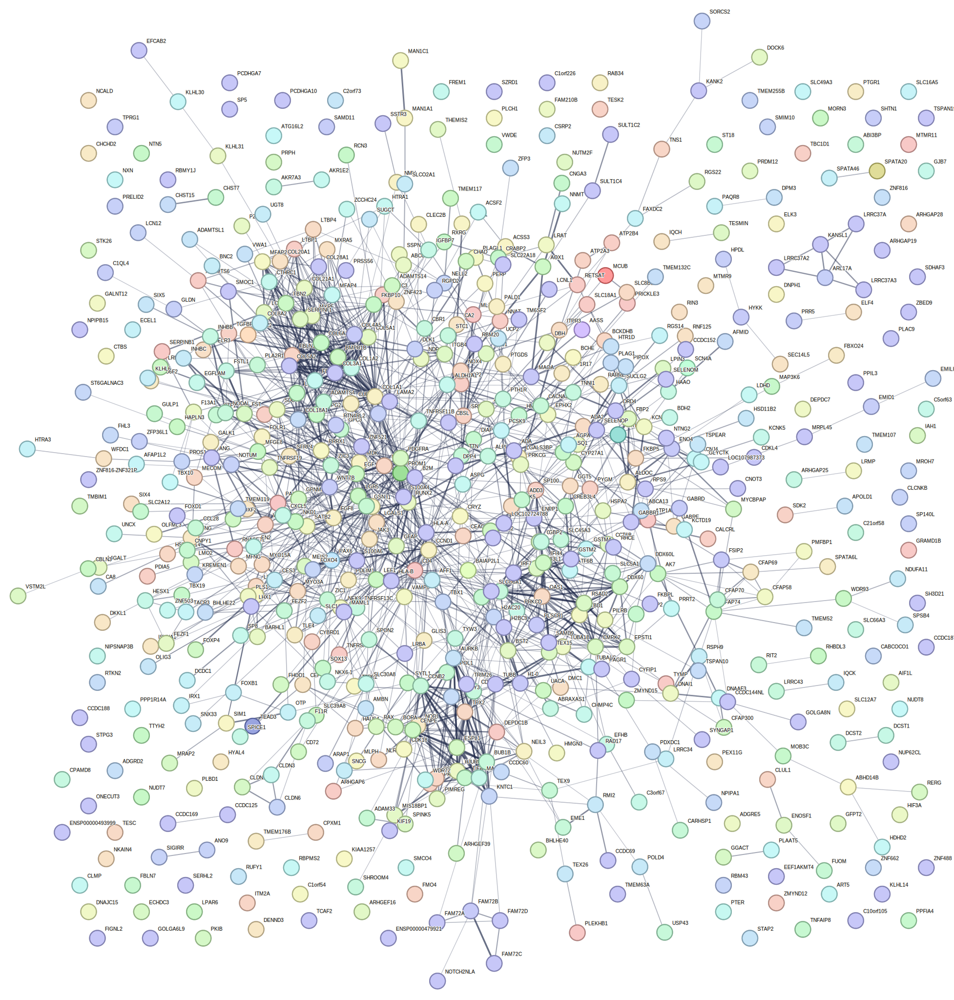

##### Clusterization
[Figure 36](figures/STRING/LRRK2_down/string_clusterisation.png)

[Figure 36 - STRING website](https://version-12-0.string-db.org/cgi/network?networkId=bs06sesb86bX)


[Figure 37](figures/STRING/LRRK2_down/clusterisation.png)

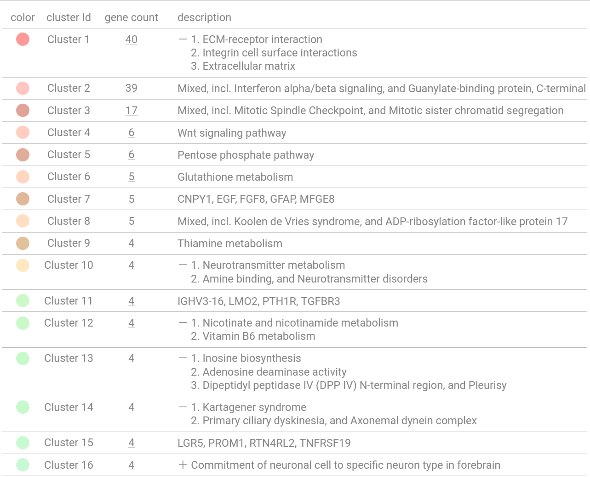

##### ECM cluster
[Figure 38](figures/STRING/LRRK2_down/string_ECM.png)

[Figure 38 - STRING website](https://version-12-0.string-db.org/cgi/network?networkId=bXGSCw6dlMai)

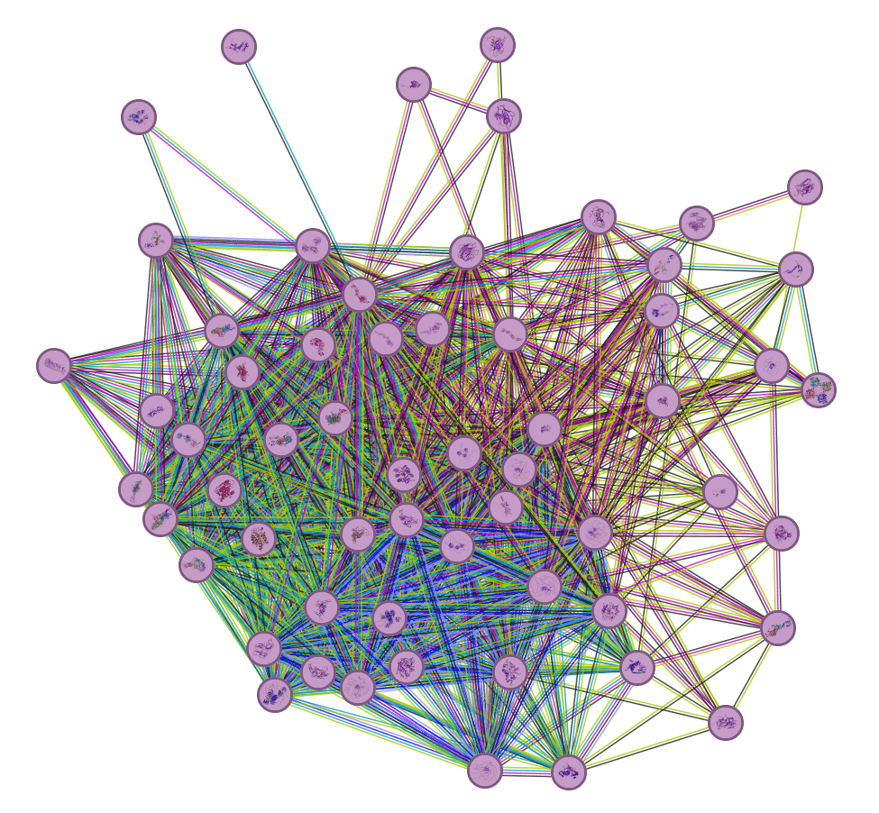

[Figure 39](figures/STRING/LRRK2_down/string_ECM_enrichment_RCTM.svg)

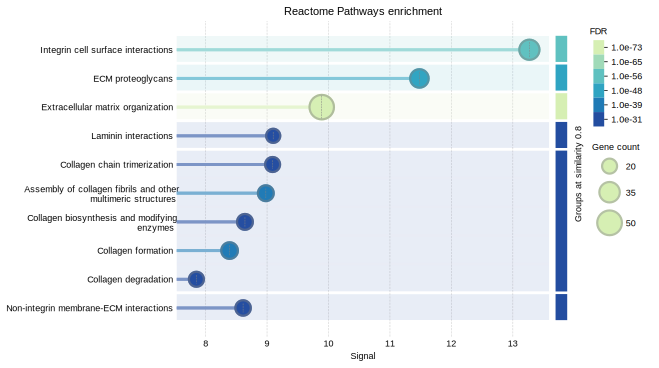

```{r}
#| echo: false
ECM_enrichment_RCTM <- read.csv("figures/STRING/LRRK2_down/string_ECM_enrichment_RCTM.tsv", sep = "\t")
colnames(ECM_enrichment_RCTM) <- c("ID", "description", "observed.gene.count", "background.gene.count", "strength", "signal", "false.discovery.rate", "matching.proteins.IDs", "matching.proteins.labels")

datatable(ECM_enrichment_RCTM, 
          caption = "Table 37. Enriched Reactome pathways for ECM cluster.",
          style = "bootstrap5", 
          extensions = 'Buttons', 
          options = list(dom = 'lBfrtip', 
              buttons = c('csv', 'excel')))
```

```{r}
#| echo: false
ECM_gene_list <- read.csv("figures/STRING/LRRK2_down/string_ECM_gene_list.tsv", sep = "\t")
ECM_gene_list <- unique(c(ECM_gene_list$X.node1, ECM_gene_list$node2))
ECM_gene_list <- ensbl2geneid[ensbl2geneid$gene_name %in% ECM_gene_list,]
ECM_gene_list <- ECM_gene_list[order(ECM_gene_list$gene_name),]
rownames(ECM_gene_list) <- NULL

datatable(ECM_gene_list, 
          caption = "Table 38. Genes included to ECM cluster.",
          style = "bootstrap5", 
          extensions = 'Buttons', 
          options = list(dom = 'lBfrtip', 
              buttons = c('csv', 'excel')))
```

##### Interferon cluster
[Figure 40](figures/STRING/LRRK2_down/string_interferon.png)

[Figure 40 - STRING website](https://version-12-0.string-db.org/cgi/network?networkId=bXJ6psXkrY62)


[Figure 41](figures/STRING/LRRK2_down/string_interferon_enrichment_RCTM.svg)

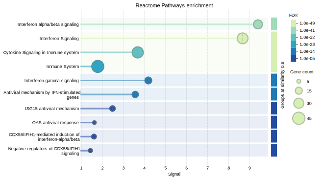

```{r}
#| echo: false
interferon_enrichment_RCTM <- read.csv("figures/STRING/LRRK2_down/string_interferon_enrichment_RCTM.tsv", sep = "\t")
colnames(interferon_enrichment_RCTM) <- c("ID", "description", "observed.gene.count", "background.gene.count", "strength", "signal", "false.discovery.rate", "matching.proteins.IDs", "matching.proteins.labels")

datatable(interferon_enrichment_RCTM, 
          caption = "Table 39. Enriched Reactome pathways for Interferon cluster.",
          style = "bootstrap5", 
          extensions = 'Buttons', 
          options = list(dom = 'lBfrtip', 
              buttons = c('csv', 'excel')))
```

```{r}
#| echo: false
interferon_gene_list <- read.csv("figures/STRING/LRRK2_down/string_interferon_gene_list.tsv", sep = "\t")
interferon_gene_list <- unique(c(interferon_gene_list$X.node1, interferon_gene_list$node2))
interferon_gene_list <- ensbl2geneid[ensbl2geneid$gene_name %in% interferon_gene_list,]
interferon_gene_list <- interferon_gene_list[order(interferon_gene_list$gene_name),]
rownames(interferon_gene_list) <- NULL

datatable(interferon_gene_list, 
          caption = "Table 40. Genes included to Interferon cluster.",
          style = "bootstrap5", 
          extensions = 'Buttons', 
          options = list(dom = 'lBfrtip', 
              buttons = c('csv', 'excel')))
```

### Insertions between PD and Healthy linked DEG and STRING clusters
```{r}
#| include: false
DEG_STRING_2 <- list(LRRK2_up = LRRK2_up, 
                     LRRK2_down = LRRK2_down,
                     Synapse = synapse_gene_list$gene_id,
                     ECM = ECM_gene_list$gene_id,
                     Interferon = interferon_gene_list$gene_id
)

DEG_STRING_upset_2 <- upset(fromList(DEG_STRING_2), 
      nintersects = 40, 
      nsets = 8, 
      order.by = "freq", 
      decreasing = T, 
      mb.ratio = c(0.6, 0.4),
      number.angles = 0, 
      text.scale = 1.1, 
      point.size = 2.8, 
      line.size = 1
)

# pdf("figures/DEG_STRING_upset_2.pdf", width = 8, height = 5)
# DEG_STRING_upset_2
# dev.off()
```

[Figure 42](figures/DEG_STRING_upset_2.pdf)

```{r fig.width=8, fig.height=5}
#| echo: false
#| message: false
#| warning: false
#| fig-cap: "Figure 42.  Intersections between LRRK2 DEGs and STRING clusters."
DEG_STRING_upset_2
```

### STRING clusters validation using GSEA
```{r}
#| include: false
Synapse <- unique(synapse_gene_list$gene_id)
ECM <- unique(ECM_gene_list$gene_id)
Interferon <- unique(interferon_gene_list$gene_id)

df.Synapse <- data.frame(gene_name = Synapse, group = "Synapse")
df.ECM <- data.frame(gene_name = ECM, group = "ECM")
df.Interferon <- data.frame(gene_name = Interferon, group = "Interferon")

custom_genesets.lrrk2 <- rbind(df.Synapse, df.ECM, df.Interferon)

gseaDEG.lrrk2_1 <- GSEA(geneList = ranks, TERM2GENE = custom_genesets.lrrk2[c(2,1)], eps = 0, pAdjustMethod = "fdr", 
                pvalueCutoff = 0.05, seed = 13)

gseaDEG.lrrk2_2 <- GSEA(geneList = ranks.lrrk2, TERM2GENE = custom_genesets.lrrk2[c(2,1)], eps = 0, pAdjustMethod = "fdr", 
                pvalueCutoff = 0.05, seed = 13)

gseaDEG.lrrk2_3 <- GSEA(geneList = ranks.Parkin, TERM2GENE = custom_genesets.lrrk2[c(2,1)], eps = 0, pAdjustMethod = "fdr", 
                pvalueCutoff = 0.05, seed = 13)

gseaDEG.lrrk2_4 <- GSEA(geneList = ranks.B, TERM2GENE = custom_genesets.lrrk2[c(2,1)], eps = 0, pAdjustMethod = "fdr", 
                pvalueCutoff = 0.05, seed = 13)


gseaDEG.lrrk2.df_1 <- as.data.frame(gseaDEG.lrrk2_1)
rownames(gseaDEG.lrrk2.df_1) <- NULL

gseaDEG.lrrk2.df_2 <- as.data.frame(gseaDEG.lrrk2_2)
rownames(gseaDEG.lrrk2.df_2) <- NULL

gseaDEG.lrrk2.df_3 <- as.data.frame(gseaDEG.lrrk2_3)
rownames(gseaDEG.lrrk2.df_3) <- NULL

gseaDEG.lrrk2.df_4 <- as.data.frame(gseaDEG.lrrk2_4)
rownames(gseaDEG.lrrk2.df_4) <- NULL

lrrk2_gsea_1 <- GSEAmultiGP(gsea_list = c(gseaDEG.lrrk2_2, gseaDEG.lrrk2_4),
            geneSetID = "Synapse",
            exp_name = c("LRRK2 vs Healthy", "LRRK2 vs Parkin"), 
            legend.position = "right", 
            curve.col = brewer.pal(n = 4, name = "Set1")[c(2,4)])

lrrk2_gsea_2 <- GSEAmultiGP(gsea_list = c(gseaDEG.lrrk2_2, gseaDEG.lrrk2_4),
            geneSetID = "Interferon",
            exp_name = c("LRRK2 vs Healthy", "LRRK2 vs Parkin"), 
            legend.position = "right", 
            curve.col = brewer.pal(n = 4, name = "Set1")[c(2,4)])

lrrk2_gsea_3 <- GSEAmultiGP(gsea_list = c(gseaDEG.lrrk2_2, gseaDEG.lrrk2_4),
            geneSetID = "ECM",
            exp_name = c("LRRK2 vs Healthy", "LRRK2 vs Parkin"), 
            legend.position = "right", 
            curve.col = brewer.pal(n = 4, name = "Set1")[c(2,4)])
```

```{r}
#| echo: false
#| message: false
#| warning: false
datatable(gseaDEG.lrrk2.df_1[c(2:9)], 
          caption = "Table 41. Functional coherence of STRING/MCL clusters validated through Gene Set Enrichment Analysis (GSEA), demonstrating concordant enrichment of cluster-specific pathways in phenotype-ranked expression data (PD vs Healthy).",
          style = "bootstrap5", 
          extensions = 'Buttons', 
          options = list(dom = 'lBfrtip', 
              buttons = c('csv', 'excel')))
```

```{r}
#| echo: false
#| message: false
#| warning: false
datatable(gseaDEG.lrrk2.df_2[c(2:9)], 
          caption = "Table 42. Functional coherence of STRING/MCL clusters validated through Gene Set Enrichment Analysis (GSEA), demonstrating concordant enrichment of cluster-specific pathways in phenotype-ranked expression data (LRRK2 vs Healthy).",
          style = "bootstrap5", 
          extensions = 'Buttons', 
          options = list(dom = 'lBfrtip', 
              buttons = c('csv', 'excel')))
```

```{r}
#| echo: false
#| message: false
#| warning: false
datatable(gseaDEG.lrrk2.df_4[c(2:9)], 
          caption = "Table 43. Functional coherence of STRING/MCL clusters validated through Gene Set Enrichment Analysis (GSEA), demonstrating concordant enrichment of cluster-specific pathways in phenotype-ranked expression data (LRRK2 vs Parkin).",
          style = "bootstrap5", 
          extensions = 'Buttons', 
          options = list(dom = 'lBfrtip', 
              buttons = c('csv', 'excel')))
```

```{r fig.width=6.5, fig.height=4.5}
#| echo: false
#| message: false
#| warning: false
download_this(
  lrrk2_gsea_1,
  output_name = "lrrk2_gsea_1",
  output_extension = ".pdf",
  button_label = "PDF",
  button_type = "primary"
)
```

```{r fig.width=6.5, fig.height=4.5}
#| echo: false
#| message: false
#| warning: false
#| fig-cap: "Figure 43. Functional coherence of STRING/MCL clusters validated through Gene Set Enrichment Analysis (GSEA), demonstrating concordant enrichment of cluster-specific pathways in phenotype-ranked expression data (Synapse)."
lrrk2_gsea_1
```

```{r fig.width=6.5, fig.height=4.5}
#| echo: false
#| message: false
#| warning: false
download_this(
  lrrk2_gsea_2,
  output_name = "lrrk2_gsea_2",
  output_extension = ".pdf",
  button_label = "PDF",
  button_type = "primary"
)
```

```{r fig.width=6.5, fig.height=4.5}
#| echo: false
#| message: false
#| warning: false
#| fig-cap: "Figure 44. Functional coherence of STRING/MCL clusters validated through Gene Set Enrichment Analysis (GSEA), demonstrating concordant enrichment of cluster-specific pathways in phenotype-ranked expression data (Interferon)."
lrrk2_gsea_2
```

```{r fig.width=6.5, fig.height=4.5}
#| echo: false
#| message: false
#| warning: false
download_this(
  lrrk2_gsea_3,
  output_name = "lrrk2_gsea_3",
  output_extension = ".pdf",
  button_label = "PDF",
  button_type = "primary"
)
```

```{r fig.width=6.5, fig.height=4.5}
#| echo: false
#| message: false
#| warning: false
#| fig-cap: "Figure 45. Functional coherence of STRING/MCL clusters validated through Gene Set Enrichment Analysis (GSEA), demonstrating concordant enrichment of cluster-specific pathways in phenotype-ranked expression data (ECM)."
lrrk2_gsea_3
```

## Parkin
### Upregulation
```{r}
#| include: false
Parkin_up = unique_intersections$`PD_Parkin & Parkin`
Parkin_up.df <- ensbl2geneid[ensbl2geneid$gene_id %in% Parkin_up,]
rownames(Parkin_up.df) <- NULL
```

```{r}
#| echo: false
datatable(Parkin_up.df, 
          caption = "Table 44. Consistent Parkin upregulated gene list (n = 124).",
          style = "bootstrap5", 
          extensions = 'Buttons', 
          options = list(dom = 'lBfrtip', 
              buttons = c('csv', 'excel')))
```

#### WebGestalt ORA
[Table 45 - WebGestalt results](figures/STRING/Parkin_up/Parkin_up_enrichment_results_wg.html)

```{r}
#| echo: false
Parkin_up_enrichment_results_wg <- read.csv("figures/STRING/Parkin_up/Parkin_up_enrichment_results_wg.txt", sep = "\t")

datatable(Parkin_up_enrichment_results_wg, 
          caption = "Table 45. WebGestalt ORA results for Parkin upregulation genes.",
          style = "bootstrap5", 
          extensions = 'Buttons', 
          options = list(dom = 'lBfrtip', 
              buttons = c('csv', 'excel')))
```

#### STRING analysis
##### Raw network
[Figure 46](figures/STRING/Parkin_up/string_raw.png)

[Figure 46 - STRING website](https://version-12-0.string-db.org/cgi/network?networkId=bZabxpJUZ5JK)


##### Clusterization
[Figure 47](figures/STRING/Parkin_up/string_clusterisation.png)

[Figure 47 - STRING website](https://version-12-0.string-db.org/cgi/network?networkId=bFthhtmsAAB0)

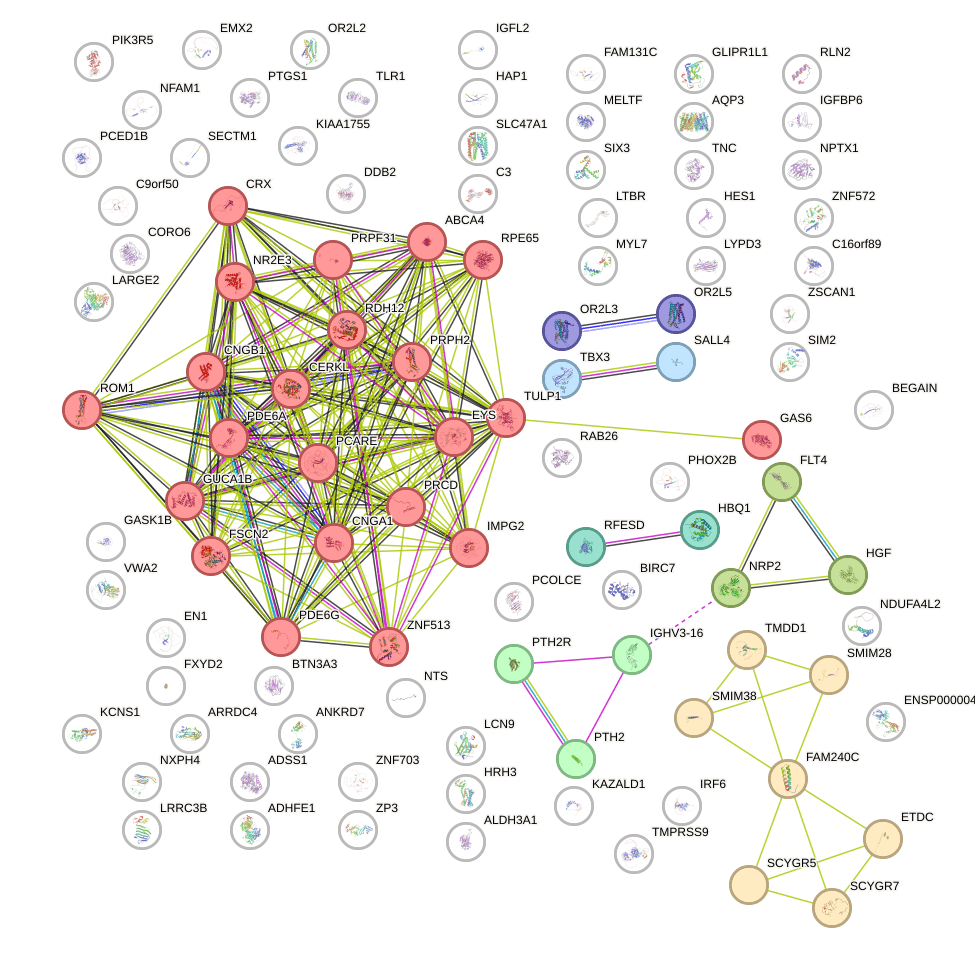

[Figure 48](figures/STRING/Parkin_up/clusterisation.png)

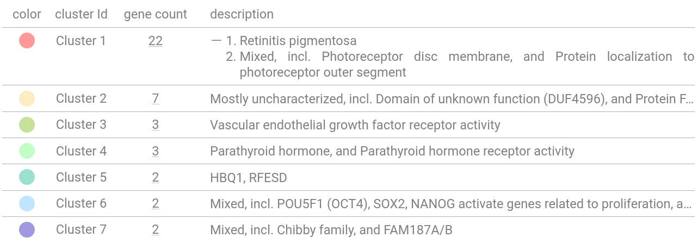

##### Retina cluster
[Figure 49](figures/STRING/Parkin_up/string_retina.png)

[Figure 49 - STRING website](https://version-12-0.string-db.org/cgi/network?networkId=broF4y138llJ)


[Figure 50](figures/STRING/Parkin_up/string_retina_enrichment_Process.svg)

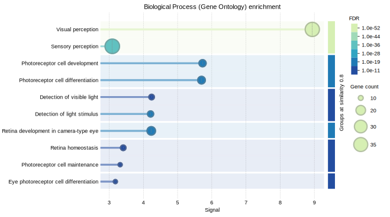

```{r}
#| echo: false
retina_enrichment_Process <- read.csv("figures/STRING/Parkin_up/string_retina_enrichment_Process.tsv", sep = "\t")
colnames(retina_enrichment_Process) <- c("ID", "description", "observed.gene.count", "background.gene.count", "strength", "signal", "false.discovery.rate", "matching.proteins.IDs", "matching.proteins.labels")

datatable(retina_enrichment_Process, 
          caption = "Table 46. Enriched GO Biological Process pathways for Retina cluster.",
          style = "bootstrap5", 
          extensions = 'Buttons', 
          options = list(dom = 'lBfrtip', 
              buttons = c('csv', 'excel')))
```

```{r}
#| echo: false
retina_gene_list <- read.csv("figures/STRING/Parkin_up/string_retina_gene_list.tsv", sep = "\t")
retina_gene_list <- unique(c(retina_gene_list$X.node1, retina_gene_list$node2))
retina_gene_list <- ensbl2geneid[ensbl2geneid$gene_name %in% retina_gene_list,]
retina_gene_list <- retina_gene_list[order(retina_gene_list$gene_name),]
rownames(retina_gene_list) <- NULL

datatable(retina_gene_list, 
          caption = "Table 47. Genes included to Retina cluster.",
          style = "bootstrap5", 
          extensions = 'Buttons', 
          options = list(dom = 'lBfrtip', 
              buttons = c('csv', 'excel')))
```

### Downregulation
```{r}
#| include: false
Parkin_down = unique_intersections$`Healthy_Parkin & LRRK2`
Parkin_down.df <- ensbl2geneid[ensbl2geneid$gene_id %in% Parkin_down,]
rownames(Parkin_down.df) <- NULL
```

```{r}
#| echo: false
datatable(Parkin_down.df, 
          caption = "Table 48. Consistent Parkin downregulation gene list (n = 96).",
          style = "bootstrap5", 
          extensions = 'Buttons', 
          options = list(dom = 'lBfrtip', 
              buttons = c('csv', 'excel')))
```

#### WebGestalt ORA
[Table 51 - WebGestalt results](figures/STRING/Parkin_down/Parkin_down_enrichment_results_wg.html)

```{r}
#| echo: false
Parkin_down_enrichment_results_wg <- read.csv("figures/STRING/Parkin_down/Parkin_down_enrichment_results_wg.txt", sep = "\t")

datatable(Parkin_down_enrichment_results_wg, 
          caption = "Table 49. WebGestalt ORA results for Parkin downregulation genes.",
          style = "bootstrap5", 
          extensions = 'Buttons', 
          options = list(dom = 'lBfrtip', 
              buttons = c('csv', 'excel')))
```

#### STRING analysis
##### Raw network
[Figure 51](figures/STRING/Parkin_down/string_raw.png)

[Figure 51 - STRING website](https://version-12-0.string-db.org/cgi/network?networkId=b5gnoSwsCVPe)

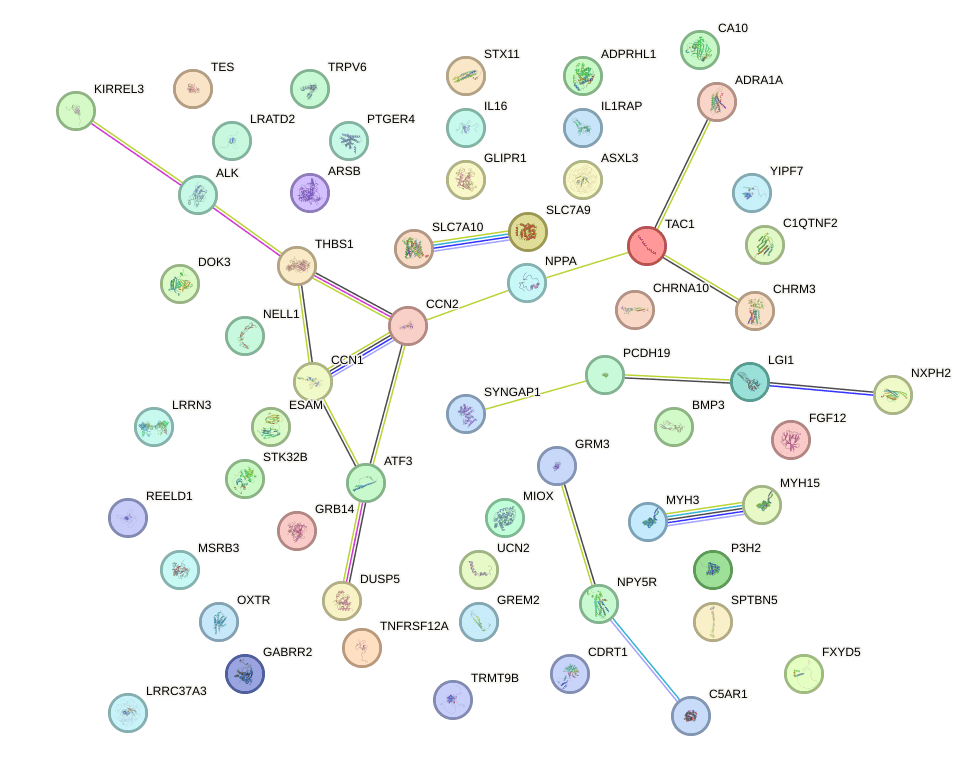

##### Clusterization
[Figure 52](figures/STRING/Parkin_down/string_clusterisation.png)

[Figure 52 - STRING website](https://version-12-0.string-db.org/cgi/network?networkId=bjsA7cFzCU8e)

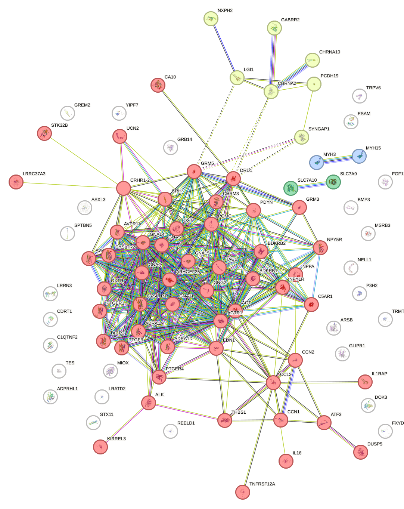

[Figure 53](figures/STRING/Parkin_down/clusterisation.png)


##### Retina cluster
[Figure 54](figures/STRING/Parkin_down/string_GPCR.png)

[Figure 54 - STRING website](https://version-12-0.string-db.org/cgi/network?networkId=bodcxix6qARf)

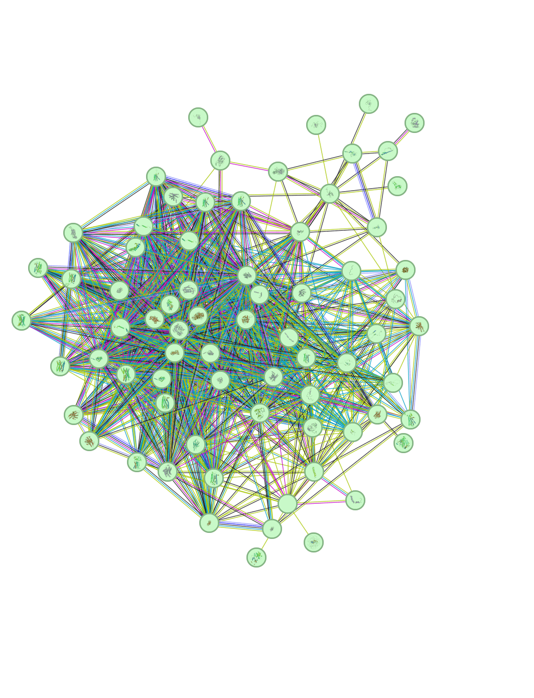

[Figure 55](figures/STRING/Parkin_down/string_GPCR_enrichment_RCTM.svg)


```{r}
#| echo: false
GPCR_enrichment_RCTM <- read.csv("figures/STRING/Parkin_down/string_GPCR_enrichment_RCTM.tsv", sep = "\t")
colnames(GPCR_enrichment_RCTM) <- c("ID", "description", "observed.gene.count", "background.gene.count", "strength", "signal", "false.discovery.rate", "matching.proteins.IDs", "matching.proteins.labels")

datatable(GPCR_enrichment_RCTM, 
          caption = "Table 50. Enriched Reactome pathways for GPCR cluster.",
          style = "bootstrap5", 
          extensions = 'Buttons', 
          options = list(dom = 'lBfrtip', 
              buttons = c('csv', 'excel')))
```

```{r}
#| echo: false
GPCR_gene_list <- read.csv("figures/STRING/Parkin_down/string_GPCR_gene_list.tsv", sep = "\t")
GPCR_gene_list <- unique(c(GPCR_gene_list$X.node1, GPCR_gene_list$node2))
GPCR_gene_list <- ensbl2geneid[ensbl2geneid$gene_name %in% GPCR_gene_list,]
GPCR_gene_list <- GPCR_gene_list[order(GPCR_gene_list$gene_name),]
rownames(GPCR_gene_list) <- NULL

datatable(GPCR_gene_list, 
          caption = "Table 51. Genes included to GPCR cluster.",
          style = "bootstrap5", 
          extensions = 'Buttons', 
          options = list(dom = 'lBfrtip', 
              buttons = c('csv', 'excel')))
```

### Insertions between PD and Healthy linked DEG and STRING clusters
```{r}
#| include: false
DEG_STRING_3 <- list(Parkin_up = Parkin_up, 
                     Parkin_down = Parkin_down,
                     Retina = retina_gene_list$gene_id,
                     GPCR = GPCR_gene_list$gene_id
)

DEG_STRING_upset_3 <- upset(fromList(DEG_STRING_3), 
      nintersects = 40, 
      nsets = 8, 
      order.by = "freq", 
      decreasing = T, 
      mb.ratio = c(0.6, 0.4),
      number.angles = 0, 
      text.scale = 1.1, 
      point.size = 2.8, 
      line.size = 1
)

# pdf("figures/DEG_STRING_upset_3.pdf", width = 8, height = 5)
# DEG_STRING_upset_3
# dev.off()
```

[Figure 56](figures/DEG_STRING_upset_3.pdf)

```{r fig.width=8, fig.height=5}
#| echo: false
#| message: false
#| warning: false
#| fig-cap: "Figure 56.  Intersections between Parkin DEGs and STRING clusters."
DEG_STRING_upset_3
```

### STRING clusters validation using GSEA
```{r}
#| include: false
Retina <- unique(retina_gene_list$gene_id)
GPCR <- unique(GPCR_gene_list$gene_id)

df.Retina <- data.frame(gene_name = Retina, group = "Retina")
df.GPCR <- data.frame(gene_name = GPCR, group = "GPCR")

custom_genesets.Parkin <- rbind(df.Retina, df.GPCR)

gseaDEG.Parkin_1 <- GSEA(geneList = ranks.Parkin, TERM2GENE = custom_genesets.Parkin[c(2,1)], eps = 0, pAdjustMethod = "fdr", 
                pvalueCutoff = 0.05, seed = 13)

gseaDEG.Parkin_2 <- GSEA(geneList = ranks.lrrk2, TERM2GENE = custom_genesets.Parkin[c(2,1)], eps = 0, pAdjustMethod = "fdr", 
                pvalueCutoff = 0.05, seed = 13)

gseaDEG.Parkin_3 <- GSEA(geneList = ranks, TERM2GENE = custom_genesets.Parkin[c(2,1)], eps = 0, pAdjustMethod = "fdr", 
                pvalueCutoff = 0.05, seed = 13)

gseaDEG.Parkin_4 <- GSEA(geneList = ranks.B, TERM2GENE = custom_genesets.Parkin[c(2,1)], eps = 0, pAdjustMethod = "fdr", 
                pvalueCutoff = 0.05, seed = 13)

gseaDEG.Parkin.df_1 <- as.data.frame(gseaDEG.Parkin_1)
rownames(gseaDEG.Parkin.df_1) <- NULL

gseaDEG.Parkin.df_4 <- as.data.frame(gseaDEG.Parkin_4)
rownames(gseaDEG.Parkin.df_4) <- NULL

gsea.parkin_list <- c(gseaDEG.Parkin_1, gseaDEG.Parkin_4)

gsea_3 <- GSEAmultiGP(gsea_list = gsea.parkin_list,
            geneSetID = "GPCR",
            exp_name = c("Parkin vs Healthy","LRRK2 vs Parkin"), 
            legend.position = "right", 
            curve.col = brewer.pal(n = 4, name = "Set1")[c(3,4)])
```

```{r}
#| echo: false
#| message: false
#| warning: false
datatable(gseaDEG.Parkin.df_1[c(2:9)], 
          caption = "Table 52. Functional coherence of STRING/MCL clusters validated through Gene Set Enrichment Analysis (GSEA), demonstrating concordant enrichment of cluster-specific pathways in phenotype-ranked expression data (Parkin vs Healthy).",
          style = "bootstrap5", 
          extensions = 'Buttons', 
          options = list(dom = 'lBfrtip', 
              buttons = c('csv', 'excel')))
```

```{r}
#| echo: false
#| message: false
#| warning: false
datatable(gseaDEG.Parkin.df_4[c(2:9)], 
          caption = "Table 53. Functional coherence of STRING/MCL clusters validated through Gene Set Enrichment Analysis (GSEA), demonstrating concordant enrichment of cluster-specific pathways in phenotype-ranked expression data (LRRK2 vs Parkin).",
          style = "bootstrap5", 
          extensions = 'Buttons', 
          options = list(dom = 'lBfrtip', 
              buttons = c('csv', 'excel')))
```

```{r fig.width=6, fig.height=4.5}
#| echo: false
#| message: false
#| warning: false
download_this(
  gsea_3,
  output_name = "DEGgsea_3",
  output_extension = ".pdf",
  button_label = "PDF",
  button_type = "primary"
)
```

```{r fig.width=6, fig.height=4.5}
#| echo: false
#| message: false
#| warning: false
#| fig-cap: "Figure 57. Functional coherence of STRING/MCL clusters validated through Gene Set Enrichment Analysis (GSEA), demonstrating concordant enrichment of cluster-specific pathways in phenotype-ranked expression data (GPCR)."
gsea_3
```

## Table 54. Comparison of DEG results in Parkinson's disease models (LRRK2 vs. Parkin)
| Feature | LRRK2 | Parkin | Biological Interpretation |
| :--- | :--- | :--- | :--- |
| **Potassium Homeostasis** | ↑ Expression of VGPC and ion transport genes | ↑ Expression of VGPC and ion transport genes | **Common Mechanism:** |
| **Signaling Pathways** | ↓ WNT signaling | ↓ WNT signaling | **Common Mechanism:** |
| **Genomic Stability** | ↓ Chromatin segregation genes | ↓ Chromatin segregation genes | **Common Mechanism:** |
| **Synaptic Function** | ↑ Glutamatergic synapse genes | — | **LRRK2-Unique:** |
| **Extracellular Matrix** | ↓ Extracellular matrix (ECM) genes | — | **LRRK2-Unique:** |
| **Immune Response** | ↓ Interferon signaling | — | **LRRK2-Unique:** |
| **Receptor Signaling** | — | ↓ GPCR genes | **Parkin-Unique:** |