```{r}
#| include: false
library(hrbrthemes)

library(sva)
library(vegan)
library(pairwiseAdonis)
library(fgsea)
library(DESeq2)
library(limma)
library(BioNERO)
library(permutes)
library(tidyverse)
library(factoextra)
library(clusterProfiler)
library(metafor)

library(ggpubr)
library(ggplot2)
library(ggdist)
library(pheatmap)
library(multcomp)
library(RColorBrewer)
library(ComplexHeatmap)
library(EnhancedVolcano)

library(DOSE)
library(msigdbr)
library(biomaRt)
library(ReactomePA)
library(org.Hs.eg.db)
library(AnnotationDbi)
library(AnnotationHub)
library(STRINGdb)
library(GSVA)
library(ggfortify)
library(GseaVis)
library(rcartocolor)
library(UpSetR)

library(lmerTest)
library(dplyr)
library(multcomp)

library(DT)
library(downloadthis)

mypal <- brewer.pal(8, "Set1")

set.seed(666)
```

```{r}
#| include: false
ensbl2geneid <- read.csv("data/ensbl2geneid.tsv", sep = "\t", header = T)

cell_marker_data <- read.csv("data/cell_marker_human.csv", sep = "\t")
cell_names <- unique(cell_marker_data$cell_name)

meta_data <- read.csv("data/metadata.tsv", sep = "\t")
meta_data <- meta_data[meta_data$Ergicity == "DA",]
colnames(meta_data)[1] <- "sampleid"

meta_data$replicate <- factor(meta_data$Tech.rep)
meta_data$place <- factor(meta_data$Cells.Msc.SPb)

meta_data$pict.name <- sub("_1|_2|_3", "", meta_data$pict.name)

meta_data$mutation <- factor(meta_data$pict.name)
meta_data$condition <- factor(meta_data$Health.PD)

meta_data$File <- meta_data$sampleid
meta_data$File <- paste0(meta_data$File, ".counts")

meta_data <- meta_data %>% relocate(File, .after = sampleid)
meta_data <- meta_data[c(1,2,11:14)]

reads.counts <- read.csv("data/counts.tsv", sep = "\t")
reads.counts$sampleid <- sub(".txt", "", reads.counts$sampleid)
reads.counts$sampleid <- sub("_1A", "-1A", reads.counts$sampleid)
colnames(reads.counts)[4] <- "%_filt"
reads.counts <- merge(meta_data, reads.counts, by = 1)[-c(2,4)]

ddsHTSeq <- DESeqDataSetFromHTSeqCount(sampleTable = meta_data,
                                       directory = "data/htseq/",
                                       design = ~ place + replicate + condition)

rownames(ddsHTSeq) <- sapply(str_split(rownames(ddsHTSeq), "\\."), function(x) x[1])

keep <- rowSums(counts(ddsHTSeq)>= 10) > ncol(ddsHTSeq)*0.3
ddsHTSeq <- ddsHTSeq[keep,]
```

# Co-expression analysis
<p style="text-align: justify;">
To identify functionally coordinated gene clusters and uncover potential regulatory mechanisms in LRRK2 and Parkin mutation, we performed co-expression network analysis. Experimental place-associated batch effects were mitigated using the removeBatchEffect function from the limma package prior to analysis. While PCA on batch-corrected expression data did not enhance visual separation between experimental groups compared to raw data (Figures 104-105), PERMANOVA confirmed that the batch correction effectively removed variance associated with experimental lab (R² = 0.01, p = 0.98) with save the dispersion of target variable (R² = 0.12, p = 0.0003). Using the BioNERO package, we identified co-expressed gene modules exhibiting distinct expression patterns, including modules enriched in the Parkin group in comparison to Healthy group (Tables 23–24; visualized in Figures 26-30). Within these co-expression networks, hub genes (central nodes) were prioritized as functionally important and potential regulatory candidates (Tables 25–26, Figure 31).
<p>

<p style="text-align: justify;">
skyblue3-pearson shows statistically significant enrichment in molecular pathways such as Extracellular matrix organization (R-HSA-1474244; ER = 6.12, FDR = 0.09), actin filament bundle (GO:0032432; ER = 12.07, FDR = 0.09), Proteoglycan biosynthesis (WP4784; ER = 38.22, FDR = 0.09), extracellular matrix structural constituent (GO:0005201; ER = 8.39, FDR = 0.09), Non-integrin membrane-ECM interactions (R-HSA-3000171; ER = 15.55, FDR = 0.12), cell growth (GO:0016049; ER = 4.25, FDR = 0.18), cell-cell junction organization (GO:0045216; ER = 6.37, FDR = 0.18), endoplasmic reticulum lumen (GO:0005788; ER = 5.15, FDR = 0.18), Mesodermal commitment pathway (WP2857; ER = 7.75, FDR = 0.18), endoderm development (GO:0007492; ER = 10.79, FDR = 0.18).
<p>

<p style="text-align: justify;">
black shows statistically significant enrichment in molecular pathways such as positive regulation of cell projection organization (GO:0031346; ER = 5.79, FDR = 0.04), Axon guidance (R-HSA-422475; ER = 4.50, FDR = 0.04), Splicing factor NOVA regulated synaptic proteins (WP4148; ER = 21.57, FDR = 0.04), Sema3A PAK dependent Axon repulsion (R-HSA-399954; ER = 42.46, FDR = 0.04), Nervous system development (R-HSA-9675108; ER = 4.31, FDR = 0.04), TGF beta receptor signaling in skeletal dysplasias (WP4816; ER = 15.35, FDR = 0.09), Axon guidance (hsa04360; ER = 7.47, FDR = 0.09), regulation of neuron projection development (GO:0010975; ER = 4.53, FDR = 0.09), Neurotrophin signaling pathway (hsa04722; ER = 9.51, FDR = 0.09), Activated NTRK3 signals through PI3K (R-HSA-9603381; ER = 75.48, FDR = 0.13).
<p>

<p style="text-align: justify;">
grey shows statistically significant enrichment in molecular pathways such as cell junction assembly (GO:0034329; ER = 3.17, FDR = 0.0000039), cell-substrate junction (GO:0030055; ER = 3.17, FDR = 0.0000039), adherens junction (GO:0005912; ER = 4.62, FDR = 0.0000039), actin binding (GO:0003779; ER = 3.09, FDR = 0.0000068), establishment or maintenance of cell polarity (GO:0007163; ER = 3.82, FDR = 0.000076), regulation of actin filament-based process (GO:0032970; ER = 3.01, FDR = 0.00018), Nervous system development (R-HSA-9675108; ER = 2.51, FDR = 0.00019), cell-substrate junction organization (GO:0150115; ER = 5.33, FDR = 0.00020), neuron projection guidance (GO:0097485; ER = 3.45, FDR = 0.00046), cell leading edge (GO:0031252; ER = 2.67, FDR = 0.00078).
<p>

<p style="text-align: justify;">
skyblue3-spearman shows statistically significant enrichment in molecular pathways such as Other semaphorin interactions (R-HSA-416700; ER = 40.50, FDR = 0.0072), Elastic fibre formation (R-HSA-1566948; ER = 21.86, FDR = 0.0072), Nervous system development (R-HSA-9675108; ER = 4.33, FDR = 0.013), Semaphorin interactions (R-HSA-373755; ER = 14.80, FDR = 0.025), Axon guidance (R-HSA-422475; ER = 4.17, FDR = 0.026), regulation of cellular response to growth factor stimulus (GO:0090287; ER = 5.55, FDR = 0.026), Molecules associated with elastic fibres (R-HSA-2129379; ER = 20.80, FDR = 0.026), Axon guidance (hsa04360; ER = 7.40, FDR = 0.026), TGF-beta receptor signaling activates SMADs (R-HSA-2173789; ER = 16.37, FDR = 0.047), Mechanoregulation and pathology of YAP TAZ via Hippo and non Hippo mechanisms (WP4534; ER = 16.37, FDR = 0.047).
<p>

<p style="text-align: justify;">
ORA analysis on all genes included to all modules shows statistically significant enrichment in molecular pathways such as cell junction assembly (GO:0034329; ER = 3.08, FDR = 0.00000002), actin binding (GO:0003779; ER = 3.05, FDR = 0.000000041), cell-substrate junction (GO:0030055; ER = 2.97, FDR = 0.00000010), axonogenesis (GO:0007409; ER = 2.90, FDR = 0.00000010), Nervous system development (R-HSA-9675108; ER = 2.62, FDR = 0.00000015), neuron projection guidance (GO:0097485; ER = 3.58, FDR = 0.0000011), adherens junction (GO:0005912; ER = 3.97, FDR = 0.0000013), Axon guidance (R-HSA-422475; ER = 2.53, FDR = 0.0000015), establishment or maintenance of cell polarity (GO:0007163; ER = 3.53, FDR = 0.0000035), VEGFA VEGFR2 signaling (WP3888; ER = 2.71, FDR = 0.0000035).
<p>

## Batch correction
```{r}
#| include: false
vsd <- vst(ddsHTSeq, blind = F)
# mod <- model.matrix(~ replicate + condition, data = meta_data)
mat <- removeBatchEffect(assay(vsd), batch = meta_data$place)
```

```{r}
#| echo: false
#| message: false
#| warning: false
PCA_vst <- prcomp(t(mat))
PCA_vst.points <- as.data.frame(PCA_vst$x)
PCA_vst.points <- merge(meta_data, cbind(rownames(PCA_vst.points), PCA_vst.points), by = 1)[-2]

PCA_vst_plot <- ggplot(PCA_vst.points, aes(PC1, PC2, col = place, shape = condition))+
    geom_point(size = 2.75)+
    # geom_text(size = 3)+
    theme_bw()+
    theme(legend.position = "right")+
    scale_color_brewer(palette = "Set1")+
    xlab("PC1")+
    ylab("PC2")

prop_vst_plot <- fviz_eig(PCA_vst, col.var="blue") + ggtitle("Proportion of variance")
```

```{r fig.width=5, fig.height=4}
#| echo: false
download_this(
  PCA_vst_plot,
  output_name = "PCA_vst_plot",
  output_extension = ".pdf",
  button_label = "PDF",
  button_type = "primary"
)
```

```{r fig.width=5, fig.height=4}
#| echo: false
#| fig-cap: "Figure 104. PCA plot: post-vst transformation and batch correction of gene expression counts."
PCA_vst_plot
```

```{r fig.width=5, fig.height=4}
#| echo: false
download_this(
  prop_vst_plot,
  output_name = "prop_vst_plot",
  output_extension = ".pdf",
  button_label = "PDF",
  button_type = "primary"
)
```

```{r fig.width=5, fig.height=4}
#| echo: false
#| fig-cap: "Figure 105. Explained variance per principal component."
prop_vst_plot
```

```{r}
#| echo: false
PERMANOVA <- adonis2(t(mat) ~  place + replicate + condition, data = meta_data, permutations = 9999, by = "margin")
PERMANOVA
```

## Co-experssion net construction
```{r}
#| message: false
#| warning: false
#| include: false
final_exp <- exp_preprocess(
    mat, min_exp = 10, variance_filter = TRUE, n = 3000
)

sft.p <- SFT_fit(final_exp, net_type = "signed hybrid", cor_method = "pearson")
power.p <- sft.p$power

net.p <- exp2gcn(
    final_exp, net_type = "signed hybrid", SFTpower = power.p, 
    cor_method = "pearson"
)

plot_dendro.p <- plot_dendro_and_colors(net.p)
plot_cor_module.p <- plot_eigengene_network(net.p)
plot_ngenes.p <- plot_ngenes_per_module(net.p)

# pdf("figures/plot_cor_module.p.pdf", width = 8, height = 7)
# plot_cor_module.p
# dev.off()

sft.s <- SFT_fit(final_exp, net_type = "signed hybrid", cor_method = "spearman")
power.s <- sft.s$power

net.s <- exp2gcn(
    final_exp, net_type = "signed hybrid", SFTpower = power.s, 
    cor_method = "spearman"
)

plot_dendro.s <- plot_dendro_and_colors(net.s)
plot_cor_module.s <- plot_eigengene_network(net.s)
plot_ngenes.s <- plot_ngenes_per_module(net.s)

# pdf("figures/plot_cor_module.s.pdf", width = 8, height = 7)
# plot_cor_module.s
# dev.off()
```

```{r}
#| message: true
#| warning: true
#| include: false
dfg <- meta_data[c(1,4:6)]
rownames(dfg) <- dfg$sampleid
dfg <- dfg[-1]

# dfg$exp <- as.character(dfg$exp)
# dfg$exp <- paste0("exp", dfg$exp)
# dfg$exp <- factor(dfg$exp, levels = c("exp1", "exp2", "exp3"))

# colnames(dfg)[2] <- "experiment"

MEtrait.p <- module_trait_cor(exp = final_exp, MEs = net.p$MEs, metadata = dfg)
module_trait_cor_plot.p <- plot_module_trait_cor(MEtrait.p)

# pdf("figures/module_trait_cor_plot.p.pdf", width = 7, height = 8)
# module_trait_cor_plot.p
# dev.off()

MEtrait.s <- module_trait_cor(exp = final_exp, MEs = net.s$MEs, metadata = dfg)
module_trait_cor_plot.s <- plot_module_trait_cor(MEtrait.s)

# pdf("figures/module_trait_cor_plot.s.pdf", width = 7, height = 8)
# module_trait_cor_plot.s
# dev.off()
```

### Pearson
```{r fig.width=8, fig.height=5}
#| echo: false
download_this(
  plot_dendro.p,
  output_name = "plot_dendro.p",
  output_extension = ".pdf",
  button_label = "PDF",
  button_type = "primary"
)
```

```{r fig.width=8, fig.height=5}
#| echo: false
#| fig-cap: "Figure 106. Dengrogramm of genes and modules (Pearson)."
plot_dendro.p
```

```{r fig.width=8, fig.height=6}
#| echo: false
download_this(
  plot_ngenes.p,
  output_name = "plot_ngenes.p",
  output_extension = ".pdf",
  button_label = "PDF",
  button_type = "primary"
)
```

```{r fig.width=8, fig.height=6}
#| echo: false
#| fig-cap: "Figure 107. Number of genes per module (Pearson)."
plot_ngenes.p
```

[Figure 108](figures/plot_cor_module.p.pdf)

```{r fig.width=8, fig.height=7}
#| echo: false
#| fig-cap: "Figure 108. Pairwise correlation between module eigenegenes (Pearson)."
plot_cor_module.p
```

[Figure 109](figures/module_trait_cor_plot.p.pdf)

```{r fig.width=7, fig.height=8}
#| echo: false
#| fig-cap: "Figure 109. Co-expression module association with experimental groups (Pearson)."
module_trait_cor_plot.p
```

### Spearman
```{r fig.width=8, fig.height=5}
#| echo: false
download_this(
  plot_dendro.s,
  output_name = "plot_dendro.s",
  output_extension = ".pdf",
  button_label = "PDF",
  button_type = "primary"
)
```

```{r fig.width=8, fig.height=5}
#| echo: false
#| fig-cap: "Figure 109. Dengrogramm of genes and modules (Spearman)."
plot_dendro.s
```

```{r fig.width=8, fig.height=6}
#| echo: false
download_this(
  plot_ngenes.s,
  output_name = "plot_ngenes.s",
  output_extension = ".pdf",
  button_label = "PDF",
  button_type = "primary"
)
```

```{r fig.width=8, fig.height=6}
#| echo: false
#| fig-cap: "Figure 110. Number of genes per module (Spearman)."
plot_ngenes.s
```

[Figure 108](figures/plot_cor_module.s.pdf)

```{r fig.width=8, fig.height=7}
#| echo: false
#| fig-cap: "Figure 111. Pairwise correlation between module eigenegenes (Spearman)."
plot_cor_module.s
```

[Figure 109](figures/module_trait_cor_plot.s.pdf)

```{r fig.width=7, fig.height=8}
#| echo: false
#| fig-cap: "Figure 109. Co-expression module association with experimental groups (Spearman)."
module_trait_cor_plot.s
```

## Module eigenegene analysis
```{r}
#| include: false
ME.pearson <- as.data.frame(net.p$MEs)
ME.spearman <- as.data.frame(net.s$MEs)

ME.pearson.m <- merge(meta_data, cbind(rownames(ME.pearson), ME.pearson), by = 1)
ME.spearman.m <- merge(meta_data, cbind(rownames(ME.spearman), ME.spearman), by = 1)

skyblue3.p.mut <- ggplot(ME.pearson.m, aes(MEskyblue3, mutation, col = mutation))+
      stat_halfeye()+
      xlab("Module eigengene")+
      ylab("Mutation")+
      theme_pubr()+
      theme(legend.position = "none")+
      scale_color_brewer(palette = "Set1")

skyblue3.p.dis <- ggplot(ME.pearson.m, aes(MEskyblue3, condition, col = condition))+
      stat_halfeye()+
      xlab("Module eigengene")+
      ylab("Disease")+
      theme_pubr()+
      theme(legend.position = "none")+
      scale_color_brewer(palette = "Set1")

black.p.mut <- ggplot(ME.pearson.m, aes(MEblack, mutation, col = mutation))+
      stat_halfeye()+
      xlab("Module eigengene")+
      ylab("Mutation")+
      theme_pubr()+
      theme(legend.position = "none")+
      scale_color_brewer(palette = "Set1")

black.p.dis <- ggplot(ME.pearson.m, aes(MEblack, condition, col = condition))+
      stat_halfeye()+
      xlab("Module eigengene")+
      ylab("Disease")+
      theme_pubr()+
      theme(legend.position = "none")+
      scale_color_brewer(palette = "Set1")

grey.p.mut <- ggplot(ME.pearson.m, aes(MEgrey, mutation, col = mutation))+
      stat_halfeye()+
      xlab("Module eigengene")+
      ylab("Mutation")+
      theme_pubr()+
      theme(legend.position = "none")+
      scale_color_brewer(palette = "Set1")

grey.p.dis <- ggplot(ME.pearson.m, aes(MEgrey, condition, col = condition))+
      stat_halfeye()+
      xlab("Module eigengene")+
      ylab("Disease")+
      theme_pubr()+
      theme(legend.position = "none")+
      scale_color_brewer(palette = "Set1")

skyblue3.s.mut <- ggplot(ME.spearman.m, aes(MEskyblue3, mutation, col = mutation))+
      stat_halfeye()+
      xlab("Module eigengene")+
      ylab("Mutation")+
      theme_pubr()+
      theme(legend.position = "none")+
      scale_color_brewer(palette = "Set1")

skyblue3.s.dis <- ggplot(ME.spearman.m, aes(MEskyblue3, condition, col = condition))+
      stat_halfeye()+
      xlab("Module eigengene")+
      ylab("Disease")+
      theme_pubr()+
      theme(legend.position = "none")+
      scale_color_brewer(palette = "Set1")
```

### Skyblue3-pearson
#### Mutation
```{r fig.width=4.5, fig.height=4}
#| echo: false
download_this(
  skyblue3.p.mut,
  output_name = "skyblue3.p.mut",
  output_extension = ".pdf",
  button_label = "PDF",
  button_type = "primary"
)
```

```{r fig.width=4.5, fig.height=4}
#| echo: false
#| fig-cap: "Figure 112. Skyblue3 module eigenegene values across mutation groups."
skyblue3.p.mut
```

```{r}
#| echo: false
lmer_skyblue3_p <- glm(MEskyblue3 ~ mutation, data = ME.pearson.m)
summary(glht(lmer_skyblue3_p, linfct = mcp(mutation = "Tukey")), test = adjusted("fdr"))
```

#### Condition
```{r fig.width=4.5, fig.height=4}
#| echo: false
download_this(
  skyblue3.p.dis,
  output_name = "skyblue3.p.dis",
  output_extension = ".pdf",
  button_label = "PDF",
  button_type = "primary"
)
```

```{r fig.width=4.5, fig.height=4}
#| echo: false
#| fig-cap: "Figure 113. Skyblue3 module eigenegene values across disease groups."
skyblue3.p.dis
```

```{r}
#| echo: false
lmer_skyblue3_c <- glm(MEskyblue3 ~ condition, data = ME.pearson.m)
summary(glht(lmer_skyblue3_c, linfct = mcp(condition = "Tukey")), test = adjusted("fdr"))
```

### Black
#### Mutation
```{r fig.width=4.5, fig.height=4}
#| echo: false
download_this(
  black.p.mut,
  output_name = "black.p.mut",
  output_extension = ".pdf",
  button_label = "PDF",
  button_type = "primary"
)
```

```{r fig.width=4.5, fig.height=4}
#| echo: false
#| fig-cap: "Figure 114. Black module eigenegene values across mutation groups."
black.p.mut
```

```{r}
#| echo: false
lmer_black_p <- glm(MEblack ~ mutation, data = ME.pearson.m)
summary(glht(lmer_black_p, linfct = mcp(mutation = "Tukey")), test = adjusted("fdr"))
```

#### Condition
```{r fig.width=4.5, fig.height=4}
#| echo: false
download_this(
  black.p.dis,
  output_name = "black.p.dis",
  output_extension = ".pdf",
  button_label = "PDF",
  button_type = "primary"
)
```

```{r fig.width=4.5, fig.height=4}
#| echo: false
#| fig-cap: "Figure 115. Black module eigenegene values across disease groups."
black.p.dis
```

```{r}
#| echo: false
lmer_black_c <- glm(MEblack ~ condition, data = ME.pearson.m)
summary(glht(lmer_black_c, linfct = mcp(condition = "Tukey")), test = adjusted("fdr"))
```

### Grey
#### Mutation
```{r fig.width=4.5, fig.height=4}
#| echo: false
download_this(
  grey.p.mut,
  output_name = "grey.p.mut",
  output_extension = ".pdf",
  button_label = "PDF",
  button_type = "primary"
)
```

```{r fig.width=4.5, fig.height=4}
#| echo: false
#| fig-cap: "Figure 115. Grey module eigenegene values across mutation groups."
grey.p.mut
```

```{r}
#| echo: false
lmer_grey_p <- glm(MEgrey ~ mutation, data = ME.pearson.m)
summary(glht(lmer_grey_p, linfct = mcp(mutation = "Tukey")), test = adjusted("fdr"))
```

#### Condition
```{r fig.width=4.5, fig.height=4}
#| echo: false
download_this(
  grey.p.dis,
  output_name = "grey.p.dis",
  output_extension = ".pdf",
  button_label = "PDF",
  button_type = "primary"
)
```

```{r fig.width=4.5, fig.height=4}
#| echo: false
#| fig-cap: "Figure 116. Grey module eigenegene values across disease groups."
grey.p.dis
```

```{r}
#| echo: false
lmer_grey_c <- glm(MEgrey ~ condition, data = ME.pearson.m)
summary(glht(lmer_grey_c, linfct = mcp(condition = "Tukey")), test = adjusted("fdr"))
```

### Skyblue-spearman
#### Mutation
```{r fig.width=4.5, fig.height=4}
#| echo: false
download_this(
  skyblue3.s.mut,
  output_name = "skyblue3.s.mut",
  output_extension = ".pdf",
  button_label = "PDF",
  button_type = "primary"
)
```

```{r fig.width=4.5, fig.height=4}
#| echo: false
#| fig-cap: "Figure 117. Skyblue3 module eigenegene values across mutation groups (Spearman)."
skyblue3.s.mut
```

```{r}
#| echo: false
lmer_skyblue3_p_sp <- glm(MEskyblue3 ~ mutation, data = ME.spearman.m)
summary(glht(lmer_skyblue3_p_sp, linfct = mcp(mutation = "Tukey")), test = adjusted("fdr"))
```

#### Condition
```{r fig.width=4.5, fig.height=4}
#| echo: false
download_this(
  skyblue3.s.dis,
  output_name = "skyblue3.s.mut",
  output_extension = ".pdf",
  button_label = "PDF",
  button_type = "primary"
)
```

```{r fig.width=4.5, fig.height=4}
#| echo: false
#| fig-cap: "Figure 118. Skyblue3 module eigenegene values across condition groups (Spearman)."
skyblue3.s.dis
```

```{r}
#| echo: false
lmer_skyblue3_s_sp <- glm(MEskyblue3 ~ condition, data = ME.spearman.m)
summary(glht(lmer_skyblue3_s_sp, linfct = mcp(condition = "Tukey")), test = adjusted("fdr"))
```

### Combined PCA with eigenegene values of modules
```{r}
#| include: false
ME.select <- cbind(ME.pearson[c("MEskyblue3", "MEblack", "MEgrey")], ME.spearman["MEskyblue3"])

PCA.ME <- prcomp(ME.select)
PCA.ME.points <- as.data.frame(PCA.ME$x)
PCA.ME.points <- merge(meta_data, cbind(rownames(PCA.ME.points), PCA.ME.points), by = 1)[-2]

PCA.ME_plot <- ggplot(PCA.ME.points, aes(PC1, PC2, col = mutation, shape = place))+
    geom_point(size = 2.75)+
    theme_bw()+
    theme(legend.position = "right")+
    scale_color_brewer(palette = "Set1")+
    xlab("PC1")+
    ylab("PC2")

prop_plot_ME <- fviz_eig(PCA.ME, col.var="blue") + ggtitle("Proportion of explained variance")

PC1.mut <- ggplot(PCA.ME.points, aes(PC1, mutation, col = mutation))+
      stat_halfeye()+
      xlab("PC1")+
      ylab("Mutation")+
      theme_pubr()+
      theme(legend.position = "none")+
      scale_color_brewer(palette = "Set1")

PC1.dis <- ggplot(PCA.ME.points, aes(PC1, condition, col = condition))+
      stat_halfeye()+
      xlab("PC1")+
      ylab("Disease")+
      theme_pubr()+
      theme(legend.position = "none")+
      scale_color_brewer(palette = "Set1")
```

```{r}
#| echo: false
download_this(
  PCA.ME_plot,
  output_name = "PCA_plot",
  output_extension = ".pdf",
  button_label = "PDF",
  button_type = "primary"
)
```

```{r fig.width=5, fig.height=4}
#| echo: false
#| fig-cap: "Figure 119. PCA visualization using module eigenegene values."
PCA.ME_plot
```

```{r fig.width=5, fig.height=4}
#| echo: false
download_this(
  prop_plot_ME,
  output_name = "prop_plot_ME",
  output_extension = ".pdf",
  button_label = "PDF",
  button_type = "primary"
)
```

```{r fig.width=5, fig.height=4}
#| echo: false
#| fig-cap: "Figure 120. The proportion of explained variance of each component."
prop_plot_ME
```

#### PERMANOVA
```{r}
#| echo: false
PERMANOVA <- adonis2(ME.select ~  place + mutation, data = meta_data[meta_data$sampleid %in% rownames(ME.select),], permutations = 9999, by = "margin", method = "euclidean")

pairwise_mutation <- pairwise.adonis2(ME.select ~  mutation, data = meta_data[meta_data$sampleid %in% rownames(ME.select),], permutations = 9999, 
by = "margin", method = "euclidean")

pairwise_condition <- pairwise.adonis2(ME.select ~  condition, data = meta_data[meta_data$sampleid %in% rownames(ME.select),], permutations = 9999, 
by = "margin", method = "euclidean")
```

```{r}
#| echo: false
print(PERMANOVA)
```

#### Pairwise PEMANOVA - mutation
```{r}
#| echo: false
print(pairwise_mutation)
```

#### Pairwise PEMANOVA - condition
```{r}
#| echo: false
print(pairwise_condition)
```

#### Homogeneity of groups dispersions - mutation
```{r}
#| echo: false
disp.m <- betadisper(vegdist(ME.select, method = "euclidean"), meta_data$mutation[meta_data$sampleid %in% rownames(ME.select)])
anova(disp.m)
```

```{r}
#| echo: false
plot(disp.m)
```

```{r}
#| echo: false
TukeyHSD(disp.m)
```

#### Homogeneity of groups dispersions - condition
```{r}
#| echo: false
disp.c <- betadisper(vegdist(ME.select, method = "euclidean"), meta_data$condition[meta_data$sampleid %in% rownames(ME.select)])
anova(disp.c)
```

```{r}
#| echo: false
plot(disp.c)
```

```{r}
#| echo: false
TukeyHSD(disp.c)
```

#### PC1 plot - mutation
```{r fig.width=4.5, fig.height=4}
#| echo: false
download_this(
  PC1.mut,
  output_name = "PC1.mut",
  output_extension = ".pdf",
  button_label = "PDF",
  button_type = "primary"
)
```

```{r fig.width=4.5, fig.height=4}
#| echo: false
#| fig-cap: "Figure 121. PC1 values across mutation groups."
PC1.mut
```

```{r}
#| echo: false
lmer_PC1_m <- glm(PC1 ~ mutation, data = PCA.ME.points)
summary(glht(lmer_PC1_m, linfct = mcp(mutation = "Tukey")), test = adjusted("fdr"))
```

#### PC1 plot - condition
```{r fig.width=4.5, fig.height=4}
#| echo: false
download_this(
  PC1.dis,
  output_name = "PC1.dis",
  output_extension = ".pdf",
  button_label = "PDF",
  button_type = "primary"
)
```

```{r fig.width=4.5, fig.height=4}
#| echo: false
#| fig-cap: "Figure 122. PC1 values across condition groups."
PC1.dis
```

```{r}
#| echo: false
lmer_PC1_c <- glm(PC1 ~ condition, data = PCA.ME.points)
summary(glht(lmer_PC1_c, linfct = mcp(condition = "Tukey")), test = adjusted("fdr"))
```

### Genes and modules
#### Pearson modules
```{r}
#| echo: false
#| message: false
#| warning: false
cor_sets <- c("skyblue3", "black", "grey")

genes_and_modules.p <- net.p$genes_and_modules
selected_modules.p <- genes_and_modules.p[genes_and_modules.p$Modules %in% cor_sets,]
selected_modules.p <- selected_modules.p[order(selected_modules.p$Modules, decreasing = T),]
rownames(selected_modules.p) <- 1:nrow(selected_modules.p)

selected_modules_add.p <- merge(ensbl2geneid, selected_modules.p, by = 1)
selected_modules_add.p <- selected_modules_add.p[order(selected_modules_add.p$Modules, decreasing = T),]

colnames(selected_modules_add.p)[4] <- "module"
```

```{r}
#| echo: false
rownames(selected_modules_add.p) <- 1:nrow(selected_modules_add.p)

datatable(selected_modules_add.p,
          caption = "Table 78. Modules obtained using Pearson correlation.",
          style = "bootstrap5",
          extensions = 'Buttons', 
          options = list(dom = 'lBfrtip',
                         buttons = c('csv', 'excel')))
```

#### Spearman modules
```{r}
#| include: false
genes_and_modules.s <- net.s$genes_and_modules
selected_modules.s <- genes_and_modules.s[genes_and_modules.s$Modules %in% cor_sets[1],]
selected_modules.s <- selected_modules.s[order(selected_modules.s$Modules, decreasing = T),]
rownames(selected_modules.s) <- 1:nrow(selected_modules.s)

selected_modules_add.s <- merge(ensbl2geneid, selected_modules.s, by = 1)
selected_modules_add.s <- selected_modules_add.s[order(selected_modules_add.s$Modules, decreasing = T),]

colnames(selected_modules_add.s)[4] <- "module"
```

```{r}
#| echo: false
rownames(selected_modules_add.s) <- 1:nrow(selected_modules_add.s)

datatable(selected_modules_add.s,
          caption = "Table 79. Modules obtained using Spearman correlation.",
          style = "bootstrap5",
          extensions = 'Buttons', 
          options = list(dom = 'lBfrtip',
                         buttons = c('csv', 'excel')))
```

### Hub genes analysis and visualization
#### Pearson modules
```{r}
#| echo: false
hubs.p <- get_hubs_gcn(final_exp, net.p)
selected_hubs.p <- hubs.p[hubs.p$Module %in% cor_sets,]
rownames(selected_hubs.p) <- 1:nrow(selected_hubs.p)

selected_hubs_add.p <- merge(ensbl2geneid, selected_hubs.p, by = 1)
selected_hubs_add.p <- selected_hubs_add.p[order(selected_hubs_add.p$Module, decreasing = T),]
rownames(selected_hubs_add.p) <- 1:nrow(selected_hubs_add.p)
```

```{r}
#| echo: false
rownames(selected_hubs_add.p) <- 1:nrow(selected_hubs_add.p)

datatable(selected_hubs_add.p[selected_hubs_add.p$Module %in% cor_sets,], 
          caption = "Table 80. Hub genes of Pearson modules.",
          style = "bootstrap5", 
          extensions = 'Buttons', 
          options = list(dom = 'lBfrtip',
                         buttons = c('csv', 'excel')))
```

#### Spearman modules
```{r}
#| echo: false
hubs.s <- get_hubs_gcn(final_exp, net.s)
selected_hubs.s <- hubs.p[hubs.s$Module %in% cor_sets[1],]
rownames(selected_hubs.s) <- 1:nrow(selected_hubs.s)

selected_hubs_add.s <- merge(ensbl2geneid, selected_hubs.s, by = 1)
selected_hubs_add.s <- selected_hubs_add.s[order(selected_hubs_add.s$Module, decreasing = T),]
rownames(selected_hubs_add.s) <- 1:nrow(selected_hubs_add.s)
```

```{r}
#| echo: false
rownames(selected_hubs_add.s) <- 1:nrow(selected_hubs_add.s)

datatable(selected_hubs_add.s[selected_hubs_add.s$Module %in% cor_sets,], 
          caption = "Table 81. Hub genes of Spearman modules.",
          style = "bootstrap5", 
          extensions = 'Buttons', 
          options = list(dom = 'lBfrtip',
                         buttons = c('csv', 'excel')))
```

```{r}
#| message: false
#| warning: false
#| include: false
edges_filtered_1 <- get_edge_list(net.p, 
                                module = cor_sets[1],
                                filter = TRUE,
                                method = "optimalSFT",
                                r_optimal_test = 0.6)

net_plot_1 <- plot_gcn(
    edgelist_gcn = edges_filtered_1, 
    net = net.p, 
    color_by = "module", 
    hubs = hubs.p,
    top_n_hubs = 0 
) + ggtitle("skyblue3")


edges_filtered_2 <- get_edge_list(net.p, 
                                module = cor_sets[2],
                                filter = TRUE,
                                method = "optimalSFT",
                                r_optimal_test = 0.6)

net_plot_2 <- plot_gcn(
    edgelist_gcn = edges_filtered_2, 
    net = net.p, 
    color_by = "module", 
    hubs = hubs.p,
    top_n_hubs = 0 
) + ggtitle("black")


edges_filtered_3 <- get_edge_list(net.p, 
                                module = cor_sets[3],
                                filter = TRUE,
                                method = "optimalSFT",
                                r_optimal_test = 0.6)

net_plot_3 <- plot_gcn(
    edgelist_gcn = edges_filtered_3, 
    net = net.p, 
    color_by = "grey30", 
    hubs = hubs.p,
    top_n_hubs = 0 
) + ggtitle("grey")


edges_filtered_4 <- get_edge_list(net.s, 
                                module = cor_sets[1],
                                filter = TRUE,
                                method = "optimalSFT",
                                r_optimal_test = 0.6)

net_plot_4 <- plot_gcn(
    edgelist_gcn = edges_filtered_4, 
    net = net.s, 
    color_by = "module", 
    hubs = hubs.s,
    top_n_hubs = 0 
) + ggtitle("skyblue3")


net_plot <- ggarrange(net_plot_1, net_plot_2, net_plot_3, net_plot_4)
```

```{r fig.width=12, fig.height=12}
#| echo: false
#| message: false
#| warning: false
download_this(
  net_plot,
  output_name = "net_plot",
  output_extension = ".pdf",
  button_label = "PDF",
  button_type = "primary"
)
```

```{r fig.width=12, fig.height=12}
#| echo: false
#| message: false
#| warning: false
#| fig-cap: "Figure 123. Corelation network of co-expressed genes modules linked to experimental groups."
net_plot
```

## Over-representation analysis (WebGestalt)
### Skyblue3-Pearson
[Table 80 - WebGestalt results](data/webgestalt/skyblue3-pearson_wg.html)

```{r}
#| echo: false
skyblue3_pearson_wg <- read.csv("data/webgestalt/skyblue3-pearson_wg.txt", sep = "\t")

datatable(skyblue3_pearson_wg, 
          caption = "Table 82. WebGestalt ORA results for skyblue3-pearson module.",
          style = "bootstrap5", 
          extensions = 'Buttons', 
          options = list(dom = 'lBfrtip', 
              buttons = c('csv', 'excel')))
```

### Black
[Table 81 - WebGestalt results](data/webgestalt/black_wg.html)

```{r}
#| echo: false
black_wg <- read.csv("data/webgestalt/black_wg.txt", sep = "\t")

datatable(black_wg, 
          caption = "Table 83. WebGestalt ORA results for black module.",
          style = "bootstrap5", 
          extensions = 'Buttons', 
          options = list(dom = 'lBfrtip', 
              buttons = c('csv', 'excel')))
```

### Grey
[Table 82 - WebGestalt results](data/webgestalt/grey_wg.html)

```{r}
#| echo: false
grey_wg <- read.csv("data/webgestalt/grey_wg.txt", sep = "\t")

datatable(grey_wg, 
          caption = "Table 84. WebGestalt ORA results for grey module.",
          style = "bootstrap5", 
          extensions = 'Buttons', 
          options = list(dom = 'lBfrtip', 
              buttons = c('csv', 'excel')))
```

### Skyblue3-Spearman
[Table 82 - WebGestalt results](data/webgestalt/skyblue3-spearman_wg.html)

```{r}
#| echo: false
skyblue3_spearman_wg <- read.csv("data/webgestalt/skyblue3-spearman_wg.txt", sep = "\t")

datatable(skyblue3_spearman_wg, 
          caption = "Table 85. WebGestalt ORA results for skyblue3-spearman module.",
          style = "bootstrap5", 
          extensions = 'Buttons', 
          options = list(dom = 'lBfrtip', 
              buttons = c('csv', 'excel')))
```

## STRING analysis
### Skyblue3-Pearson
#### Raw
[Figure 124](figures/STRING/skyblue3_pearson/skyblue3_raw.svg)

[Figure 124 - STRING website](https://version-12-0.string-db.org/cgi/network?networkId=btJNsJrjUvvq)


#### Clusterisation
[Figure 125](figures/STRING/skyblue3_pearson/skyblue3_clusterisation.svg)

[Figure 125 - STRING website](https://version-12-0.string-db.org/cgi/network?networkId=bNOzgIu9LxCf)


[Figure 126](figures/STRING/skyblue3_pearson/clusters.png)

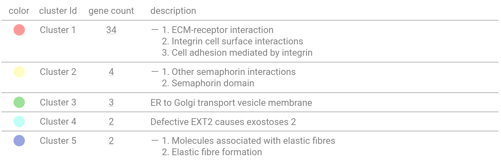

#### ECM cluster
[Figure 127](figures/STRING/skyblue3_pearson/skyblue3_ecm.svg)

[Figure 127 - STRING website](https://version-12-0.string-db.org/cgi/network?networkId=bvsQdwkJ833Y)


[Figure 128](figures/STRING/skyblue3_pearson/skyblue3_ecm_KEGG.svg)

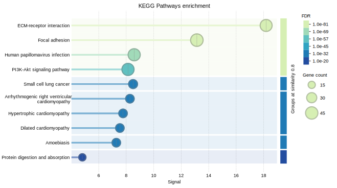

```{r}
#| echo: false
skyblue3_ecm_KEGG <- read.csv("figures/STRING/skyblue3_pearson/skyblue3_ecm_KEGG.tsv", sep = "\t")
colnames(skyblue3_ecm_KEGG) <- c("ID", "description", "observed.gene.count", "background.gene.count", "strength", "signal", "false.discovery.rate", "matching.proteins.IDs", "matching.proteins.labels")

datatable(skyblue3_ecm_KEGG, 
          caption = "Table 86. Enriched KEGG pathways for ECM cluster.",
          style = "bootstrap5", 
          extensions = 'Buttons', 
          options = list(dom = 'lBfrtip', 
              buttons = c('csv', 'excel')))
```

```{r}
#| echo: false
skyblue3_ecm_gene_list <- read.csv("figures/STRING/skyblue3_pearson/skyblue3_ecm_gene_list.tsv", sep = "\t")
skyblue3_ecm_gene_list <- unique(c(skyblue3_ecm_gene_list$X.node1, skyblue3_ecm_gene_list$node2))
skyblue3_ecm_gene_list <- ensbl2geneid[ensbl2geneid$gene_name %in% skyblue3_ecm_gene_list,]
skyblue3_ecm_gene_list <- skyblue3_ecm_gene_list[order(skyblue3_ecm_gene_list$gene_name),]
rownames(skyblue3_ecm_gene_list) <- NULL

datatable(skyblue3_ecm_gene_list, 
          caption = "Table 87. Genes included to ECM cluster.",
          style = "bootstrap5", 
          extensions = 'Buttons', 
          options = list(dom = 'lBfrtip', 
              buttons = c('csv', 'excel')))
```

### Black
#### Raw
[Figure 129](figures/STRING/black_pearson/black_raw.svg)

[Figure 129 - STRING website](https://version-12-0.string-db.org/cgi/network?networkId=bpGGaQqXsDpV)


#### Clusterisation
[Figure 130](figures/STRING/black_pearson/black_clusterisation.svg)

[Figure 130 - STRING website](https://version-12-0.string-db.org/cgi/network?networkId=b0UodMLIMpCH)


[Figure 131](figures/STRING/black_pearson/clusterisation.png)

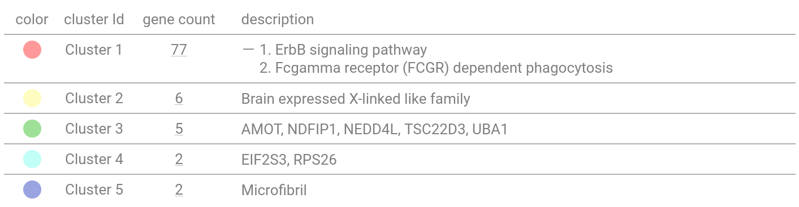

#### ErbB signaling pathway
[Figure 132](figures/STRING/black_pearson/black_erbb.svg)

[Figure 132 - STRING website](https://version-12-0.string-db.org/cgi/network?networkId=bTpNF6ieMzQQ)


[Figure 133](figures/STRING/black_pearson/black_erbb_KEGG.svg)

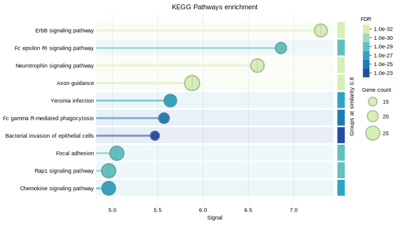

```{r}
#| echo: false
black_erbb_KEGG <- read.csv("figures/STRING/black_pearson/black_erbb_KEGG.tsv", sep = "\t")
colnames(black_erbb_KEGG) <- c("ID", "description", "observed.gene.count", "background.gene.count", "strength", "signal", "false.discovery.rate", "matching.proteins.IDs", "matching.proteins.labels")

datatable(black_erbb_KEGG, 
          caption = "Table 88. Enriched KEGG pathways for ErbB cluster.",
          style = "bootstrap5", 
          extensions = 'Buttons', 
          options = list(dom = 'lBfrtip', 
              buttons = c('csv', 'excel')))
```

```{r}
#| echo: false
black_erbb_gene_list <- read.csv("figures/STRING/black_pearson/black_erbb_gene_list.tsv", sep = "\t")
black_erbb_gene_list <- unique(c(black_erbb_gene_list$X.node1, black_erbb_gene_list$node2))
black_erbb_gene_list <- ensbl2geneid[ensbl2geneid$gene_name %in% black_erbb_gene_list,]
black_erbb_gene_list <- black_erbb_gene_list[order(black_erbb_gene_list$gene_name),]
rownames(black_erbb_gene_list) <- NULL

datatable(black_erbb_gene_list, 
          caption = "Table 89. Genes included to ErbB cluster.",
          style = "bootstrap5", 
          extensions = 'Buttons', 
          options = list(dom = 'lBfrtip', 
              buttons = c('csv', 'excel')))
```

### Grey
#### Raw
[Figure 134](figures/STRING/grey_pearson/grey_raw.svg)

[Figure 134 - STRING website](https://version-12-0.string-db.org/cgi/network?networkId=bsub7atXXsFZ)

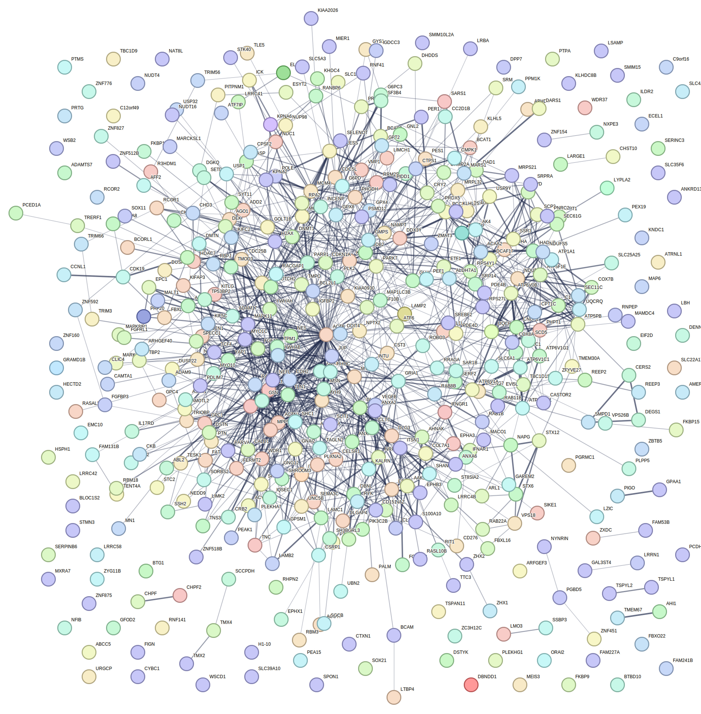

#### Clusterisation
[Figure 135](figures/STRING/grey_pearson/grey_clusterisation.svg)

[Figure 135 - STRING website](https://version-12-0.string-db.org/cgi/network?networkId=bLFXJJRc83SU)


[Figure 136](figures/STRING/grey_pearson/clusterisation.png)

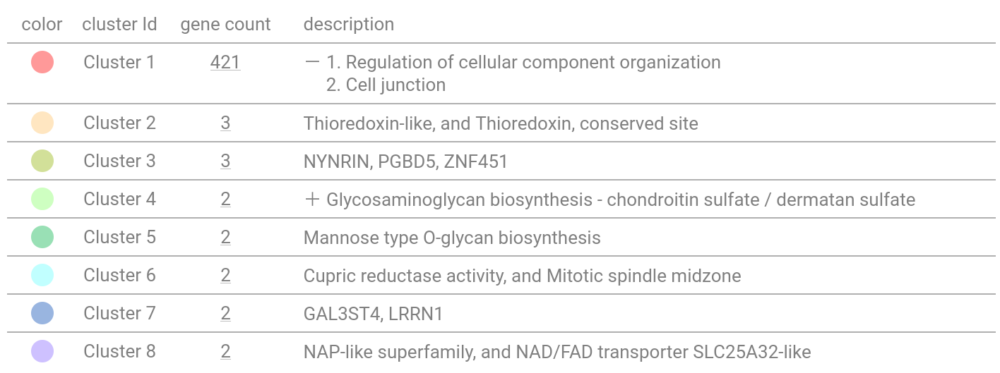

#### Regulation of cellular component organization
[Figure 137](figures/STRING/grey_pearson/grey_cellular.svg)

[Figure 137 - STRING website](https://version-12-0.string-db.org/cgi/network?networkId=bhHLrN8JyFtN)


[Table 84 - WebGestalt website](https://www.webgestalt.org/results/1759248139/#)

```{r}
#| echo: false
cellular_wg <- read.csv("figures/STRING/grey_pearson/enrichment_results_wg.txt", sep = "\t")

datatable(cellular_wg, 
          caption = "Table 90. WebGestalt ORA results for Regulation of cellular component organization cluster.",
          style = "bootstrap5", 
          extensions = 'Buttons', 
          options = list(dom = 'lBfrtip', 
              buttons = c('csv', 'excel')))
```

```{r}
#| echo: false
grey_cellular_gene_list <- read.csv("figures/STRING/grey_pearson/grey_cellular_gene_list.tsv", sep = "\t")
grey_cellular_gene_list <- unique(c(grey_cellular_gene_list$X.node1, grey_cellular_gene_list$node2))
grey_cellular_gene_list <- ensbl2geneid[ensbl2geneid$gene_name %in% grey_cellular_gene_list,]
grey_cellular_gene_list <- grey_cellular_gene_list[order(grey_cellular_gene_list$gene_name),]
rownames(grey_cellular_gene_list) <- NULL

datatable(grey_cellular_gene_list, 
          caption = "Table 91. Genes included to Regulation of cellular component organization cluster.",
          style = "bootstrap5", 
          extensions = 'Buttons', 
          options = list(dom = 'lBfrtip', 
              buttons = c('csv', 'excel')))
```

### Skyblue3-Spearman
#### Raw
[Figure 138](figures/STRING/spearman/spearman_raw.svg)

[Figure 138 - STRING website](https://version-12-0.string-db.org/cgi/network?networkId=bx52B3V0FBKc)

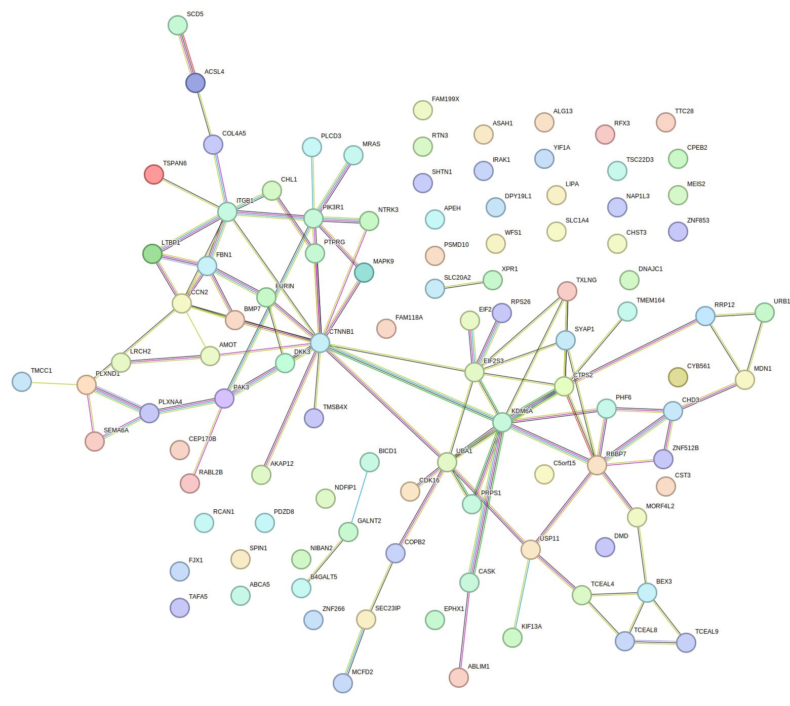

#### Clusterisation
[Figure 139](figures/STRING/spearman/spearman_clusterisation.svg)

[Figure 139 - STRING website](https://version-12-0.string-db.org/cgi/network?networkId=bVuvW0nmeNWq)

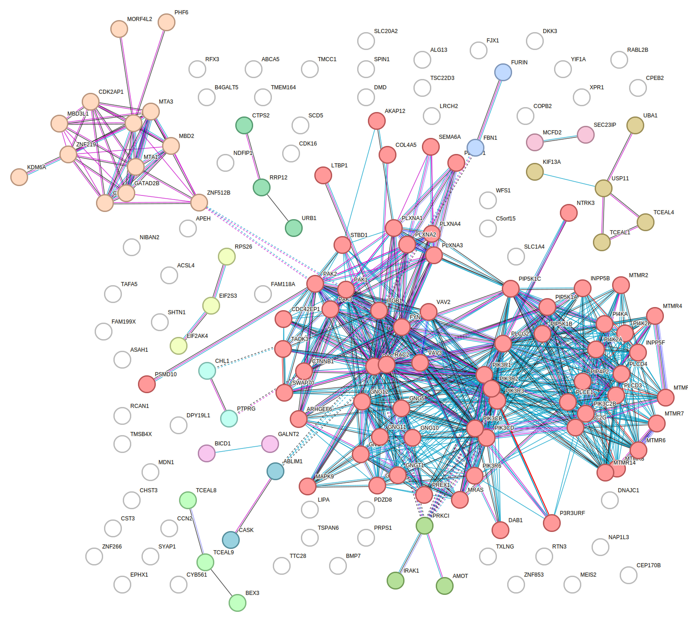

[Figure 140](figures/STRING/spearman/clusterisation.png)

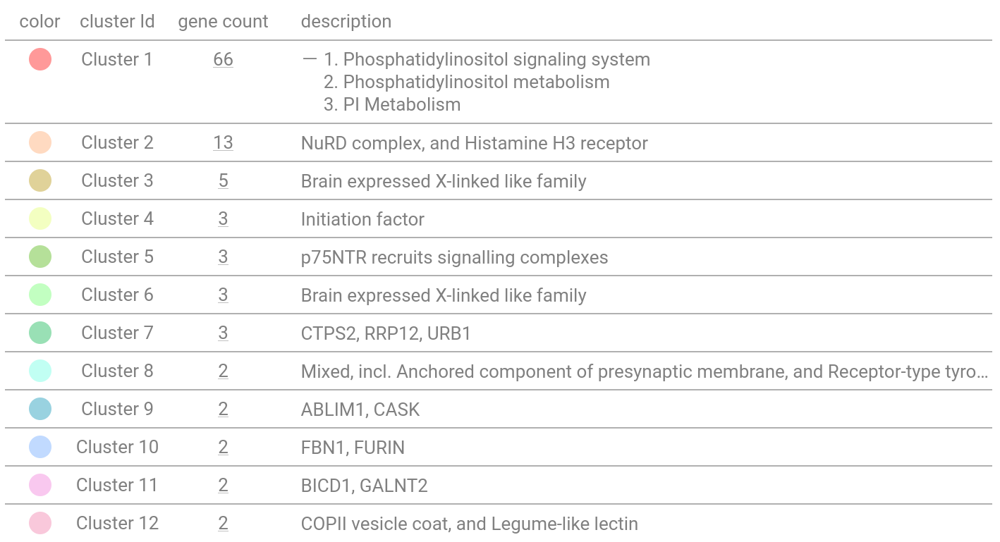

#### Phosphatidylinositol cluster
[Figure 141](figures/STRING/spearman/phosphatidylinositol.svg)

[Figure 141 - STRING website](https://version-12-0.string-db.org/cgi/network?networkId=bXoTlLyYuzR2)

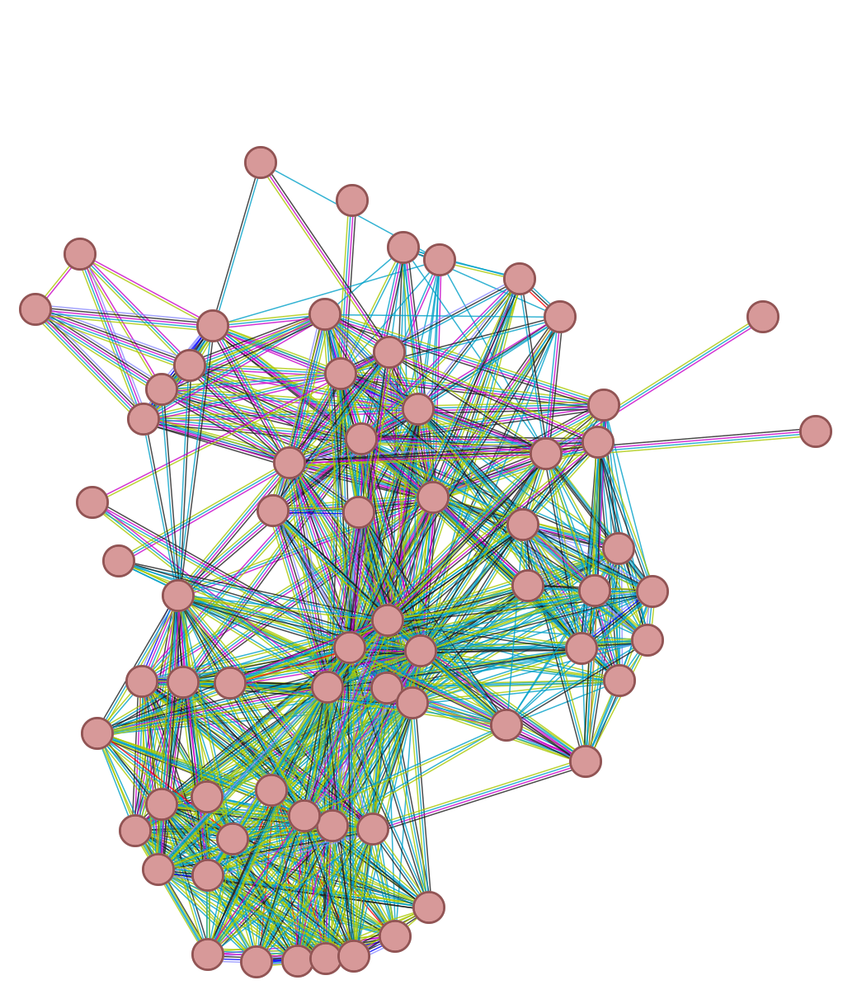

[Figure 142](figures/STRING/spearman/phosphatidylinositol_KEGG.svg)

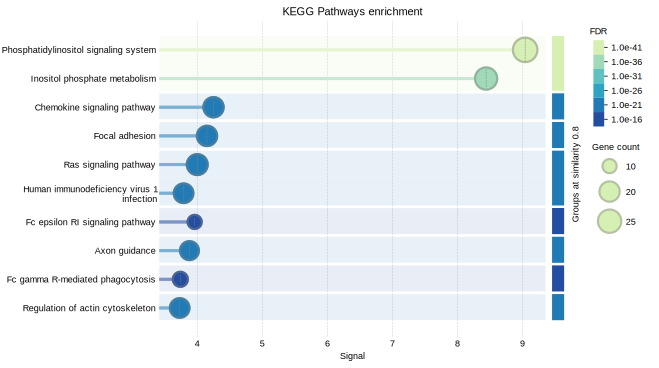

```{r}
#| echo: false
phosphatidylinositol_KEGG <- read.csv("figures/STRING/spearman/phosphatidylinositol_KEGG.tsv", sep = "\t")
colnames(phosphatidylinositol_KEGG) <- c("ID", "description", "observed.gene.count", "background.gene.count", "strength", "signal", "false.discovery.rate", "matching.proteins.IDs", "matching.proteins.labels")

datatable(phosphatidylinositol_KEGG, 
          caption = "Table 92. Enriched KEGG pathways for Phosphatidylinositol cluster.",
          style = "bootstrap5", 
          extensions = 'Buttons', 
          options = list(dom = 'lBfrtip', 
              buttons = c('csv', 'excel')))
```

```{r}
#| echo: false
phosphatidylinositol_gene_list <- read.csv("figures/STRING/spearman/phosphatidylinositol_gene_list.tsv", sep = "\t")
phosphatidylinositol_gene_list <- unique(c(phosphatidylinositol_gene_list$X.node1, phosphatidylinositol_gene_list$node2))
phosphatidylinositol_gene_list <- ensbl2geneid[ensbl2geneid$gene_name %in% phosphatidylinositol_gene_list,]
phosphatidylinositol_gene_list <- phosphatidylinositol_gene_list[order(phosphatidylinositol_gene_list$gene_name),]
rownames(phosphatidylinositol_gene_list) <- NULL

datatable(phosphatidylinositol_gene_list, 
          caption = "Table 93. Genes included to Phosphatidylinositol cluster.",
          style = "bootstrap5", 
          extensions = 'Buttons', 
          options = list(dom = 'lBfrtip', 
              buttons = c('csv', 'excel')))
```

#### Histone cluster
[Figure 143](figures/STRING/spearman/histone.svg)

[Figure 143 - STRING website](https://version-12-0.string-db.org/cgi/network?networkId=bixdcvRTpkeD)

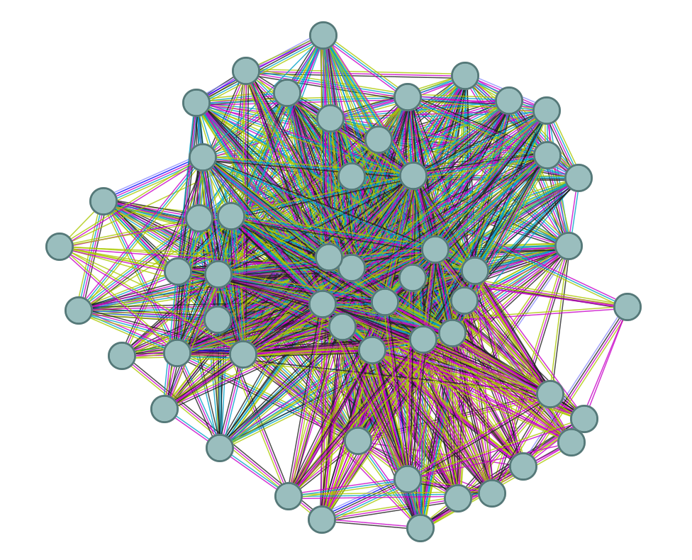

[Figure 144](figures/STRING/spearman/histone_RCTM.svg)

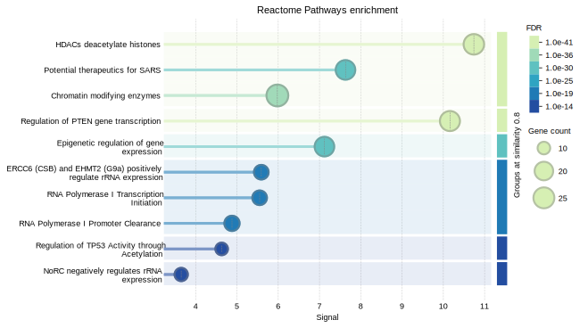

```{r}
#| echo: false
histone_RCTM <- read.csv("figures/STRING/spearman/histone_RCTM.tsv", sep = "\t")
colnames(histone_RCTM) <- c("ID", "description", "observed.gene.count", "background.gene.count", "strength", "signal", "false.discovery.rate", "matching.proteins.IDs", "matching.proteins.labels")

datatable(histone_RCTM, 
          caption = "Table 94. Enriched Reactome pathways for Histone cluster.",
          style = "bootstrap5", 
          extensions = 'Buttons', 
          options = list(dom = 'lBfrtip', 
              buttons = c('csv', 'excel')))
```

```{r}
#| echo: false
histone_gene_sets <- read.csv("figures/STRING/spearman/histone_gene_sets.tsv", sep = "\t")
histone_gene_sets <- unique(c(histone_gene_sets$X.node1, histone_gene_sets$node2))
histone_gene_sets <- ensbl2geneid[ensbl2geneid$gene_name %in% histone_gene_sets,]
histone_gene_sets <- histone_gene_sets[order(histone_gene_sets$gene_name),]
rownames(histone_gene_sets) <- NULL

datatable(histone_gene_sets, 
          caption = "Table 95. Genes included to Histone cluster.",
          style = "bootstrap5", 
          extensions = 'Buttons', 
          options = list(dom = 'lBfrtip', 
              buttons = c('csv', 'excel')))
```

#### Semaphorin cluster
[Figure 143](figures/STRING/spearman/semaphorin.svg)

[Figure 143 - STRING website](https://version-12-0.string-db.org/cgi/network?networkId=bKq8LTWXEFG1)

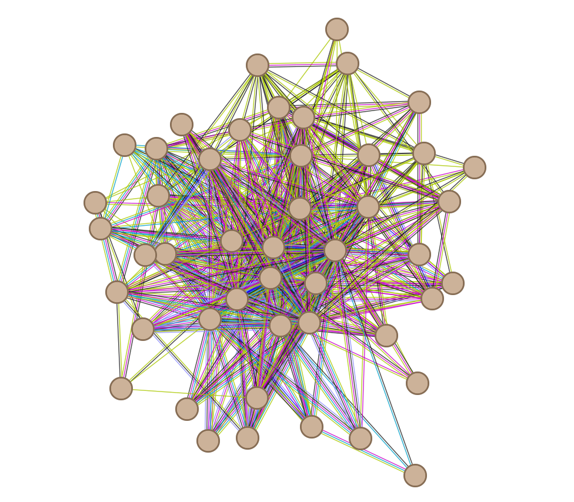

[Figure 144](figures/STRING/spearman/semaphorin_RCTM.svg)

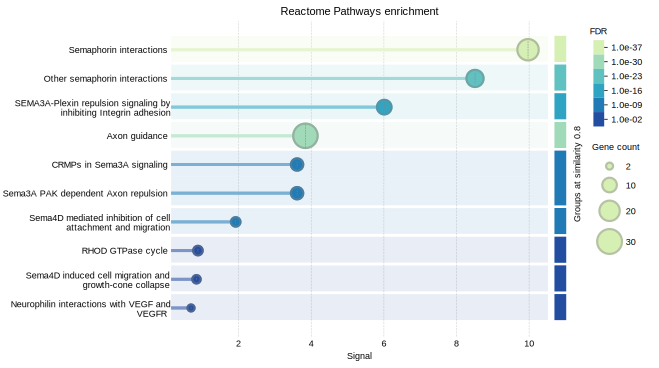

```{r}
#| echo: false
semaphorin_RCTM <- read.csv("figures/STRING/spearman/semaphorin_RCTM.tsv", sep = "\t")
colnames(semaphorin_RCTM) <- c("ID", "description", "observed.gene.count", "background.gene.count", "strength", "signal", "false.discovery.rate", "matching.proteins.IDs", "matching.proteins.labels")

datatable(semaphorin_RCTM, 
          caption = "Table 96. Enriched Reactome pathways for Semaphorin cluster.",
          style = "bootstrap5", 
          extensions = 'Buttons', 
          options = list(dom = 'lBfrtip', 
              buttons = c('csv', 'excel')))
```

```{r}
#| echo: false
semaphorin_gene_list <- read.csv("figures/STRING/spearman/semaphorin_gene_list.tsv", sep = "\t")
semaphorin_gene_list <- unique(c(semaphorin_gene_list$X.node1, semaphorin_gene_list$node2))
semaphorin_gene_list <- ensbl2geneid[ensbl2geneid$gene_name %in% semaphorin_gene_list,]
semaphorin_gene_list <- semaphorin_gene_list[order(semaphorin_gene_list$gene_name),]
rownames(semaphorin_gene_list) <- NULL

datatable(semaphorin_gene_list, 
          caption = "Table 97. Genes included to Semaphorin cluster.",
          style = "bootstrap5", 
          extensions = 'Buttons', 
          options = list(dom = 'lBfrtip', 
              buttons = c('csv', 'excel')))
```

## GSEA validation of clusters
```{r}
#| include: false
ranks.df <- read.csv("data/ranks.tsv", sep = "\t")
ranks.lrrk2.df <- read.csv("data/ranks.lrrk2.tsv", sep = "\t")
ranks.Parkin.df <- read.csv("data/ranks.Parkin.tsv", sep = "\t")
ranks.B.df <- read.csv("data/ranks.B.tsv", sep = "\t")

ranks <- ranks.df$ranks
names(ranks) <- ranks.df$gene_id

ranks.lrrk2 <- ranks.lrrk2.df$ranks.lrrk2
names(ranks.lrrk2) <- ranks.lrrk2.df$gene_id

ranks.Parkin <- ranks.Parkin.df$ranks.Parkin
names(ranks.Parkin) <- ranks.Parkin.df$gene_id

ranks.B <- ranks.B.df$ranks.B
names(ranks.B) <- ranks.B.df$gene_id
```

```{r}
#| include: false
ECM <- unique(skyblue3_ecm_gene_list$gene_id)
ERBB <- unique(black_erbb_gene_list$gene_id)
Cellular <- unique(grey_cellular_gene_list$gene_id)
Phosphatidylinositol <- unique(phosphatidylinositol_gene_list$gene_id)
Histone <- unique(histone_gene_sets$gene_id)
Semaphorin <- unique(semaphorin_gene_list$gene_id)

df.ECM <- data.frame(gene_name = ECM, group = "ECM")
df.ERBB <- data.frame(gene_name = ERBB, group = "ERBB")
df.Cellular <- data.frame(gene_name = Cellular, group = "Cellular")
df.Phosphatidylinositol <- data.frame(gene_name = Phosphatidylinositol, group = "Phosphatidylinositol")
df.Histone <- data.frame(gene_name = Histone, group = "Histone")
df.Semaphorin <- data.frame(gene_name = Semaphorin, group = "Semaphorin")

custom_genesets <- rbind(df.ECM, df.ERBB, df.Cellular, df.Phosphatidylinositol, df.Histone, df.Semaphorin)

gseaDEG_1 <- GSEA(geneList = ranks, TERM2GENE = custom_genesets[c(2,1)], eps = 0, pAdjustMethod = "fdr", 
                pvalueCutoff = 0.25, seed = 13)

gseaDEG_2 <- GSEA(geneList = ranks.lrrk2, TERM2GENE = custom_genesets[c(2,1)], eps = 0, pAdjustMethod = "fdr", 
                pvalueCutoff = 0.25, seed = 13)

gseaDEG_3 <- GSEA(geneList = ranks.Parkin, TERM2GENE = custom_genesets[c(2,1)], eps = 0, pAdjustMethod = "fdr", 
                pvalueCutoff = 0.25, seed = 13)

gseaDEG_4 <- GSEA(geneList = ranks.B, TERM2GENE = custom_genesets[c(2,1)], eps = 0, pAdjustMethod = "fdr", 
                pvalueCutoff = 0.25, seed = 13)

gseaDEG_1.df <- as.data.frame(gseaDEG_1)
rownames(gseaDEG_1.df) <- NULL

gseaDEG_2.df <- as.data.frame(gseaDEG_2)
rownames(gseaDEG_2.df) <- NULL

gseaDEG_3.df <- as.data.frame(gseaDEG_3)
rownames(gseaDEG_3.df) <- NULL

gseaDEG_4.df <- as.data.frame(gseaDEG_4)
rownames(gseaDEG_4.df) <- NULL

gsea_ECM <- GSEAmultiGP(gsea_list = c(gseaDEG_1, gseaDEG_2, gseaDEG_4),
            geneSetID = "ECM",
            exp_name = c("PD vs Healthy", "LRRK2 vs Healthy", "LRRK2 vs Parkin"), 
            legend.position = "right", 
            curve.col = brewer.pal(n = 4, name = "Set1")[c(1,2,4)])

gsea_ERBB <- GSEAmultiGP(gsea_list = c(gseaDEG_1, gseaDEG_3),
            geneSetID = "ERBB",
            exp_name = c("PD vs Healthy", "Parkin vs Healthy"), 
            legend.position = "right", 
            curve.col = brewer.pal(n = 4, name = "Set1")[c(1,3)])

gsea_cellular <- GSEAmultiGP(gsea_list = c(gseaDEG_1, gseaDEG_3),
            geneSetID = "Cellular",
            exp_name = c("PD vs Healthy", "Parkin vs Healthy"), 
            legend.position = "right", 
            curve.col = brewer.pal(n = 4, name = "Set1")[c(1,3)])

gsea_phosphatidylinositol <- GSEAmultiGP(gsea_list = c(gseaDEG_1, gseaDEG_3),
            geneSetID = "Phosphatidylinositol",
            exp_name = c("PD vs Healthy", "Parkin vs Healthy"), 
            legend.position = "right", 
            curve.col = brewer.pal(n = 4, name = "Set1")[c(1,3)])

gsea_histone <- GSEAmultiGP(gsea_list = c(gseaDEG_1, gseaDEG_3),
            geneSetID = "Histone",
            exp_name = c("PD vs Healthy", "Parkin vs Healthy"), 
            legend.position = "right", 
            curve.col = brewer.pal(n = 4, name = "Set1")[c(1,3)])

gsea_semaphorin <- GSEAmultiGP(gsea_list = c(gseaDEG_1),
            geneSetID = "Semaphorin",
            exp_name = c("PD vs Healthy"), 
            legend.position = "right", 
            curve.col = brewer.pal(n = 4, name = "Set1")[c(1,3)])
```

```{r}
#| echo: false
#| message: false
#| warning: false
datatable(gseaDEG_1.df[c(2:9)], 
          caption = "Table 98. Functional coherence of STRING/MCL clusters validated through Gene Set Enrichment Analysis (GSEA), demonstrating concordant enrichment of cluster-specific pathways in phenotype-ranked expression data (PD vs Healthy).",
          style = "bootstrap5", 
          extensions = 'Buttons', 
          options = list(dom = 'lBfrtip', 
              buttons = c('csv', 'excel')))
```

```{r}
#| echo: false
#| message: false
#| warning: false
datatable(gseaDEG_2.df[c(2:9)], 
          caption = "Table 99. Functional coherence of STRING/MCL clusters validated through Gene Set Enrichment Analysis (GSEA), demonstrating concordant enrichment of cluster-specific pathways in phenotype-ranked expression data (LRRK2 vs Healthy).",
          style = "bootstrap5", 
          extensions = 'Buttons', 
          options = list(dom = 'lBfrtip', 
              buttons = c('csv', 'excel')))
```

```{r}
#| echo: false
#| message: false
#| warning: false
datatable(gseaDEG_3.df[c(2:9)], 
          caption = "Table 100. Functional coherence of STRING/MCL clusters validated through Gene Set Enrichment Analysis (GSEA), demonstrating concordant enrichment of cluster-specific pathways in phenotype-ranked expression data (Parkin vs Healthy).",
          style = "bootstrap5", 
          extensions = 'Buttons', 
          options = list(dom = 'lBfrtip', 
              buttons = c('csv', 'excel')))
```

```{r}
#| echo: false
#| message: false
#| warning: false
datatable(gseaDEG_4.df[c(2:9)], 
          caption = "Table 101. Functional coherence of STRING/MCL clusters validated through Gene Set Enrichment Analysis (GSEA), demonstrating concordant enrichment of cluster-specific pathways in phenotype-ranked expression data (LRRK2 vs Parkin).",
          style = "bootstrap5", 
          extensions = 'Buttons', 
          options = list(dom = 'lBfrtip', 
              buttons = c('csv', 'excel')))
```

```{r fig.width=6.5, fig.height=4.5}
#| echo: false
#| message: false
#| warning: false
download_this(
  gsea_ECM,
  output_name = "gsea_ECM_coexp",
  output_extension = ".svg",
  button_label = "SVG",
  button_type = "primary"
)
```

```{r fig.width=6.5, fig.height=4.5}
#| echo: false
#| message: false
#| warning: false
#| fig-cap: "Figure 145. Functional coherence of STRING/MCL clusters validated through Gene Set Enrichment Analysis (GSEA), demonstrating concordant enrichment of cluster-specific pathways in phenotype-ranked expression data (ECM cluster)."
gsea_ECM
```

```{r fig.width=6.5, fig.height=4.5}
#| echo: false
#| message: false
#| warning: false
download_this(
  gsea_ERBB,
  output_name = "gsea_ERBB_coexp",
  output_extension = ".svg",
  button_label = "SVG",
  button_type = "primary"
)
```

```{r fig.width=6.5, fig.height=4.5}
#| echo: false
#| message: false
#| warning: false
#| fig-cap: "Figure 146. Functional coherence of STRING/MCL clusters validated through Gene Set Enrichment Analysis (GSEA), demonstrating concordant enrichment of cluster-specific pathways in phenotype-ranked expression data (ERBB cluster)."
gsea_ERBB
```

```{r fig.width=6.5, fig.height=4.5}
#| echo: false
#| message: false
#| warning: false
download_this(
  gsea_cellular,
  output_name = "gsea_cellular_coexp",
  output_extension = ".svg",
  button_label = "SVG",
  button_type = "primary"
)
```

```{r fig.width=6.5, fig.height=4.5}
#| echo: false
#| message: false
#| warning: false
#| fig-cap: "Figure 147. Functional coherence of STRING/MCL clusters validated through Gene Set Enrichment Analysis (GSEA), demonstrating concordant enrichment of cluster-specific pathways in phenotype-ranked expression data (Cellular cluster)."
gsea_cellular
```

```{r fig.width=6.5, fig.height=4.5}
#| echo: false
#| message: false
#| warning: false
download_this(
  gsea_phosphatidylinositol,
  output_name = "gsea_phosphatidylinositol_coexp",
  output_extension = ".svg",
  button_label = "SVG",
  button_type = "primary"
)
```

```{r fig.width=6.5, fig.height=4.5}
#| echo: false
#| message: false
#| warning: false
#| fig-cap: "Figure 148. Functional coherence of STRING/MCL clusters validated through Gene Set Enrichment Analysis (GSEA), demonstrating concordant enrichment of cluster-specific pathways in phenotype-ranked expression data (Phosphatidylinositol  cluster)."
gsea_phosphatidylinositol 
```

```{r fig.width=6.5, fig.height=4.5}
#| echo: false
#| message: false
#| warning: false
download_this(
  gsea_histone,
  output_name = "gsea_histone_coexp",
  output_extension = ".svg",
  button_label = "SVG",
  button_type = "primary"
)
```

```{r fig.width=6.5, fig.height=4.5}
#| echo: false
#| message: false
#| warning: false
#| fig-cap: "Figure 149. Functional coherence of STRING/MCL clusters validated through Gene Set Enrichment Analysis (GSEA), demonstrating concordant enrichment of cluster-specific pathways in phenotype-ranked expression data (Histone cluster)."
gsea_histone
```

```{r fig.width=6.5, fig.height=4.5}
#| echo: false
#| message: false
#| warning: false
download_this(
  gsea_semaphorin,
  output_name = "gsea_semaphorin_coexp",
  output_extension = ".svg",
  button_label = "SVG",
  button_type = "primary"
)
```

```{r fig.width=6.5, fig.height=4.5}
#| echo: false
#| message: false
#| warning: false
#| fig-cap: "Figure 150. Functional coherence of STRING/MCL clusters validated through Gene Set Enrichment Analysis (GSEA), demonstrating concordant enrichment of cluster-specific pathways in phenotype-ranked expression data (Semaphorin cluster)."
gsea_semaphorin
```

```{r}
#| include: false
COEXP_STRING <- list(skyblue3_pearson = selected_modules_add.p$gene_id[selected_modules_add.p$module == "skyblue3"],
                     black = selected_modules_add.p$gene_id[selected_modules_add.p$module == "black"],
                     grey = selected_modules_add.p$gene_id[selected_modules_add.p$module == "grey"],
                     skyblue3_spearman = selected_modules_add.s$gene_id[selected_modules_add.s$module == "skyblue3"],
                     ECM = ECM,
                     ERBB = ERBB,
                     Cellular = Cellular,
                     Phosphatidylinositol = Phosphatidylinositol,
                     Histone = Histone,
                     Semaphorin = Semaphorin
                     
)

COEXP_STRING_upset <- upset(fromList(COEXP_STRING), 
      nintersects = 40, 
      nsets = 15, 
      order.by = "freq", 
      decreasing = T, 
      mb.ratio = c(0.6, 0.4),
      number.angles = 0, 
      text.scale = 1.1, 
      point.size = 2.8, 
      line.size = 1
)

# pdf("figures/COEXP_STRING_upset.pdf", width = 12, height = 6)
# COEXP_STRING_upset
# dev.off()
```

[Figure 151](figures/COEXP_STRING_upset.pdf)

```{r fig.width=8, fig.height=5}
#| echo: false
#| message: false
#| warning: false
#| fig-cap: "Figure 151. Intersections between Parkin DEGs and STRING clusters."
COEXP_STRING_upset
```

## Pathway activity analysis
### PROGENy predicted scores
```{r}
#| include: false
library(decoupleR)
library(progeny)
library(dplyr)
library(tibble)
library(tidyr)
library(ggplot2)
library(pheatmap)
library(ggrepel)
library(OmnipathR)

mat.df <- as.data.frame(mat)

mat.df.s <- merge(ensbl2geneid[-3], cbind(rownames(mat.df), mat.df), by = 1)[-1]
mat.df.s <- mat.df.s[!duplicated(mat.df.s$gene_name),]
rownames(mat.df.s) <- mat.df.s$gene_name
mat.df.s <- mat.df.s[-1]

net.progeny <- decoupleR::get_progeny(organism = 'human', top = 500)

sample_acts <- decoupleR::run_mlm(mat = mat.df.s, 
                                  net = net.progeny, 
                                  .source = 'source', 
                                  .target = 'target',
                                  .mor = 'weight', 
                                  minsize = 5)

sample_acts_mat <- sample_acts %>%
                   tidyr::pivot_wider(id_cols = 'condition', 
                                      names_from = 'source',
                                      values_from = 'score') %>%
                   tibble::column_to_rownames('condition') %>%
                   as.matrix()

sample_acts_mat <- as.data.frame(sample_acts_mat)

sample_acts_mat_df <- merge(meta_data[-2], cbind(sampleid = rownames(sample_acts_mat), sample_acts_mat))

sample_acts_mat_heatmap <- pheatmap::pheatmap(cor(sample_acts_mat, method = "spearman"), cutree_cols = 6, cutree_rows = 6)

# pdf("figures/sample_acts_mat_heatmap.pdf", width = 7, height = 6)
# sample_acts_mat_heatmap
# dev.off()
```

```{r}
#| echo: false
datatable(sample_acts_mat_df, 
          caption = "Table 102. PROGENy signaling pathway predicted activity scores.",
          style = "bootstrap5", 
          extensions = 'Buttons', 
          options = list(dom = 'lBfrtip', 
              buttons = c('csv', 'excel')))
```

[Figure 152](figures/sample_acts_mat_heatmap.pdf)

```{r fig.width=7, fig.height=6}
#| echo: false
#| message: false
#| warning: false
#| fig-cap: "Figure 152. Spearman correlation matrix of pathway activity scores."
sample_acts_mat_heatmap
```

### Correlation with selected module eigenegene PC1
```{r}
#| message: false
#| warning: false
#| include: false
PCA.ME.df <- as.data.frame(PCA.ME$x)
PCA.ME.df <- merge(cbind(sampleid = rownames(PCA.ME.df), PCA.ME.df[1]), 
                   cbind(rownames(sample_acts_mat), sample_acts_mat), by = 1)
rownames(PCA.ME.df) <- PCA.ME.df$sampleid
PCA.ME.df <- PCA.ME.df[-1]

cor.res.df <- NULL
for (i in 2:ncol(PCA.ME.df)){
      cor.res <- cor.test(PCA.ME.df[,1], PCA.ME.df[,i], method = "spearman")
      cor.res <- data.frame(rho = cor.res$estimate, p = cor.res$p.value)
      
      cor.res.df <- rbind(cor.res.df, cor.res)
}

rownames(cor.res.df) <- colnames(PCA.ME.df)[-1]

cor.res.df$p.adj <- p.adjust(cor.res.df$p, method = "fdr")
cor.res.df <- cor.res.df[order(cor.res.df$rho, decreasing = T),]

PCA.ME.df_meta <- merge(cbind(sampleid = rownames(PCA.ME.df), PCA.ME.df), meta_data[-2], by = 1)

PC1_TGFb_plot <- ggplot(PCA.ME.df_meta, aes(PC1, TGFb))+
      geom_point(aes(col = mutation))+
      geom_smooth(method = "lm")+
      theme_bw()+
      scale_color_brewer(palette = "Set1")
```

```{r}
#| echo: false
datatable(cbind(pathway = rownames(cor.res.df), cor.res.df), 
          caption = "Table 103. Spearman correlations between pathway activity scores and PC1 of PCA selected module eigenegenes.",
          style = "bootstrap5", 
          extensions = 'Buttons', 
          options = list(dom = 'lBfrtip', 
              buttons = c('csv', 'excel')))
```

```{r fig.width=5, fig.height=4}
#| echo: false
download_this(
  PC1_TGFb_plot,
  output_name = "PC1_TGFb_plot",
  output_extension = ".pdf",
  button_label = "PDF",
  button_type = "primary"
)
```

```{r fig.height=4, fig.width=5}
#| echo: false
#| message: false
#| warning: false
#| fig-cap: Figure 153. Correlations between TGFb and PC1 (Rho = 0.57, p.adj = 0.012).
PC1_TGFb_plot
```

### Differences in activity of signaling pathways
```{r}
#| include: false
sample_acts_mat_df <- sample_acts_mat_df[-c(2,5)]

mixed.results <- NULL
for (i in 4:ncol(sample_acts_mat_df)){
      model2 <- aov(sample_acts_mat_df[,i] ~ place + mutation, data = sample_acts_mat_df)
      model2_sum <- summary(model2)
      mixed.results <- c(mixed.results, model2_sum[[1]]$`Pr(>F)`[2])
}

mixed.results <- data.frame(pathway = colnames(sample_acts_mat_df)[4:ncol(sample_acts_mat_df)], pval = mixed.results)
mixed.results$padj <- p.adjust(mixed.results$pval, method = "fdr")
mixed.results <- mixed.results[mixed.results$padj < 0.05,]

mixed.results <- mixed.results[order(mixed.results$padj),]
rownames(mixed.results) <- NULL
```

```{r}
#| include: false
PI3K_boxplot <- ggplot(sample_acts_mat_df, aes(PI3K, mutation, col = mutation))+
      stat_halfeye()+
      xlab("Activity score")+
      ylab("Mutation")+
      ggtitle("PI3K")+
      theme_pubr()+
      theme(legend.position = "none")+
      scale_color_brewer(palette = "Set1")

Trail_boxplot <- ggplot(sample_acts_mat_df, aes(Trail, mutation, col = mutation))+
      stat_halfeye()+
      xlab("Activity score")+
      ylab("Mutation")+
      ggtitle("Trail")+
      theme_pubr()+
      theme(legend.position = "none")+
      scale_color_brewer(palette = "Set1")

NFkB_boxplot <- ggplot(sample_acts_mat_df, aes(NFkB, mutation, col = mutation))+
      stat_halfeye()+
      xlab("Activity score")+
      ylab("Mutation")+
      ggtitle("NFkB")+
      theme_pubr()+
      theme(legend.position = "none")+
      scale_color_brewer(palette = "Set1")

TNFa_boxplot <- ggplot(sample_acts_mat_df, aes(TNFa, mutation, col = mutation))+
      stat_halfeye()+
      xlab("Activity score")+
      ylab("Mutation")+
      ggtitle("TNFa")+
      theme_pubr()+
      theme(legend.position = "none")+
      scale_color_brewer(palette = "Set1")

MAPK_boxplot <- ggplot(sample_acts_mat_df, aes(MAPK, mutation, col = mutation))+
      stat_halfeye()+
      xlab("Activity score")+
      ylab("Mutation")+
      ggtitle("MAPK")+
      theme_pubr()+
      theme(legend.position = "none")+
      scale_color_brewer(palette = "Set1")

Hypoxia_boxplot <- ggplot(sample_acts_mat_df, aes(Hypoxia, mutation, col = mutation))+
      stat_halfeye()+
      xlab("Activity score")+
      ylab("Mutation")+
      ggtitle("Hypoxia")+
      theme_pubr()+
      theme(legend.position = "none")+
      scale_color_brewer(palette = "Set1")

p53_boxplot <- ggplot(sample_acts_mat_df, aes(p53, mutation, col = mutation))+
      stat_halfeye()+
      xlab("Activity score")+
      ylab("Mutation")+
      ggtitle("p53")+
      theme_pubr()+
      theme(legend.position = "none")+
      scale_color_brewer(palette = "Set1")

JAK_STAT_boxplot <- ggplot(sample_acts_mat_df, aes(`JAK-STAT`, mutation, col = mutation))+
      stat_halfeye()+
      xlab("Activity score")+
      ylab("Mutation")+
      ggtitle("JAK-STAT")+
      theme_pubr()+
      theme(legend.position = "none")+
      scale_color_brewer(palette = "Set1")

WNT_boxplot <- ggplot(sample_acts_mat_df, aes(WNT, mutation, col = mutation))+
      stat_halfeye()+
      xlab("Activity score")+
      ylab("Mutation")+
      ggtitle("WNT")+
      theme_pubr()+
      theme(legend.position = "none")+
      scale_color_brewer(palette = "Set1")
```

### PI3K
```{r fig.width=4.5, fig.height=4}
#| echo: false
download_this(
  PI3K_boxplot,
  output_name = "PI3K_boxplot",
  output_extension = ".pdf",
  button_label = "PDF",
  button_type = "primary"
)
```

```{r fig.width=4.5, fig.height=4}
#| echo: false
#| fig-cap: "Figure 154. PI3K pathway predicted activity across experimantal groups."
PI3K_boxplot
```

```{r}
#| echo: false
PI3K_mmodel <- glm(PI3K ~ mutation, data = sample_acts_mat_df)
summary(glht(PI3K_mmodel, linfct = mcp(mutation = "Tukey")), test = adjusted("fdr"))
```

### Trail
```{r fig.width=4.5, fig.height=4}
#| echo: false
download_this(
  Trail_boxplot,
  output_name = "Trail_boxplot",
  output_extension = ".pdf",
  button_label = "PDF",
  button_type = "primary"
)
```

```{r fig.width=4.5, fig.height=4}
#| echo: false
#| fig-cap: "Figure 155. Trail pathway predicted activity across experimantal groups."
Trail_boxplot
```

```{r}
#| echo: false
Trail_mmodel <- glm(Trail ~ mutation, data = sample_acts_mat_df)
summary(glht(Trail_mmodel, linfct = mcp(mutation = "Tukey")), test = adjusted("fdr"))
```

### NFkB
```{r fig.width=4.5, fig.height=4}
#| echo: false
download_this(
  NFkB_boxplot,
  output_name = "NFkB_boxplot",
  output_extension = ".pdf",
  button_label = "PDF",
  button_type = "primary"
)
```

```{r fig.width=4.5, fig.height=4}
#| echo: false
#| fig-cap: "Figure 156. NFkB pathway predicted activity across experimantal groups."
NFkB_boxplot
```

```{r}
#| echo: false
NFkB_mmodel <- glm(NFkB ~ mutation, data = sample_acts_mat_df)
summary(glht(NFkB_mmodel, linfct = mcp(mutation = "Tukey")), test = adjusted("fdr"))
```

### TNFa
```{r fig.width=4.5, fig.height=4}
#| echo: false
download_this(
  TNFa_boxplot,
  output_name = "TNFa_boxplot",
  output_extension = ".pdf",
  button_label = "PDF",
  button_type = "primary"
)
```

```{r fig.width=4.5, fig.height=4}
#| echo: false
#| fig-cap: "Figure 157. TNFa pathway predicted activity across experimantal groups."
TNFa_boxplot
```

```{r}
#| echo: false
TNFa_mmodel <- glm(TNFa ~ mutation, data = sample_acts_mat_df)
summary(glht(TNFa_mmodel, linfct = mcp(mutation = "Tukey")), test = adjusted("fdr"))
```

### MAPK
```{r fig.width=4.5, fig.height=4}
#| echo: false
download_this(
  MAPK_boxplot,
  output_name = "MAPK_boxplot",
  output_extension = ".pdf",
  button_label = "PDF",
  button_type = "primary"
)
```

```{r fig.width=4.5, fig.height=4}
#| echo: false
#| fig-cap: "Figure 158. MAPK pathway predicted activity across experimantal groups."
MAPK_boxplot
```

```{r}
#| echo: false
MAPK_mmodel <- glm(MAPK ~ mutation, data = sample_acts_mat_df)
summary(glht(MAPK_mmodel, linfct = mcp(mutation = "Tukey")), test = adjusted("fdr"))
```

### Hypoxia
```{r fig.width=4.5, fig.height=4}
#| echo: false
download_this(
  Hypoxia_boxplot,
  output_name = "Hypoxia_boxplot",
  output_extension = ".pdf",
  button_label = "PDF",
  button_type = "primary"
)
```

```{r fig.width=4.5, fig.height=4}
#| echo: false
#| fig-cap: "Figure 159. Hypoxia pathway predicted activity across experimantal groups."
Hypoxia_boxplot
```

```{r}
#| echo: false
Hypoxia_mmodel <- glm(Hypoxia ~ mutation, data = sample_acts_mat_df)
summary(glht(Hypoxia_mmodel, linfct = mcp(mutation = "Tukey")), test = adjusted("fdr"))
```

### p53
```{r fig.width=4.5, fig.height=4}
#| echo: false
download_this(
  p53_boxplot,
  output_name = "p53_boxplot",
  output_extension = ".pdf",
  button_label = "PDF",
  button_type = "primary"
)
```

```{r fig.width=4.5, fig.height=4}
#| echo: false
#| fig-cap: "Figure 160. p53 pathway predicted activity across experimantal groups."
p53_boxplot
```

```{r}
#| echo: false
p53_mmodel <- glm(p53 ~ mutation, data = sample_acts_mat_df)
summary(glht(p53_mmodel, linfct = mcp(mutation = "Tukey")), test = adjusted("fdr"))
```

### JAK-STAT
```{r fig.width=4.5, fig.height=4}
#| echo: false
download_this(
  JAK_STAT_boxplot,
  output_name = "JAK_STAT_boxplot",
  output_extension = ".pdf",
  button_label = "PDF",
  button_type = "primary"
)
```

```{r fig.width=4.5, fig.height=4}
#| echo: false
#| fig-cap: "Figure 161. JAK-STAT pathway predicted activity across experimantal groups."
JAK_STAT_boxplot
```

```{r}
#| echo: false
JAK_STAT_mmodel <- glm(`JAK-STAT` ~ mutation, data = sample_acts_mat_df)
summary(glht(JAK_STAT_mmodel, linfct = mcp(mutation = "Tukey")), test = adjusted("fdr"))
```

### WNT
```{r fig.width=4.5, fig.height=4}
#| echo: false
download_this(
  WNT_boxplot,
  output_name = "WNT_boxplot",
  output_extension = ".pdf",
  button_label = "PDF",
  button_type = "primary"
)
```

```{r fig.width=4.5, fig.height=4}
#| echo: false
#| fig-cap: "Figure 162. JAK-STAT pathway predicted activity across experimantal groups."
WNT_boxplot
```

```{r}
#| echo: false
WNT_mmodel <- glm(WNT ~ mutation, data = sample_acts_mat_df)
summary(glht(WNT_mmodel, linfct = mcp(mutation = "Tukey")), test = adjusted("fdr"))
```

## Table 104. Comparison of co-expression results in Parkinson's disease models (LRRK2 vs. Parkin)
| Feature | LRRK2 | Parkin | Biological Interpretation |
|---------|-------|--------|---------------------------|
| **Cellular Homeostasis & Structure** | - | ↓↓ Organization, Cytoskeleton | **Common Mechanism:** |
| **Pro-Survival & Intracellular Signaling** | - | ↓↓ ErbB signaling, ↓↓ PI signaling | **Common Mechanism:** |
| **Neuronal Connectivity & Guidance** | - | ↓↓ Semaphorin-Plexin | **Common Mechanism:** |
| **Epigenetic Regulation** | - | ↓↓ Histone deacetylation | **Common Mechanism:** | 
| **Neuronal Microenvironment** | - | ↓↓ Extracellular Matrix (ECM) | **Common Mechanism:** |

## Table 105. Comparison of pathway activity analysis in Parkinson's disease models (LRRK2 vs. Parkin)
| Feature | LRRK2 | Parkin | Biological Interpretation |
|---------|-------|--------|---------------------------|
| **Apoptosis & Cell Stress** | ↑ Trail | ↑ Trail | **Increased Apoptotic Signaling:** |
| **Cell Cycle & Tumor Suppression** | ↑ p53 | ↑ p53 | **Cellular Stress Response:** |
| **Neuronal Development & Survival** | ↓ WNT | ↓ WNT | **Impaired Neuroprotection:** |
| **Inflammation & Immune Response** | ↑ NF-κB, ↓ TNFα | ↓ TNFα | **Dysregulated Inflammation:** |
| **Intracellular Signaling & Kinase Activity** | ↑ MAPK | - | **Enhanced MAPK Pathway (LRRK2):** |
| **JAK/STAT Pathway** | ↓ JAK/STAT | - | **Impaired Immunomodulation (LRRK2):**|
| **Mitochondrial Function & Oxygen Sensing** | - | ↑ Hypoxia | **Mitochondrial Dysfunction/Hypoxia (Parkin):** |
| **PI3K/Akt Signaling** | ↑ PI3K | ↓ PI3K | **Divergent PI3K Regulation:** |